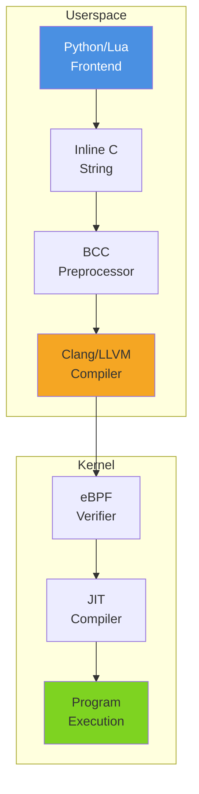

# BCC (BPF Compiler Collection)

## Summary

**BCC** is a toolkit for creating efficient kernel tracing and manipulation programs. It provides high-level frontends (Python, Lua, C++) that compile C-based eBPF programs **at runtime**, making kernel instrumentation accessible without requiring deep kernel expertise.

**Ecosystem**: The bcc-tools package provides 150+ ready-to-use utilities for performance analysis, networking, and security monitoring.

> **Note**: BCC is mature and widely adopted, though modern projects increasingly favor CO-RE (Compile Once - Run Everywhere) approaches to avoid runtime compilation overhead.

---

## Architecture Pipeline



**Pipeline Breakdown:**

1. **Frontend (Python/Lua)**
   - User writes eBPF program as C string embedded in Python/Lua script
   - User-space logic handles data collection and presentation

2. **BCC Preprocessor**
   - Expands object-oriented macros (e.g., `output.ringbuf_output()` → `bpf_ringbuf_output()`)
   - Automatically defines BPF maps (hash tables, ring buffers, perf events) shared between kernel and user-space
   - Generates boilerplate for tracepoint/kprobe attachment

3. **Clang/LLVM Runtime Compilation**
   - C code compiled to eBPF bytecode **at script execution time**
   - Uses host's installed LLVM/Clang toolchain
   - Produces kernel-compatible bytecode for current running kernel

4. **Kernel Loading**
   - Bytecode passed through in-kernel eBPF verifier
   - JIT-compiled to native machine instructions
   - Program attached to kernel hooks (kprobes, tracepoints, network filters)

5. **Execution & Polling**
   - Kernel executes eBPF on triggered events
   - Data written to BPF maps
   - User-space polls maps asynchronously for results

---

## Developer Experience

**How BCC makes BPF easier than raw C/BPF development:**

| Raw C/BPF | BCC Abstraction |
|-----------|----------------|
| Manual `bpf()` syscalls | Python API (`BPF()`, `attach_kprobe()`) |
| Inline assembly helpers | C macros (`bpf_get_current_pid_tgid()`) |
| Manual map definition | Automatic map creation from C declarations |
| Complex BTF handling | Hidden by BCC runtime |
| Verifier error debugging | User-friendly error messages |
| Separate compile/load steps | Single Python script execution |

**Example: BCC "Hello World"**

```python
from bcc import BPF

# C code embedded as Python string
program = """
int hello(void *ctx) {
    bpf_trace_printk("Hello, World!\\n");
    return 0;
}
"""

# Compile, load, and attach
b = BPF(text=program)
b.attach_kprobe(event="sys_clone", fn_name="hello")

# Poll for output
b.trace_print()
```

**Key Convenience Features:**
- **Object-oriented shortcuts**: `ringbuf_output()` instead of manual `bpf_ringbuf_output()` calls
- **Automatic map bridging**: Maps defined in C are automatically accessible from Python
- **Type inference**: BCC infers struct layouts from kernel headers
- **Built-in tools**: 150+ ready-to-use scripts (see [Tools Ecosystem](#tools-ecosystem))

---

## Dependencies & System Footprint

### Required System Components

**Kernel Requirements:**
- Linux kernel ≥ 4.1 (≥ 4.6 recommended)
- Kernel compiled with:
  ```
  CONFIG_BPF=y
  CONFIG_BPF_SYSCALL=y
  CONFIG_BPF_JIT=y
  CONFIG_HAVE_EBPF_JIT=y
  CONFIG_BPF_EVENTS=y
  CONFIG_IKHEADERS=y
  ```

**Toolchain:**
- LLVM/Clang compiler toolchain (must be installed on target machine)
- Linux kernel headers for current running kernel
- libbpf (for low-level BPF operations)
- Python 2.7 or 3.x (or Lua 5.1+)

**Packages:**
```bash
# Ubuntu/Debian
sudo apt-get install bpfcc-tools linux-headers-$(uname -r)

# Fedora
sudo dnf install bcc-tools kernel-headers

# From source: see BCC GitHub for full instructions
```

---

## Trade-offs of Runtime Compilation

### Advantages

✅ **Kernel Compatibility**: Runtime compilation ensures generated bytecode matches host kernel's data structures exactly — no compatibility issues across kernel versions

✅ **Developer Velocity**: Quick iteration cycle — modify C string, rerun script, immediate feedback

✅ **Mature Ecosystem**: 150+ battle-tested tools covering tracing, networking, security, and performance

✅ **Rich Frontend APIs**: Python bindings provide intuitive map access, symbol resolution, and USDT probe support

### Disadvantages

❌ **Heavy Target Footprint**: Requires full LLVM/Clang toolchain + kernel headers on every production machine

❌ **Startup Latency**: Runtime compilation adds significant startup overhead (~94% of BCC init time is C compilation via Clang per py-spy analysis)

❌ **Resource Intensive**: Forking Clang process consumes memory (100+ MB) and CPU during compilation

❌ **Not Production-Friendly**: Unsuitable for embedded devices or environments with strict resource constraints

❌ **Deployment Complexity**: Cannot distribute pre-compiled BPF objects — must compile on each target

---

## Comparison: BCC vs Python-BPF

| Aspect | BCC | Python-BPF |
|--------|-----|------------|
| **Language** | C embedded in Python strings | Pure Python with decorators |
| **Compilation** | **Runtime (JIT)** — at script startup | **Ahead-of-time (AOT)** — generates object file |
| **Frontend** | Python/Lua/C++ API | Python-native decorators (`@bpf`, `@section`) |
| **Dependencies** | Full LLVM/Clang + kernel headers | llvmlite + clang (lighter weight) |
| **Startup Time** | High (~94% in C compilation) | Low (~27% in Python AST translation) |
| **Target Footprint** | Heavy (compiler required) | Light (object files portable) |
| **Tooling** | IDE treats C as strings | Full Python IDE support, type checking |
| **Debug Info** | Basic | DWARF 5 with source maps |
| **Maturity** | Mature, 150+ tools | Under active development |
| **Ecosystem** | Rich (bcc-tools package) | Growing |

**When to choose BCC:**
- Rapid prototyping and ad-hoc analysis
- Environments where kernel headers are readily available
- Using existing bcc-tools utilities
- Need for USDT probes and advanced symbol resolution

**When to choose Python-BPF:**
- Production deployments with resource constraints
- Need for pre-compiled, distributable BPF objects
- Preference for pure Python development workflow
- Embedded or containerized environments without full toolchain

---

## Tools Ecosystem

BCC includes 150+ ready-to-use tools organized by category:

**Performance & Tracing:**
- `opensnoop` — Trace open() syscalls
- `execsnoop` — Trace process execution
- `biosnoop` — Trace block device I/O
- `funccount` — Count function calls
- `profile` — CPU profiler via stack sampling
- `offcputime` — Off-CPU time analysis

**Networking:**
- `tcptop` — TCP throughput by connection
- `tcpconnect` — Trace TCP active connections
- `tcpaccept` — Trace TCP passive connections
- `tcpretrans` — Trace TCP retransmits

**Memory:**
- `memleak` — Memory leak detection
- `slabratetop` — Kernel slab allocation rates
- `shmsnoop` — System V shared memory syscalls

**Security:**
- `capable` — Security capability checks
- `killsnoop` — Trace kill() signals

**Full list**: See [BCC GitHub](https://github.com/iovisor/bcc/tree/master/tools) or install `bcc-tools` package.

---

## Installation

### Quick Install (Packages)

```bash
# Ubuntu/Debian
sudo apt-get install bpfcc-tools linux-headers-$(uname -r)

# Tools installed with -bpfcc suffix
sudo opensnoop-bpfcc

# Fedora
sudo dnf install bcc-tools kernel-headers

# OpenSUSE
sudo zypper install bcc-tools kernel-source
```

### Source Install

```bash
git clone https://github.com/iovisor/bcc.git
cd bcc
mkdir build; cd build
cmake ..
make
sudo make install
```

**Dependencies for source build:**
- LLVM/Clang development libraries
- CMake
- Bison, Flex
- libelf
- Python development headers

---

## Related Notes

**Frameworks Comparison:**
- [[PythonBPF]] — Python-native eBPF with AOT compilation
- [[eBPF CO-RE Overview]] — Compile Once - Run Everywhere approach
- [[BCC vs Python-BPF bpf_printk Comparison]] — Side-by-side code comparison
- [[BCC vs Python-BPF Benchmark Plan]] — Performance benchmarking methodology

**Platform-Specific Setup:**
- [[Install BCC at Opensuse Leap 16.0]] — OpenSUSE Leap 16.0 installation guide

**Performance Analysis:**
- [[py-spy BCC Flame Graph Analysis]] — BCC execution profiling
- [[py-spy BCC vs Python-BPF Deep Analysis]] — Detailed comparison: BCC 93.98% C++ backend vs Python-BPF 27% AST

**Related Topics:**
- [[eBPF MOC]] — Parent MOC for all eBPF knowledge
- [[LLVM MOC]] — LLVM compiler infrastructure
- [[Systems MOC (kit)]] — Complex systems and emergent behavior
