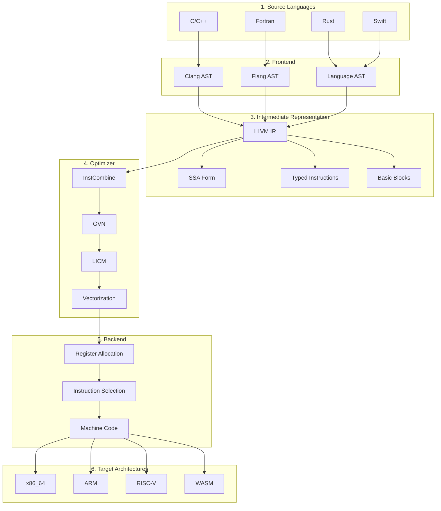

# Compiler Intermediate Representation

## Summary

An **Intermediate Representation (IR)** is any data structure or code format that sits between source language and target machine code. It is the central artifact that makes modern compiler engineering tractable by decoupling frontend parsing from backend code generation, enabling both retargetable compilers and machine-independent optimizations.

## Key Points

- **Definition**: A representation "between" source and machine language — not necessarily a programming language, but a data structure (AST, tuple-based code, or stack-based bytecode)
- **Purpose**: Breaks the compilation problem into manageable pieces; decouples frontend and backend so N frontends can share M backends via a common IR
- **Core Properties**:
  - **Simplicity**: Easy to generate, manipulate, and optimize
  - **Source/Target Independence**: General enough to serve a whole family of compilers
  - **Freedom of Expression**: Supports the full range of source language constructs
- **Abstraction Levels**:
  - **High-Level**: Close to source; preserves arrays, structs, procedure calls — useful for memory disambiguation
  - **Medium-Level**: Machine-independent; strips structured objects but retains operations
  - **Low-Level**: Close to hardware; maps one-to-one with machine instructions
- **Architectural Flavors**:
  - **Tuple-Based**: Instruction-like objects with operator and operands (registers, variables, temporaries). Assumes unlimited temporaries. Used by LLVM IR, GCC GIMPLE.
  - **Stack-Based**: Push/pop operands from a stack. Examples: JVM bytecode, Pascal PCODE.

## LLVM IR Specifics

LLVM IR is a **well-specified, SSA-based tuple IR** that serves as the universal optimization target:

- **SSA Foundation**: Every variable is assigned exactly once, simplifying data-flow analysis
- **Type Simplification**: All arguments reduced to machine-word size; arrays/structs represented by base addresses with offset calculations
- **Dual Compilation**: Supports both **JIT** (Just-In-Time) and **AOT** (Ahead-Of-Time) compilation
- **Universal Format**: Frontends (Clang, Flang) emit LLVM IR; a single optimization pipeline runs before any backend generates target code
- **Hardware Independence**: Same IR can target x86, ARM, RISC-V, WASM, and GPUs

## Design Considerations

| Aspect | Approach | LLVM Choice |
|--------|----------|-------------|
| **SSA** | Yes / No | Yes — simplifies analysis |
| **Control Flow** | Structured / Unstructured | Unstructured — explicit basic blocks and branches |
| **Typing** | Typed / Typeless | Strongly typed — every value has a type |
| **Level** | High / Mid / Low | Low-to-mid — close to machine but still portable |

## Connections

- **Questions this raises**: How does LLVM IR's SSA form compare to GCC's GIMPLE? What are the trade-offs between tuple-based and stack-based IRs for JIT compilation?
- **Related to**: [[LLVM Modular Compiler Infrastructure]], [[MLIR Multi-Level Intermediate Representation]], [[SSA Form]], [[Compiler Design]]
- **Applies to**: Building new programming languages, writing compiler backends, understanding JIT/AOT trade-offs
- **Contrast with**: JVM bytecode (stack-based, higher-level), GCC RTL (register-transfer level, target-specific)

## Source

- Extracted from NotebookLM query of llvm.org documentation
- LinkedIn: "What Is an Intermediate Representation, Really?" — Compilers Lab
- Data current as of May 2026

## Visual Summary

