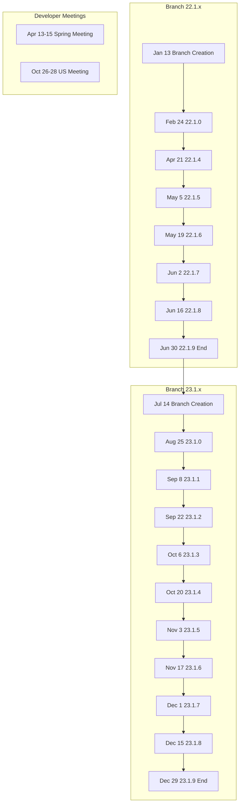

# LLVM 2026 Release Roadmap

## Summary

LLVM maintains a highly active bi-weekly release schedule throughout 2026, split between the **22.1.x branch** (first half) and the **23.1.x branch** (second half). This predictable cadence enables downstream projects to plan integration cycles while ensuring regular bug fixes and feature updates reach the ecosystem.

## Key Points

- **Bi-weekly Tuesday releases** — strict, predictable schedule across both branches
- **22.1.x cycle** — January through June 2026, concluding with 22.1.9
- **23.1.x cycle** — July through December 2026, beginning with 23.1.0 on August 25
- **Release candidates** — 3 RCs before each major version (22.1.0 and 23.1.0)
- **Developer meetings** — Spring (April) and Fall (October) gatherings

## Details

### Branch 22.1.x — First Half 2026

| Version | Date | Status |
|---------|------|--------|
| Branch creation | January 13, 2026 | ✅ Complete |
| 22.1.0 | February 24, 2026 | ✅ Complete |
| 22.1.4 | April 21, 2026 | ✅ Complete (current as of extraction) |
| 22.1.5 | May 5, 2026 | 📅 Scheduled |
| 22.1.6 | May 19, 2026 | 📅 Scheduled |
| 22.1.7 | June 2, 2026 | 📅 Scheduled |
| 22.1.8 | June 16, 2026 | 📅 Scheduled |
| 22.1.9 | June 30, 2026 | 📅 Scheduled (end of cycle, if necessary) |

### Branch 23.1.x — Second Half 2026

| Milestone | Date | Status |
|-----------|------|--------|
| Branch creation | July 14, 2026 | 📅 Scheduled |
| Release candidates | July–August 2026 | 📅 3 RCs planned |
| 23.1.0 | August 25, 2026 | 📅 Scheduled |
| 23.1.1 | September 8, 2026 | 📅 Scheduled |
| 23.1.2 | September 22, 2026 | 📅 Scheduled |
| 23.1.3 | October 6, 2026 | 📅 Scheduled |
| 23.1.4 | October 20, 2026 | 📅 Scheduled |
| 23.1.5 | November 3, 2026 | 📅 Scheduled |
| 23.1.6 | November 17, 2026 | 📅 Scheduled |
| 23.1.7 | December 1, 2026 | 📅 Scheduled |
| 23.1.8 | December 15, 2026 | 📅 Scheduled |
| 23.1.9 | December 29, 2026 | 📅 Scheduled (end of 2026 roadmap, if necessary) |

### Developer Meetings

- **Spring 2026 Developer Meeting** — April 13–15, 2026 ✅ Held
- **US LLVM Developer Meeting** — October 26–28, 2026 📅 Scheduled

## Connections

- **Questions this raises**: How do downstream distributions (Linux distros, language compilers) align their release cycles with LLVM's bi-weekly schedule? What is the typical migration lag for major LLVM versions in production systems?
- **Related to**: [[LLVM - Modular Compiler Infrastructure]], [[Software Release Management]], [[Open Source Governance]]
- **Applies to**: Planning compiler upgrades, tracking LLVM feature availability, scheduling CI/CD updates for LLVM-dependent projects
- **Contrast with**: GCC's annual release cycle, Rust's 6-week train model, Linux kernel's time-based releases

## Source

- Extracted from NotebookLM query of llvm.org documentation
- Data current as of April 2026

## Visual Summary

