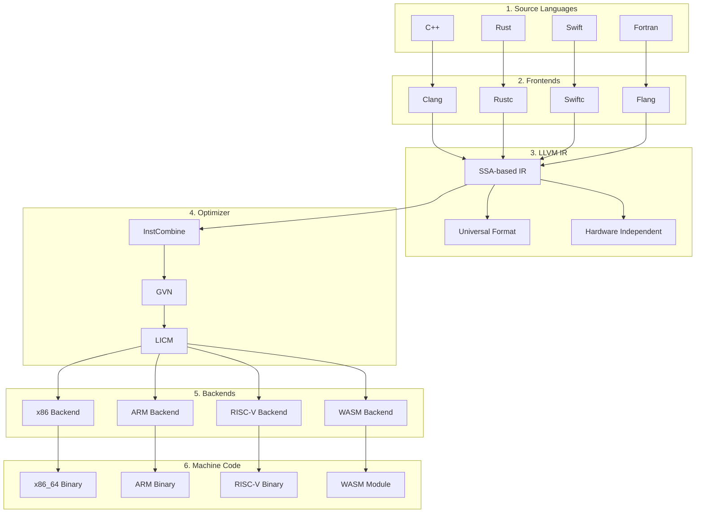

# LLVM IR Relationship

## Summary

LLVM uses **Intermediate Representation (IR)** as a universal middleman — a single format that all source languages compile into, and all machine architectures compile from. This eliminates the combinatorial explosion of needing a separate compiler for every language-hardware combination.

## Key Points

- **The N×M Problem**: Without IR, N languages × M architectures = N×M compilers needed
- **The LLVM Solution**: N frontends + 1 IR + M backends = far less engineering
- **Real-world analogy**: LLVM IR is like a universal electrical outlet — your coffee maker (Clang/C++), toaster (Rust), and blender (Swift) all plug into the same outlet, which connects to US grids, European grids, or battery packs (different CPUs)
- **SSA Foundation**: LLVM IR uses Static Single Assignment form where every variable is assigned exactly once, making optimization straightforward

## How It Works

1. **Frontend** (Clang, Flang, etc.) translates your source code → LLVM IR
2. **Optimizer** cleans up and speeds up the LLVM IR (machine-independent)
3. **Backend** translates LLVM IR → machine code for any target (x86, ARM, RISC-V, WASM)

This means:
- A new programming language only needs one frontend that "speaks" LLVM IR
- A new CPU architecture only needs one backend that reads LLVM IR
- Optimizations are written once and benefit all languages

## Connections

- **Questions this raises**: What are the trade-offs between tuple-based IR (LLVM) and stack-based IR (JVM)? How does SSA form simplify data-flow analysis?
- **Related to**: [[Compiler Intermediate Representation]], [[LLVM Modular Compiler Infrastructure]], [[MLIR Multi-Level Intermediate Representation]]
- **Applies to**: Understanding why LLVM dominates modern compiler infrastructure, evaluating compiler backends for new languages
- **Contrast with**: Direct compilation (GCC pre-modularization), stack-based VMs (JVM, .NET CLR)

## Source

- Synthesized from explanation provided during LLVM knowledge extraction workflow
- Data current as of May 2026

## Visual Summary

