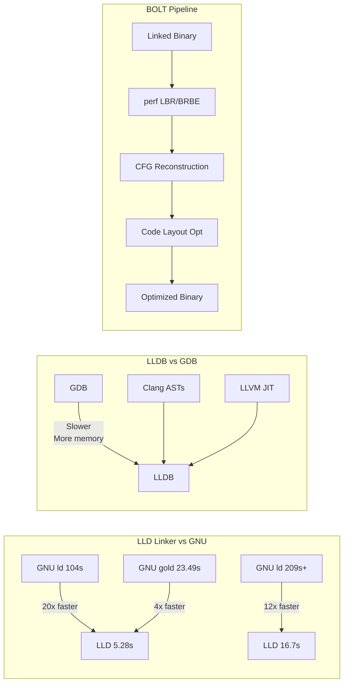

# LLVM Toolchain Performance Benchmarks

## Summary

**LLVM's developer tools significantly outperform GNU alternatives** through modern architecture, aggressive parallelization, and profile-guided optimization. The LLD linker demonstrates **20x speedups** over GNU ld on large codebases, while LLDB leverages LLVM's Clang infrastructure for superior debugging performance, and BOLT enables post-link optimization using hardware branch profiling.

## Key Points

- **LLD (Linker)**: Drop-in GNU linker replacement achieving **>2x faster** performance than GNU gold on multicore machines — with even more dramatic gains over GNU ld
  * Debug build of Clang: GNU ld=104s, GNU gold=23.49s, **LLD=5.28s** (~20x faster than ld)
  * Chromium debug build: GNU ld=209s+, **LLD=16.7s** (~12x faster)
- **LLDB (Debugger)**: Next-gen native debugger built on LLVM components — "blazing fast and much more memory-efficient than GDB when loading symbols"
  * Uses **Clang ASTs**, expression parser, LLVM JIT, and disassembler (no reimplementation)
  * Converts debug info directly into Clang types
  * Optimized for complex multi-line expressions and ABI details
- **BOLT (Post-Link Optimizer)**: Speeds up execution time of large applications by optimizing code layout based on **real-world execution profiles**
  * Requires binaries linked with `--emit-relocs` (relocations intact)
  * Needs unstripped symbol table
  * Disassembles **X86-64** or **AArch64 ELF** binaries
  * Reconstructs Control Flow Graph (CFG)
  * Uses hardware branch profiling: **LBR** (Last Branch Record) on X86, **BRBE** (Branch Record Buffer Extension) on AArch64
  * Organizes code layout based on branch execution data

## Details

### Why LLD Is So Much Faster

LLD achieves its speedup through:
- **Parallel symbol resolution**: Aggressive multithreading during the linking process
- **Modern data structures**: Optimized internal representations that reduce memory overhead
- **Incremental linking support**: Faster rebuilds in development workflows
- **ELF/MachO/PE support**: Universal linker across platforms (not just Linux)

### LLDB's Architectural Advantage

Unlike GDB, which implements its own type system and expression evaluator, LLDB reuses LLVM's mature infrastructure:
- **Single source of truth**: Debug info maps directly to Clang AST nodes — no translation layer
- **JIT compilation**: Expressions evaluated in the debugger use the same LLVM JIT that powers Clang
- **Better C++ support**: Template instantiation and complex type handling are inherited from Clang's parser

### BOLT's Profile-Given Optimization Pipeline

BOLT operates after linking (post-link) which enables optimizations that LTO cannot perform:

1. **Profile collection**: Run binary under `perf` to capture branch traces (LBR/BRBE)
2. **CFG reconstruction**: Disassemble binary and rebuild control flow graph
3. **Layout optimization**: Reorder basic blocks to minimize branch mispredictions and improve I-cache locality
4. **Binary emission**: Rewrite optimized binary while preserving relocations

## Connections

- **Questions this raises**: What are the trade-offs of using `--emit-relocs` for BOLT? How does BOLT compare to Propeller (Google's newer post-link optimizer)? Can LLDB's reliance on Clang limit debugging of non-Clang compiled binaries?
- **Related to**: [[Link-Time Optimization (LTO)]], [[Profile-Guided Optimization (PGO)]], [[Compiler Performance Engineering]], [[Binary Optimization]]
- **Applies to**: Large-scale C++ development (Chromium, Clang, Firefox), CI/CD pipeline optimization, high-frequency trading systems, game engine builds
- **Contrast with**: GNU binutils (ld, gold, gdb), Microsoft Linker, Propeller

## Source

Distilled from LLVM tooling performance data — technical benchmarks and architecture descriptions for LLD, LLDB, and BOLT sub-projects.

## Visual Summary

