# Kernel Memory Access: BCC vs Python-BPF vs libbpf CO-RE

## Definition

Three distinct approaches to safely read kernel memory structures in eBPF programs, each with different trade-offs in portability, performance, and developer experience:

- **libbpf CO-RE**: Uses `BPF_CORE_READ` macro with BTF relocations for Compile Once – Run Everywhere
- **BCC**: Uses Clang AST rewriting (`ProbeVisitor`) to automatically convert struct member accesses into `bpf_probe_read_kernel()` calls at runtime
- **Python-BPF**: Uses explicit `probe_read()` helper functions that generate LLVM IR through llvmlite

---

## 1. libbpf CO-RE: BPF_CORE_READ

### How It Works

`BPF_CORE_READ` is a macro defined in `<bpf/bpf_core_read.h>` that expands to multiple `bpf_core_read()` calls with BTF relocation records. During program loading, libbpf patches field offsets based on the target kernel's BTF data.

### Code Example: Reading struct request Fields

```c
#include "vmlinux.h"
#include <bpf/bpf_helpers.h>
#include <bpf/bpf_core_read.h>

SEC("kprobe/blk_mq_start_request")
int example(struct pt_regs *ctx)
{
    struct request *req = (struct request *)(ctx->di);
    
    // CO-RE read with BTF relocation
    unsigned int timeout = BPF_CORE_READ(req, timeout);
    unsigned int data_len = BPF_CORE_READ(req, __data_len);
    
    bpf_printk("timeout=%u data_len=%u\n", timeout, data_len);
    return 0;
}
```

### Nested Struct Access

```c
struct sock *sk = ...;

// Nested field access through multiple structs
u16 family = BPF_CORE_READ(sk, __sk_common.skc_family);
u32 daddr = BPF_CORE_READ(sk, __sk_common.skc_daddr);

// The macro expands to multiple bpf_core_read() calls with
// BTF relocation records for each field offset
```

### Advantages

- **Portable**: Compiled once, runs on any kernel with BTF support
- **No runtime compilation**: Pre-compiled object files
- **Type-safe**: BTF provides kernel structure layout information
- **Performance**: No runtime compilation overhead

---

## 2. BCC: Clang AST Rewriting

### How It Works

BCC uses a `ProbeVisitor` class (defined in `src/cc/frontends/clang/b_frontend_action.cc`) that traverses the Clang AST during compilation. It automatically rewrites struct member accesses (`->` and `.`) into `bpf_probe_read_kernel()` calls.

### ProbeVisitor Implementation

The key method is `VisitMemberExpr()` at line 577:

```cpp
bool ProbeVisitor::VisitMemberExpr(MemberExpr *E) {
  // Track visited members to avoid double-rewriting
  if (memb_visited_.find(E) != memb_visited_.end()) return true;
  
  // Walk up the member expression chain
  for (MemberExpr *M = E; M; M = dyn_cast<MemberExpr>(M->getBase())) {
    memb_visited_.insert(M);
    if (M->isArrow()) {
      found = true;
      break;
    }
  }
  
  // Check if the base expression needs probe rewriting
  if (!ProbeChecker(base, ptregs_, track_helpers_).needs_probe())
    return true;
  
  // Generate the probe read wrapper
  string pre, post;
  pre = "({ typeof(" + E->getType().getAsString() + ") _val; "
        "__builtin_memset(&_val, 0, sizeof(_val));";
  
  if (cannot_fall_back_safely)
    pre += " bpf_probe_read_kernel(&_val, sizeof(_val), (void *)&";
  else
    pre += " bpf_probe_read(&_val, sizeof(_val), (void *)&";
  
  post = rhs + "); _val; })";
  
  // Rewrite the expression
  rewriter_.InsertText(expansionLoc(GET_BEGINLOC(E)), pre);
  rewriter_.ReplaceText(expansionRange(SourceRange(member, GET_ENDLOC(E))), post);
  return true;
}
```

### What BCC Rewrites

**User writes:**
```c
u16 family = sk->__sk_common.skc_family;
```

**BCC generates:**
```c
u16 family = ({ typeof(u16) _val; 
  __builtin_memset(&_val, 0, sizeof(_val));
  bpf_probe_read_kernel(&_val, sizeof(_val), 
    (void *)&sk->__sk_common.skc_family); 
  _val; 
});
```

### Automatic Array Subscript Rewriting

`VisitArraySubscriptExpr()` at line 641 handles array accesses:

```cpp
bool ProbeVisitor::VisitArraySubscriptExpr(ArraySubscriptExpr *E) {
  // Similar logic: wraps array access in bpf_probe_read_kernel
  // ...
}
```

### Example: BCC Tool with Automatic Rewriting

```python
from bcc import BPF

program = """
#include <net/sock.h>

int trace_tcp(struct pt_regs *ctx) {
    struct sock *sk = (struct sock *)PT_REGS_PARM1(ctx);
    
    // BCC automatically rewrites these:
    u16 family = sk->__sk_common.skc_family;
    u32 daddr = sk->__sk_common.skc_daddr;
    
    bpf_printk("family=%u daddr=%u\\n", family, daddr);
    return 0;
}
"""

b = BPF(text=program)
```

### Manual Fallback for Complex Cases

When automatic rewriting fails (e.g., IPv6 nested unions):

```c
// Manual bpf_probe_read_kernel for complex structures
bpf_probe_read_kernel(&data6.saddr, sizeof(data6.saddr),
    sk->__sk_common.skc_v6_rcv_saddr.in6_u.u6_addr32);
```

### Trade-offs

- ✅ **Developer-friendly**: Write natural C struct access
- ✅ **Automatic**: No manual probe_read calls needed
- ❌ **Runtime compilation**: Requires Clang on target machine
- ❌ **Kernel headers needed**: Must match target kernel exactly
- ❌ **Startup overhead**: ~94% of init time in C++ backend (per py-spy)

---

## 3. Python-BPF: Explicit LLVM IR Generation

### How It Works

Python-BPF provides explicit helper functions (`probe_read`, `probe_read_kernel`) that generate LLVM IR through llvmlite. The `vmlinux_parser` module handles struct field access by emitting `bpf_probe_read_kernel` calls with calculated offsets.

### probe_read Helper Implementation

From `pythonbpf/helper/helpers.py`:

```python
def probe_read(dst, size, src):
    """Safely read data from kernel memory"""
    return ctypes.c_int64(0)  # Type stub for compilation
```

### LLVM IR Emission

From `pythonbpf/helper/bpf_helper_handler.py` (lines 583-607):

```python
def emit_probe_read_kernel_call(builder, dst_ptr, dst_size, src_ptr):
    """Emit LLVM IR call to bpf_probe_read_kernel"""
    
    # Define function type: i64 (i8*, i32, i8*)
    fn_type = ir.FunctionType(
        ir.IntType(64),                           # return: i64
        [ir.PointerType(), ir.IntType(32), ir.PointerType()],  # args
        var_arg=False,
    )
    
    # Get function pointer from helper ID
    fn_ptr = builder.inttoptr(
        ir.Constant(ir.IntType(64), 
                    BPFHelperID.BPF_PROBE_READ_KERNEL.value),
        ir.PointerType(fn_type),
    )
    
    # Emit the call
    result = builder.call(
        fn_ptr,
        [
            builder.bitcast(dst_ptr, ir.PointerType()),   # dst
            ir.Constant(ir.IntType(32), dst_size),        # size
            builder.bitcast(src_ptr, ir.PointerType()),   # src
        ],
        tail=False,
    )
    
    return result
```

### Struct Field Access via vmlinux_parser

From `pythonbpf/vmlinux_parser/vmlinux_exports_handler.py` (lines 140-169):

```python
def load_struct_field(builder, struct_ptr_int, offset_global, field_data,
                      struct_name=None, local_sym_tab=None, tmp_name=None):
    """
    Generate LLVM IR to load a field from a kernel struct 
    using bpf_probe_read_kernel.
    """
    
    # Load the offset value from global (BTF-based)
    offset = builder.load(offset_global)
    
    # Convert i64 to pointer type
    i8_ptr_type = ir.PointerType(ir.IntType(8))
    struct_ptr = builder.inttoptr(struct_ptr_int, i8_ptr_type)
    
    # Calculate field address: struct_ptr + offset
    field_ptr = builder.gep(struct_ptr, [offset])
    
    # Allocate temporary storage for the read
    field_type = field_data['type']
    tmp_alloca = builder.alloca(field_type, name=tmp_name)
    
    # Emit bpf_probe_read_kernel call
    emit_probe_read_kernel_call(
        builder, 
        tmp_alloca, 
        field_data['size'], 
        field_ptr
    )
    
    # Load the value from temporary storage
    return builder.load(tmp_alloca)
```

### Python-BPF Example: Using probe_read

```python
from pythonbpf import bpf, section, bpfglobal, struct
from ctypes import c_void_p, c_int64, c_uint64, c_uint32
from pythonbpf.helper import probe_read

@struct
class data_t:
    pid: c_uint32
    value: c_uint64

@bpf
@section("tracepoint/syscalls/sys_enter_execve")
def test_probe_read(ctx: c_void_p) -> c_int64:
    """Test bpf_probe_read helper function"""
    data = data_t()
    
    # Explicit probe_read with size parameter
    probe_read(data.value, 8, ctx)   # Read 8 bytes from ctx
    probe_read(data.pid, 4, ctx)      # Read 4 bytes from ctx
    
    return 0
```

### Generated LLVM IR

The `probe_read(data.value, 8, ctx)` call generates:

```llvm
; Allocate temporary storage
%data_value = alloca i64

; Get pointer to data.value field
%field_ptr = getelementptr %data_t, %data_t* %data, i32 0, i32 1

; Bitcast for bpf_probe_read_kernel
%dst = bitcast i64* %field_ptr to i8*
%src = bitcast i8* %ctx to i8*

; Call bpf_probe_read_kernel
%result = call i64 @llvm.bpf.pseudo(i64 113, i64 4)  ; helper ID 4
```

### Trade-offs

- ✅ **Ahead-of-time compilation**: No runtime compilation overhead
- ✅ **Portable object files**: Distribute compiled .o files
- ✅ **Explicit control**: Developer sees exactly what's happening
- ❌ **Manual**: Must explicitly call probe_read helpers
- ❌ **Development complexity**: Need to understand IR generation
- ❌ **Limited**: No automatic struct field access like BCC (see [[Python-BPF Compiler Limitations]])

---

## 4. Side-by-Side Comparison

### Reading a Nested Struct Field

**Scenario**: Read `sk->__sk_common.skc_family` from a `struct sock *`

#### libbpf CO-RE
```c
struct sock *sk = ...;
u16 family = BPF_CORE_READ(sk, __sk_common.skc_family);
```
**Mechanism**: Macro expands to BTF relocation records; libbpf patches offsets at load time.

#### BCC
```c
struct sock *sk = ...;
u16 family = sk->__sk_common.skc_family;  // BCC rewrites automatically
```
**Mechanism**: `ProbeVisitor::VisitMemberExpr()` rewrites to `bpf_probe_read_kernel()` during compilation.

#### Python-BPF
```python
from pythonbpf.helper import probe_read

# Manual: Must explicitly read with size
family = c_uint16()
probe_read(family, 2, sk)  # Read 2 bytes from sk pointer
```
**Mechanism**: `emit_probe_read_kernel_call()` generates LLVM IR for `bpf_probe_read_kernel`.

---

## 5. Architecture Comparison

```mermaid
graph TD
    subgraph "libbpf CO-RE"
        A1[C Source<br/>BPF_CORE_READ] --> B1[Clang Compile<br/>Ahead-of-Time]
        B1 --> C1[BPF Object<br/>with BTF Relocs]
        C1 --> D1[libbpf Loader<br/>Patch Offsets]
        D1 --> E1[Kernel Execution]
    end
    
    subgraph "BCC"
        A2[Python Script<br/>C String] --> B2[BCC ProbeVisitor<br/>AST Rewriting]
        B2 --> C2[Clang Compile<br/>Runtime]
        C2 --> D2[BPF Bytecode<br/>probe_read injected]
        D2 --> E2[Kernel Execution]
    end
    
    subgraph "Python-BPF"
        A3[Python Decorators<br/>@bpf @section] --> B3[AST Parser]
        B3 --> C3[LLVM IR Gen<br/>llvmlite]
        C3 --> D3[BPF Object<br/>Explicit Helpers]
        D3 --> E3[Kernel Execution]
    end
    
    style B2 fill:#f5a623
    style C3 fill:#4a90e2
    style D1 fill:#7ed321
```



### Comparison Table

| Feature | libbpf CO-RE | BCC | Python-BPF |
|---------|--------------|-----|------------|
| **Mechanism** | BTF Relocations | AST Rewriting | Explicit Helpers |
| **Compile Time** | Ahead-of-Time | Runtime | Ahead-of-Time |
| **Kernel Headers** | Not required | Required on target | Not required |
| **Portability** | High (BTF-based) | Low (header dependency) | High (IR generation) |
| **Syntax** | Macro (`BPF_CORE_READ`) | Transparent (`sk->field`) | Helper (`probe_read()`) |
| **Complex Fields** | Nested macro support | Auto + manual fallback | Explicit IR gen |
| **Startup Overhead** | Load-time only | Runtime compile (~94%) | Load-time only |
| **Object Distribution** | Pre-compiled .o | Source-only | Pre-compiled .o |
| **LLVM IR Control** | None | None | Full control |

---

## 6. Concrete Examples from Repositories

### libbpf CO-RE: disksnoop.bpf.c

From `tests/c-form/disksnoop.bpf.c`:

```c
SEC("kprobe/blk_mq_end_request")
int trace_completion(struct pt_regs *ctx)
{
    __u64 reqp = (__u64)(ctx->di);
    
    // CO-RE reads from struct request
    __u32 data_len = BPF_CORE_READ((struct request *)reqp, __data_len);
    __u32 cmd_flags = BPF_CORE_READ((struct request *)reqp, cmd_flags);
    
    bpf_printk("%u %x\\n", data_len, cmd_flags);
    return 0;
}
```

### BCC: tcpstates.py

From `tools/tcpstates.py`:

```c
// BCC automatically rewrites these:
u16 family = sk->__sk_common.skc_family;
data4.saddr = sk->__sk_common.skc_rcv_saddr;
data4.daddr = sk->__sk_common.skc_daddr;

// For IPv6 (manual fallback needed):
bpf_probe_read_kernel(&data6.saddr, sizeof(data6.saddr),
    sk->__sk_common.skc_v6_rcv_saddr.in6_u.u6_addr32);
```

### Python-BPF: probe_read test

From `tests/passing_tests/helpers/bpf_probe_read.py`:

```python
@bpf
@section("tracepoint/syscalls/sys_enter_execve")
def test_probe_read(ctx: c_void_p) -> c_int64:
    data = data_t()
    probe_read(data.value, 8, ctx)  # Explicit size parameter
    probe_read(data.pid, 4, ctx)
    return 0
```

---

## Related Notes

**Python-BPF Specific:**
- [[PythonBPF]] — Main overview and architecture
- [[Python-BPF Compiler Limitations]] — Array subscript limitation affects ctx.args[]
- [[Architecture]] — Detailed pipeline breakdown

**BCC Specific:**
- [[BCC]] — BCC architecture and runtime compilation
- [[py-spy BCC Flame Graph Analysis]] — BCC execution profiling
- [[py-spy BCC vs Python-BPF Deep Analysis]] — Detailed comparison

**libbpf/CO-RE:**
- [[eBPF CO-RE Overview]] — Compile Once – Run Everywhere methodology

**Comparisons:**
- [[BCC vs Python-BPF Benchmark Plan]] — Performance benchmarking methodology
- [[BCC vs Python-BPF bpf_printk Comparison]] — Side-by-side code comparison

**Infrastructure:**
- [[LLVM MOC]] — LLVM compiler infrastructure
- [[eBPF MOC]] — Parent MOC for all eBPF knowledge
