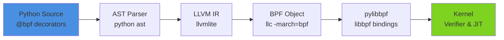

# PythonBPF & pylibbpf

## Summary

**PythonBPF** is an LLVM IR generator that enables writing eBPF programs in pure Python, compiling them to kernel-loadable object files via llvmlite, and executing them through **pylibbpf** bindings. Together they form a complete pipeline from Python source code to kernel execution without embedded C strings or runtime compilation.

> **Status**: Under active development, not production-ready.

---

## Architecture Pipeline



**Detailed architecture**: See [[Architecture]] for the full 6-step pipeline breakdown.

---

## 1. PythonBPF (Code Generation)

### Definition
An LLVM IR generator for eBPF programs written in Python. Uses decorators to define BPF constructs in native Python syntax.

### Key Components

**Decorators:**
- `@bpf` — Marks BPF functions
- `@map` — Defines BPF maps (HashMap, Array, etc.)
- `@section("tracepoint/...")` — Attaches to kernel hooks
- `@bpfglobal` — Global definitions (LICENSE, etc.)
- `@struct` — BPF struct definitions

**Core Pipeline** (from `codegen.py`):
1. Parse Python source to AST
2. Process through multiple passes:
   - vmlinux parsing
   - license processing
   - globals processing
   - struct processing
   - map processing
   - function processing
3. Generate LLVM IR with DWARF 5 debug info
4. Compile to BPF object file via `llc`

**Key Features:**
- Maps: HashMap, Array, PerfEventArray, RingBuf
- Helpers: `pid()`, `ktime_get_ns()`, `bpf_get_current_pid_tgid()`
- Type system: Python type annotations with ctypes

### Dependencies

**System:**
- `bpftool`
- `clang`
- Python ≥ 3.10

**Python:**
- `llvmlite>=0.45`
- `astpretty`
- `pylibbpf`

---

## 2. pylibbpf (Execution)

### Definition
Python bindings for libbpf on Linux. The execution companion to PythonBPF — handles object file loading, map initialization, program attachment, and user-space data polling.

### Architecture
- **C++ core** with pybind11 bindings
- **Static linking** against libbpf (built from submodule)
- **Pythonic wrappers** for map-specific operations

**Core Components** (C++ backend):
- `bpf_object.cpp` — Object loading via libbpf
- `bpf_program.cpp` — Program management
- `bpf_map.cpp` — Map operations
- `perf_event_array.cpp` — High-performance event streaming
- `struct_parser.cpp` — Struct parsing for PythonBPF compatibility

**Python API:**
- `BpfObject` — Main entry point for loading BPF objects (with automatic struct conversion)
- `BpfProgram` — Individual BPF program within an object
- `BpfMap` — Hash maps, arrays, and other BPF maps
- `PerfEventArray` — Event streaming with callbacks
- `StructParser` — Parse struct definitions

### Dependencies

**System:**
- C++ compiler (C++11+)
- CMake ≥ 4.1
- Ninja or Pip 10+
- `libelf-dev`

**Python:**
- Python ≥ 3.12
- `llvmlite>=0.40.0`

---

## Installation

### Quick Install (PyPI)

```bash
# System dependencies (Ubuntu/Debian)
sudo apt-get install bpftool clang libelf-dev

# Python packages
pip install pythonbpf pylibbpf
```

### Development Install (Source)

```bash
# PythonBPF
git clone https://github.com/pythonbpf/python-bpf.git
cd python-bpf
pip install -e .

# pylibbpf (requires recursive clone for submodules)
git clone --recursive https://github.com/pythonbpf/pylibbpf.git
cd pylibbpf
sudo apt install libelf-dev
pip install -e .
```

### Post-Install Setup

Generate `vmlinux.py` for your kernel:

```bash
# From PythonBPF repo
sudo tools/vmlinux-gen.py
cp vmlinux.py BCC-Examples/
```

> **Platform-specific setup**: See [[PythonBPF Setup]] for OpenSUSE and other environment-specific instructions.

---

## Design Rationale

**Why Python-driven LLVM IR generation over BCC?**

| Aspect | PythonBPF | BCC |
|--------|-----------|-----|
| **Language** | Pure Python | C embedded in Python strings |
| **Compilation** | Ahead-of-time (AOT) | Runtime (JIT) |
| **Tooling** | Full IDE support, type checking | Limited, string-based |
| **Dependencies** | llvmlite + clang | Full LLVM/Clang toolchain |
| **Portability** | Compiled object files | Requires headers on target |
| **Debug Info** | DWARF 5 with source maps | Basic |
| **Visibility** | Pure Python pipeline (transparent) | C compilation via Clang (black box) |

**Why pylibbpf over bcc-python?**
- Direct libbpf bindings (same as CO-RE tools)
- Smaller dependency footprint
- Faster loading (no runtime compilation)
- Better integration with modern eBPF toolchain

**Key Insight**: PythonBPF spends ~27% of execution time in pure-Python AST translation, while BCC spends ~94% in C compilation via Clang ([[py-spy BCC vs Python-BPF Deep Analysis]]).

---

## Quickstart Example

```python
from pythonbpf import bpf, section, bpfglobal, BPF
from pythonbpf.helper import pid
from ctypes import c_void_p, c_int64

@bpf
@section("tracepoint/syscalls/sys_enter_clone")
def hello(ctx: c_void_p) -> c_int64:
    process_id = pid()
    print(f"Clone syscall from PID: {process_id}")
    return 0

@bpf
@bpfglobal
def LICENSE() -> str:
    return "GPL"

# Compile and load
b = BPF()
b.load_and_attach()
```

---

## Related Notes

**Setup & Installation:**
- [[PythonBPF Setup]] — Platform-specific installation (OpenSUSE, etc.)

**Architecture & Internals:**
- [[Architecture]] — Detailed 6-step pipeline breakdown
- [[Python-BPF Compiler Limitations]] — Known AST→IR gaps and limitations

**Debugging & Development:**
- [[Python-BPF bpf_printk]] — Using print() as bpf_printk, trace_pipe reading
- [[BCC vs Python-BPF bpf_printk Comparison]] — Side-by-side code comparison

**Performance & Benchmarks:**
- [[BCC vs Python-BPF Benchmark Plan]] — Two-phase performance benchmark
- [[py-spy Flame Graph Analysis]] — Python-BPF execution profiling
- [[py-spy BCC vs Python-BPF Deep Analysis]] — BCC 93.98% C++ vs Python-BPF 27% AST

**Related Topics:**
- [[eBPF MOC]] — Parent MOC for all eBPF knowledge
- [[BCC eBPF]] — BPF Compiler Collection
- [[LLVM MOC]] — LLVM compiler infrastructure
- [[eBPF CO-RE Overview]] — Compile Once – Run Everywhere
