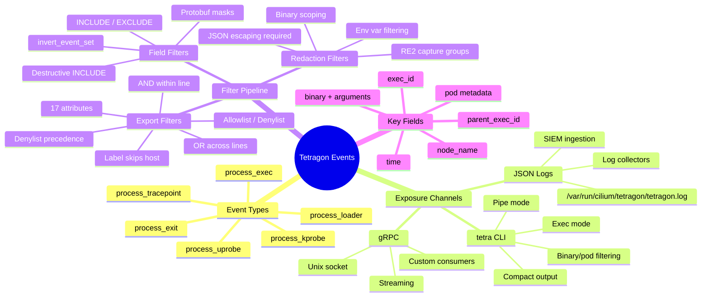

> **Source:** [Tetragon Events — tetragon.io](https://tetragon.io/docs/concepts/events/) · Processed via [[Open Notebook]]

# Tetragon Events

## Identity

Tetragon's **event system** is the primary data plane through which all security-relevant kernel activity surfaces to userspace. Every [[eBPF (extended Berkeley Packet Filter)|eBPF]] hook — process lifecycle, tracing policies, system call interception — emits structured events carrying **full [[Kubernetes]] identity** (namespace, pod, container, labels, workload) embedded directly in the payload. No post-hoc correlation required.

Default event types: **`process_exec`** and **`process_exit`**. [[Tetragon Overview|Tracing Policies]] append additional data fields to the `process_exec` block when their hooks fire.

> [!note] Cluster-Unique `exec_id`
> Every process execution receives a **cluster-unique `exec_id`** — a base64-encoded identifier enabling cross-node process lineage tracing without external state.

## Event Exposure Methods

| Channel | Consumer | Use Case |
|---------|----------|----------|
| **JSON logs** | Log collectors (Fluentd, Filebeat) | Batch export, SIEM ingestion |
| **`tetra` CLI** | Operators, debugging | Pretty-printed, filtered, interactive |
| **gRPC** | Custom applications, streaming pipelines | Real-time programmatic consumption |

Default JSON log path: **`/var/run/cilium/tetragon/tetragon.log`** (auto-rotated and compressed).

> [!note] gRPC vs JSON
> **gRPC streaming** → real-time consumers, custom applications, low-latency pipelines. **JSON log export** → log collectors, SIEM ingestion, batch processing. Both carry identical event payloads — choice is transport, not content.

## The `process_exec` Event

### Structure

Each `process_exec` event nests two process blocks — **`process`** (the executed binary) and **`parent`** (the caller) — wrapped with node-level metadata.

### Key Fields

| Field | Description |
|-------|-------------|
| `exec_id` | Cluster-unique base64 identifier for this execution |
| `pid` | Process ID |
| `uid` | User ID (0 = root) |
| `binary` | Absolute path to executed binary |
| `arguments` | Full argument string |
| `flags` | Exec flags (`execve`, `rootcwd`, etc.) |
| `start_time` | Nanosecond-precision RFC 3339 timestamp |
| `auid` | Audit UID (`4294967295` = unset) |
| `pod.namespace` | [[Kubernetes]] namespace |
| `pod.name` | Pod name |
| `pod.container.id` | Container runtime ID (`containerd://...`) |
| `pod.container.name` | Container name within pod |
| `pod.container.image` | Image ID and name |
| `pod.pod_labels` | Full label set |
| `pod.workload` | Workload name (Deployment/StatefulSet/etc.) |
| `docker` | Short container ID |
| `parent_exec_id` | Parent process's `exec_id` (lineage chain) |
| `node_name` | Cluster node hostname |
| `time` | Event emission timestamp |

### JSON Example

```json
{
  "process_exec": {
    "process": {
      "exec_id": "Z2tlLWpvaG4tNjMyLWRlZmF1bHQtcG9vbC03MDQxY2FjMC05czk1OjEzNTQ4Njc0MzIxMzczOjUyNjk5",
      "pid": 52699,
      "uid": 0,
      "cwd": "/",
      "binary": "/usr/bin/curl",
      "arguments": "https://ebpf.io/applications/#tetragon",
      "flags": "execve rootcwd",
      "start_time": "2023-10-06T22:03:57.700327580Z",
      "auid": 4294967295,
      "pod": {
        "namespace": "default",
        "name": "xwing",
        "container": {
          "id": "containerd://551e161c47d8ff0eb665438a7bcd5b4e3ef5a297282b40a92b7c77d6bd168eb3",
          "name": "spaceship",
          "image": {
            "id": "docker.io/tgraf/netperf@sha256:8e86f744bfea165fd4ce68caa05abc96500f40130b857773186401926af7e9e6",
            "name": "docker.io/tgraf/netperf:latest"
          },
          "start_time": "2023-10-06T21:52:41Z",
          "pid": 49
        },
        "pod_labels": {
          "app.kubernetes.io/name": "xwing",
          "class": "xwing",
          "org": "alliance"
        },
        "workload": "xwing"
      },
      "docker": "551e161c47d8ff0eb665438a7bcd5b4",
      "parent_exec_id": "Z2tlLWpvaG4tNjMyLWRlZmF1bHQtcG9vbC03MDQxY2FjMC05czk1OjEzNTQ4NjcwODgzMjk5OjUyNjk5",
      "tid": 52699
    },
    "parent": {
      "exec_id": "Z2tlLWpvaG4tNjMyLWRlZmF1bHQtcG9vbC03MDQxY2FjMC05czk1OjEzNTQ4NjcwODgzMjk5OjUyNjk5",
      "pid": 52699,
      "uid": 0,
      "cwd": "/",
      "binary": "/bin/bash",
      "arguments": "-c \"curl https://ebpf.io/applications/#tetragon\"",
      "flags": "execve rootcwd clone",
      "start_time": "2023-10-06T22:03:57.696889812Z",
      "auid": 4294967295,
      "pod": {
        "namespace": "default",
        "name": "xwing",
        "container": {
          "id": "containerd://551e161c47d8ff0eb665438a7bcd5b4e3ef5a297282b40a92b7c77d6bd168eb3",
          "name": "spaceship",
          "image": {
            "id": "docker.io/tgraf/netperf@sha256:8e86f744bfea165fd4ce68caa05abc96500f40130b857773186401926af7e9e6",
            "name": "docker.io/tgraf/netperf:latest"
          },
          "start_time": "2023-10-06T21:52:41Z",
          "pid": 49
        },
        "pod_labels": {
          "app.kubernetes.io/name": "xwing",
          "class": "xwing",
          "org": "alliance"
        },
        "workload": "xwing"
      },
      "docker": "551e161c47d8ff0eb665438a7bcd5b4",
      "parent_exec_id": "Z2tlLWpvaG4tNjMyLWRlZmF1bHQtcG9vbC03MDQxY2FjMC05czk1OjEzNTQ4NjQ1MjQ1ODM5OjUyNjg5",
      "tid": 52699
    }
  },
  "node_name": "gke-john-632-default-pool-7041cac0-9s95",
  "time": "2023-10-06T22:03:57.700326678Z"
}
```

## Three-Layer Filter Pipeline

Tetragon applies three filter stages **sequentially** to exported events. Each layer narrows the output further.

```
Raw Events → [Export Filters] → [Field Filters] → [Redaction Filters] → Output
```

### Layer 1: Export Filters (Allowlist / Denylist)

**Purpose:** Control *which events* leave Tetragon entirely.

**Format:** Line-separated JSON objects. Logic: **OR across lines**, **AND within a line**.

**Precedence rules:**
- **Allowlist** → default-deny (only matching events pass)
- **Denylist overrides allowlist** — denylist match always drops the event, even if allowlist also matched
- If no filters configured → **all events exported**
- If only allowlist configured → **default-deny** for all other events

> [!warning] Critical Edge Cases
> - **Label filters never match host processes** — events without a `pod` field have no labels to match against; filter silently skips them
> - **`in_init_tree`** catches processes *not* descending from container init (e.g., `kubectl exec` injections); detects external tampering
> - Export filters **only apply to JSON file exports** — gRPC streams and `tetra` CLI output are unfiltered by these rules

#### Filter Attributes

| Attribute | Description |
|-----------|-------------|
| `event_set` | Event types: `PROCESS_EXEC`, `PROCESS_EXIT`, `PROCESS_KPROBE`, `PROCESS_UPROBE`, `PROCESS_TRACEPOINT`, `PROCESS_LOADER` |
| `binary_regex` | RE2 regex on binary path (e.g., `"^/home/kubernetes/bin/kubelet$"`) |
| `health_check` | Match [[Kubernetes]] liveness/readiness probe commands |
| `namespace` | K8s pod namespaces; `""` matches host processes (no namespace) |
| `pid` | Filter by process PID |
| `pid_set` | PID + all descendant processes |
| `pod_regex` | RE2 regex on pod name |
| `arguments_regex` | RE2 regex on process arguments |
| `labels` | K8s label selector syntax |
| `policy_names` | Filter by tracing policy names |
| `capabilities` | Linux process capability |
| `cel_expression` | CEL expressions (IP/CIDR extensions from k8s project) |
| `parent_binary_regex` | RE2 regex on parent process binary |
| `parent_arguments_regex` | RE2 regex on parent process arguments |
| `container_id` | RE2 regex on `process.docker` container ID |
| `in_init_tree` | Boolean — processes NOT descending from container init process |
| `ancestor_binary_regex` | RE2 regex on any ancestor binary in process tree |

#### Export Filter Example

```json
{"event_set": ["PROCESS_EXEC", "PROCESS_EXIT"], "namespace": ["foo"]}
{"event_set": ["PROCESS_KPROBE"]}
```

> [!info] Logical Evaluation
> Line 1: (`PROCESS_EXEC` OR `PROCESS_EXIT`) AND namespace `foo` — **OR** — Line 2: any `PROCESS_KPROBE` regardless of namespace.

### Layer 2: Field Filters (Protobuf Field Masks)

**Purpose:** Control *which fields* appear in exported events.

**Format:** Protobuf field mask paths period-separated (`.`), comma-concatenated (`,`), with `INCLUDE` or `EXCLUDE` actions.

**Semantics:**
- **`INCLUDE`** → default-deny for that event type (only listed fields emitted; all others dropped)
- **`EXCLUDE`** → default-allow (listed fields stripped from otherwise full export)
- `invert_event_set: true` applies the filter to all event types *except* those listed
- Each field filter scoped via optional `event_set` key

> [!warning] INCLUDE is Destructive
> Applying `INCLUDE` with `"fields":"process.binary"` to `PROCESS_EXEC` means **only** `process.binary` survives — all other fields (exec_id, pid, arguments, pod metadata, parent) are **dropped**.

#### Field Filter Example

```json
{"fields":"process.exec_id,process.parent_exec_id", "event_set": ["PROCESS_EXEC"], "invert_event_set": true, "action": "INCLUDE"}
```

> This includes only `exec_id` and `parent_exec_id` for all event types **except** `PROCESS_EXEC`.

### Layer 3: Redaction Filters (RE2 Capture Groups)

**Purpose:** Mask **sensitive data** in process arguments and environment variables before export.

**Mechanism:** RE2 regex with **capture groups** — captured text replaced with `"*****"`. Non-captured regex text is preserved.

**Scoping:** Optional `binary_regex` restricts redaction to specific binaries.

**Environment variables:** `--filter-environment-variables VAR1[,VAR2...]` limits env var exposure to a named allowlist.

#### Redact passwords from any binary

```json
{"redact": ["--password(?:\\s+|=)(\\S*)"]}
```

> `"--password=foo"` → `"--password=*****"`

#### Redact binary-specific shorthand flag

```json
{"binary_regex": ["(?:^|/)foo$"], "redact": ["-p(?:\\s+|=)(\\S*)"]}
```

#### Redact SSHPASS environment variable

```json
{"redact": ["(?:SSHPASS=)+(\\S+)"]}
```

> `"SSHPASS=password"` → `"SSHPASS=*****"`

> [!warning] JSON Escaping Required
> When writing RE2 regex in JSON, escape backslash characters. `\Wpasswd\W?` → `"\\Wpasswd\\W?"`. Use the [RE2 syntax guide](https://github.com/google/re2/wiki/Syntax).

## `tetra` CLI

The **`tetra`** CLI pretty-prints events with color-coded, compact output. Supports filtering by process name and pod.

### Stream raw JSON from Tetragon export container

```shell
kubectl logs -n kube-system -l app.kubernetes.io/name=tetragon -c export-stdout -f
```

### Pipe JSON through tetra (compact output)

```shell
kubectl logs -n kube-system -l app.kubernetes.io/name=tetragon -c export-stdout -f | tetra getevents -o compact
```

### Exec tetra inside Tetragon container (direct gRPC)

```shell
kubectl exec -it -n kube-system ds/tetragon -c tetragon -- tetra getevents -o compact
```

### Filter by binary and pod

```shell
kubectl logs -n kube-system -l app.kubernetes.io/name=tetragon -c export-stdout -f | tetra getevents -o compact --processes curl --pod xwing
```

### Compact Output Format

```
🚀 process default/xwing /usr/bin/curl https://ebpf.io/applications/#tetragon
💥 exit    default/xwing /usr/bin/curl https://ebpf.io/applications/#tetragon 60
```

> [!tip] Two Modes
> **Pipe mode** (`kubectl logs \| tetra`) reads JSON from stdout — log-collector-compatible. **Exec mode** (`kubectl exec -- tetra`) connects directly to the gRPC socket inside the container — lower latency, no log rotation gaps.

## gRPC Endpoint

Tetragon exposes a **gRPC streaming endpoint** for programmatic event consumption.

**Default socket:** **`unix:///var/run/tetragon/tetragon.sock`** (Unix domain socket)

### Enable via Helm

```shell
helm install tetragon cilium/tetragon -n kube-system --set tetragon.grpc.enabled=true --set tetragon.grpc.address=localhost:54321
```

The address can be reconfigured with `--server-address` flag or disabled completely with `tetragon.grpc.enabled=false`.

### Client consumption

```shell
kubectl exec -ti -n kube-system ds/tetragon -c tetragon -- tetra getevents -o compact
```

## Critical Technical Takeaways

- **Cluster-unique `exec_id`** enables cross-node process lineage tracing without external state or correlation engines — trace `parent_exec_id` chains across nodes
- **Three-layer filter pipeline** (Export → Field → Redaction) provides progressive noise reduction: *which events* → *which fields* → *what's masked*
- **Denylist overrides allowlist** — enforces least-privilege export posture; you cannot accidentally export what you explicitly denied
- **Kubernetes identity embedded in events** — namespace, pod, container, labels, workload arrive pre-correlated; no join against the K8s API needed for security analysis
- **`in_init_tree` filter** detects `kubectl exec`, `docker exec`, and similar injections by catching processes not descending from container PID 1
- **Label filters silently skip host processes** — events without a `pod` field never match label-based filters (design constraint, not a bug)
- **RE2 capture groups** in redaction filters — only the captured group is replaced with `"*****"`, preserving surrounding context and argument structure
- **Field filter INCLUDE is destructive** — applying INCLUDE to an event type drops ALL non-listed fields for that type; verify before deploying
- **`cel_expression`** filter supports IP/CIDR extensions for network-aware event filtering without custom code
- **gRPC and JSON carry identical payloads** — choice is transport, not content; use gRPC for real-time, JSON for batch/archival
- **Export filters only apply to JSON file exports** — gRPC streams and `tetra` CLI output bypass export filters entirely; use `tetra` flags for runtime filtering
- **Redaction operates post-export-filtering** — sensitive data in denied events never reaches the redaction stage, reducing attack surface on the filter pipeline itself

## Connections

- [[Tetragon Overview]] — parent entity: architecture, threat model, policy lifecycle
- [[eBPF (extended Berkeley Packet Filter)]] — underlying technology enabling in-kernel event generation
- [[Kubernetes]] — identity context embedded in every event (pod, namespace, labels, workload)
- [[gRPC]] — streaming transport for real-time event consumption
- [[Cilium]] — parent ecosystem sharing eBPF-first architecture

## Architecture Mindmap


