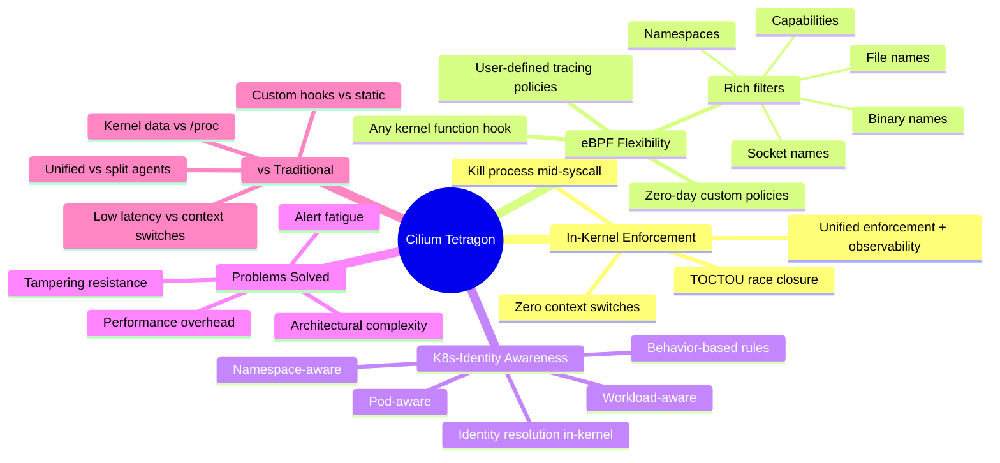

> **Source:** [Tetragon Overview — tetragon.io](https://tetragon.io/docs/overview/) · Processed via [[Open Notebook]]

# Cilium Tetragon

## Identity

**Cilium Tetragon** is a real-time, [[eBPF (extended Berkeley Packet Filter)|eBPF]]-based **security observability and runtime enforcement** tool for Linux and [[Kubernetes]] environments. It detects and reacts to security-significant events — **process executions**, **system calls**, and **I/O activity** (network and file access) — with full Kubernetes-identity awareness (namespaces, pods, workloads).

Tetragon solves three failures of traditional security tooling:

1. **Performance Overhead** — user-space context switches eliminated for high-frequency events
2. **Tampering & Data Integrity** — hooks deeper than syscalls, immune to userspace manipulation
3. **Alert Fatigue** — kernel-level filtering surfaces only high-fidelity incidents

The entire policy lifecycle (filtering, blocking, reaction) executes **in-kernel via eBPF**. No userspace agent handles decision-making. Tetragon unifies runtime enforcement and observability into a single kernel-level operation.

Developed by a team that includes **kernel developers**, ensuring robust eBPF program design.

## Three Architecture Pillars

### eBPF Real-Time

- **In-kernel filtering, blocking, and enforcement** — zero user-space context switches
- Optimized for **high-frequency events**: `send`, `read`, `write` operations inspected without latency penalty
- Can **kill a process mid-syscall** before a privilege-escalation operation completes
- Closes **TOCTOU (Time-of-Check-to-Time-of-Use) race conditions** via temporal dominance
- Enforcement latency budget compatible with security inspection at scale

### eBPF Flexibility

- Hooks into **any Linux kernel function** — not limited to syscall entry/exit points
- Filters on **arguments**, **return values**, and **process metadata** (executable names, binary paths)
- Rich filter primitives: **file names**, **socket names**, **binary names**, **namespaces**, **capabilities**
- **Tracing policies are fully user-defined** — no specific kernel functions or filters hard-coded in the engine
- Decouples threat detection from vendor roadmaps; write custom policy for **zero-day** response immediately
- **Noise reduction at source** — kernel-level filtering prevents alert fatigue by surfacing only high-fidelity incidents

### eBPF Kernel Aware

- Merges **kernel state** with **Kubernetes metadata** in real time
- **Kubernetes-identity-aware**: understands Namespaces, Pods, Workloads — asks "Which Pod is doing this?" before "Should this be permitted?"
- Enforces rules **before the kernel call returns** — identity resolution concurrent with event processing
- Shifts from **perimeter defense to intrinsic behavior-based enforcement** — rules tied to Deployment/ServiceAccount, not PID/IP
- Joins kernel state with user policy to react to **privilege changes** instantly (alert or kill before syscall completes)

## Traditional Tools vs Tetragon

| Feature             | Traditional                                                               | Tetragon                                                       |
| ------------------- | ------------------------------------------------------------------------- | -------------------------------------------------------------- |
| **Data Source**     | Userspace `/proc` or syscall interception                                 | Direct kernel data from eBPF hook                              |
| **Tampering Risk**  | High — vulnerable to userspace manipulation, incorrect reads, page faults | Low — authoritative, unspoofable kernel-observed data          |
| **Architecture**    | Separate detection agent + prevention agent                               | Unified: enforcement + observability in same eBPF program      |
| **Latency**         | High — context switches between kernel and userspace                      | Low — kernel-based filtering and enforcement                   |
| **Flexibility**     | Static hooks, fixed syscall interception points                           | Custom eBPF policies hooking any kernel function               |
| **K8s Awareness**   | Post-hoc correlation via external metadata                                | Native identity resolution in-kernel at event time             |
| **Audit Integrity** | Timestamp skew between separate agents                                    | Irrefutable — enforcement + observability from same hook point |

## Critical Technical Takeaways

- **In-kernel enforcement eliminates the userspace decision layer** — no context switch, no agent, no latency tax on every syscall
- **Deep kernel hooking closes the semantic gap** — observes implementation internals, not just the syscall interface (intermediate state, internal logic)
- **Tamper resistance is architectural, not procedural** — kernel observing itself bypasses userspace manipulation, incorrect `/proc` reads, attacker alterations, and page fault errors
- **Temporal dominance**: kill process mid-syscall before operation completes; closes TOCTOU race conditions that multi-stage attacks exploit
- **Arbitrary hooking democratizes kernel introspection** — once exclusive to kernel developers, now available via user-defined tracing policies
- **K8s-identity-aware enforcement** creates a native workload identity firewall at the syscall layer
- **Architectural consolidation**: single agent unifies enforcement + observability — eliminates separate Falco + AppArmor stacks
- **Scalable always-on visibility**: monitor every exec, file access, and network operation without prohibitive latency
- **Irrefutable audit trail**: enforcement and observability originate from the same eBPF hook point — no timestamp skew between detection and prevention
- **Engine agnosticism**: detection logic decoupled from vendor release cycles; custom eBPF policies for novel threats deploy independently

## Connections

- Built on [[eBPF (extended Berkeley Packet Filter)]] — the programmable kernel data plane enabling in-kernel security logic
- Part of the [[Cilium]] ecosystem — shares eBPF-first architecture with Cilium's networking and security layers
- Complements [[Kubernetes]] security primitives (NetworkPolicy, PodSecurity) with **syscall-level** enforcement
- Alternative to traditional runtime security: [[Falco]], AppArmor, SELinux — replaces userspace agents with kernel-native enforcement
- Related to [[Linux Kernel]] internals — hooks arbitrary kernel functions beyond syscall boundaries
- Connects to **zero-trust architecture** — behavior-based enforcement at the most granular observable layer

> [!note] No Code or Command Blocks
> The Tetragon overview page is conceptual and architectural. It contains no code examples, CLI commands, or configuration snippets. Practical usage details are in the [Getting Started](https://tetragon.io/docs/getting-started/) and [Concepts](https://tetragon.io/docs/concepts/) documentation.

## Architecture Mindmap

