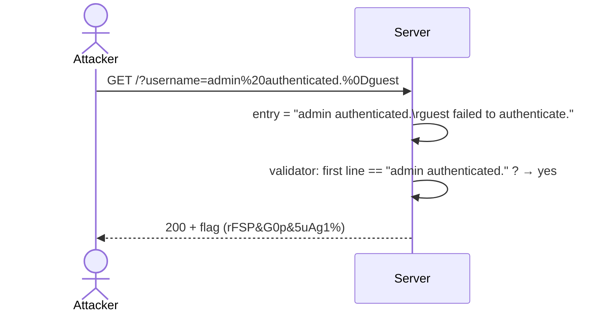

# CRLF Injection (HTTP-CRLF)

> [!map]+ TL;DR
> Server reflects `username` into a log line and validates it as a *line*. A CR (`%0D`) or LF (`%0A`) in the value ends the line early — `admin%20authenticated.%0Dguest` renders as `admin authenticated.` on line one, `guest` on line two. The validator only checks the first line → authentication "passes". Solved live on [Root-Me web-serveur ch14](http://challenge01.root-me.org/web-serveur/ch14/).

## bug

The app builds a log entry `{username} failed to authenticate.` and then checks whether that entry's **first line** equals `admin authenticated.`. User input is concatenated raw — no filtering of CR/LF. Inject a line break after the expected text and the check sees only what you put before the break:

- entry: `admin authenticated.` + `\r` + `guest failed to authenticate.`
- first line: `admin authenticated.` → valid → flag.

The trailing `guest` is decoy: it lands on line two as a normal failed attempt, so the log looks innocent.

## Vulnerable code (faithful reconstruction)

```python
LOG = ["admin failed to authenticate.", "admin authenticated.", "guest failed to authenticate."]

@app.get("/")
def index():
    username = request.args.get("username", "")
    entry = f"{username} failed to authenticate."      # raw interpolation — no CR/LF filtering
    LOG.append(entry)
    if entry.splitlines()[0] == "admin authenticated.":  # first-line validator
        return render_template("index.html", log=LOG, flag=FLAG)
    return render_template("index.html", log=LOG)
```

`str.splitlines()` splits on `\r`, `\n`, and `\r\n` — which is exactly why all three probes worked. `guest%0Dadmin authenticated.` fails because the first line is `guest`. One-line fix:

```python
username = request.args.get("username", "").replace("\r", "").replace("\n", "")
```

Same mechanism in PHP:

```php
$log = ["admin failed to authenticate.", "admin authenticated.", "guest failed to authenticate."];

if (isset($_GET['username'])) {
    $username = $_GET['username'];
    $entry = "$username failed to authenticate.";          // raw interpolation — no CR/LF filtering
    $log[] = $entry;
    if (strtok($entry, "\r\n") === "admin authenticated.") { // first-line validator
        echo $flag;
    }
}
```

`strtok($entry, "\r\n")` cuts the first line at CR **or** LF (consecutive delimiters collapse, so CRLF works) — same behavior as Python's `splitlines()`. One-line fix:

```php
$username = str_replace(["\r", "\n"], "", $_GET['username']);
```

## Attack flow



## Spotting it

> [!PUZZLE]- Test pattern
> 1. Find a reflected value (here: `username` echoed into a log `<pre>`).
> 2. Append `%0D`, `%0A`, or `%0D%0A` + your line — does the response split into two lines?
> 3. Probe the validator: wrong first line (`guest%0Dadmin authenticated.`) → fails; junk after the break (`admin authenticated.%0Dxxx`) → passes = first-line check.
> 4. CR and LF both work here — the "CRLF" name covers the pair.

## Where it shows up

Anywhere user input is reflected into an HTTP message: response bodies (logs, `<pre>`, textareas) and — worse — **headers** (response splitting: inject `\r\nHeader: value` to forge headers, set cookies, or smuggle body content). Filter/strip `\r` and `\n` from all reflected input; encode for context (HTML-encode body, CRLF-strip headers).

## Verified behavior (2026-08-14)

> [!INFO]- Live probes
> | payload | result |
> |---|---|
> | `admin authenticated.%0Dguest` | flag ✓ (CR) |
> | `admin authenticated.%0Aguest` | flag ✓ (LF) |
> | `admin authenticated.%0D%0Aguest` | flag ✓ (CRLF) |
> | `admin authenticated.%0Dxxx` | flag ✓ (first-line match, junk ignored) |
> | `guest%0Dadmin authenticated.` | no flag ✗ (first line ≠ `admin authenticated.`) |

## Source

- [Root-Me: web-serveur ch14 — HTTP CRLF injection](http://challenge01.root-me.org/web-serveur/ch14/) — solved; password `rFSP&G0p&5uAg1%`
- [OWASP — CRLF Injection](https://owasp.org/www-community/vulnerabilities/CRLF_Injection)
- Sibling: [[Open Redirect (Improper Redirect Handling)]] — same family: attacker-controlled input reflected into an HTTP message

---

*Created from challenge context distillation by Sensemaker*
