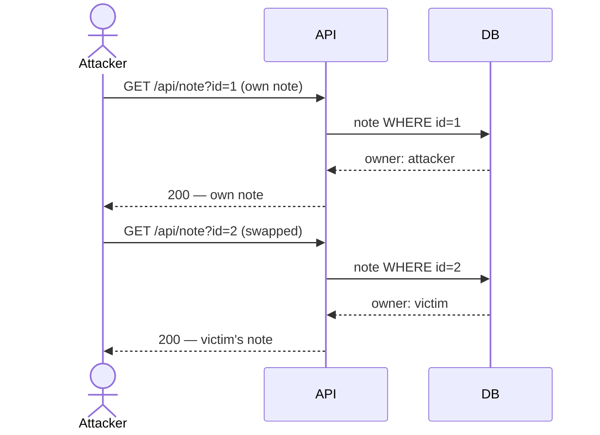

# Insecure Direct Object Reference (IDOR)

> [!map]+ TL;DR
> The server trusts a client-supplied object ID (`?user_id=3`, `/api/note/42`) without checking that the object belongs to the caller. Authentication passes; object-level authorization is missing.

## The bug

IDOR is an authorization failure, not an authentication failure. The app proves *who you are* (login) but never checks *what you may read* — it trusts the object ID you send. Swap your ID for someone else's and the server returns their data.

Why it happens: frameworks check "who may call this endpoint", not "which object may they read". The fix — verify `object.owner == current_user.id` — looks simple, but must run on *every* object-fetching endpoint. One missed endpoint is a full compromise.

## Attack flow

## Spotting it

> [!PUZZLE]- Test pattern
> 1. Register + log in; capture your own object reference.
> 2. Swap the ID for another value.
> 3. 200 with someone else's data → IDOR. 403/404 → ownership enforced.

## Where it shows up

Any place object IDs travel client → server: REST and GraphQL APIs (`GET /api/note/42`), file downloads (`/download?file=report_003.pdf`), admin panels, multi-tenant SaaS. More object endpoints = more surface; automated scanners flag IDOR constantly in large APIs.

## Connections

- **OWASP:** API Security Top 10 #1 — Broken Object Level Authorization (BOLA); also part of Broken Access Control (#1 in the Web Top 10)
- **Related:** Authentication vs Authorization — IDOR is an authorization failure
- **Applies to:** REST/GraphQL APIs, file handlers, multi-tenant platforms

## Source

- [OWASP API Security Top 10 (2023)](https://owasp.org/API-Security/) — API1:2023 Broken Object Level Authorization
- [Root-Me: API - Broken Access](https://www.root-me.org/en/Challenges/Web-Server/API-Broken-Access) — hands-on IDOR exercise via `/api/user` and `/api/note`

---

*Created from challenge context distillation by Sensemaker*
