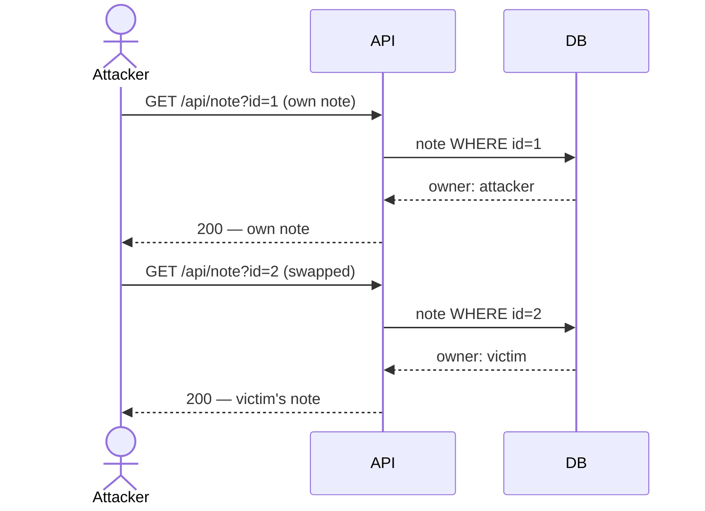
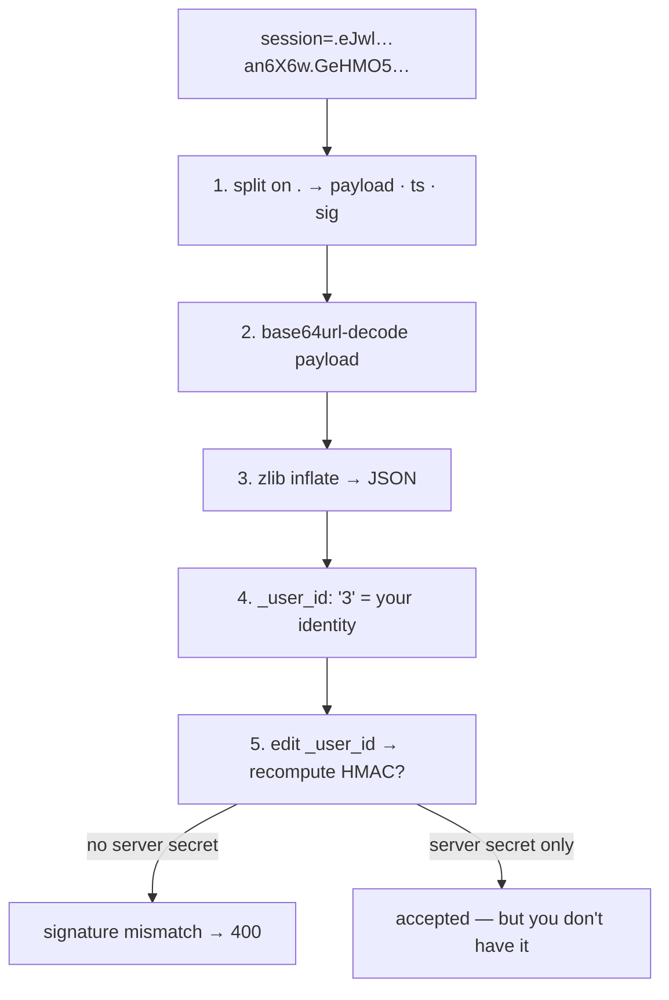

# Insecure Direct Object Reference (IDOR)

> [!map]+ TL;DR
> The server trusts a client-supplied object ID (`?user_id=3`, `/api/note/42`) without checking ownership. Authentication passes; object-level authorization is missing. Swap your ID for someone else's — server returns their data.

## The bug

IDOR is an authorization failure, not an authentication failure. The app proves *who you are* (login) but never checks *what you may read* — it trusts the ID you send.

**Why:** frameworks check "who may call this endpoint", not "which object may they read". The fix — verify `object.owner == current_user.id` — must run on *every* object-fetching endpoint. One missed endpoint is a full compromise.

## Attack flow



## Spotting it

> [!PUZZLE]- Test pattern
> 1. Register + log in; capture your own object reference.
> 2. Swap the ID for another value.
> 3. 200 with someone else's data → IDOR. 403/404 → ownership enforced.

## Where it shows up

Anywhere object IDs travel client → server: REST, GraphQL, file downloads, admin panels, multi-tenant SaaS. More object endpoints = more surface; scanners flag it constantly.

> [!Connect]- Connections
> - **Sibling:** [[Open Redirect (Improper Redirect Handling)]] — same trust boundary: server trusts client-supplied references
> - **Sibling:** [[Nginx Alias Misconfiguration (Path Traversal)]] — path-as-reference traversal, same family
> - **OWASP:** API Security Top 10 #1 — Broken Object Level Authorization (BOLA); part of Broken Access Control (#1, Web Top 10)

## Session cookie (Flask, this challenge)

Flask keeps login state in the `session=` cookie — three dot-separated base64url parts:

| # | Part | This cookie | Holds |
|---|------|-------------|-------|
| 1 | Payload | `eJwl…` | zlib-compressed JSON — readable by anyone |
| 2 | Timestamp | `an6X6w` | issue time, signed so it can't roll back |
| 3 | Signature | `GeHMO5…` | SHA-1 HMAC over parts 1+2, keyed with server secret |

> [!EXAMPLE]- Decode walkthrough
> 1. **Split on `.`** — `payload.timestamp.signature` → `eJwl…` · `an6X6w` · `GeHMO5…`
> 2. **base64url-decode part 1** — bytes start `78 9c` (zlib magic) → it's compressed
> 3. **zlib inflate** → JSON: `{"_fresh": true, "_id": "7409ba…", "_user_id": "3"}`
> 4. **Read `_user_id`** — the logged-in identity, sitting client-side in plaintext
> 5. **Verify, don't forge** — recompute HMAC; only the server's secret matches



**Working one-liner** — login request → cookie line → payload part → zlib-inflate, no manual steps:

```nu
curl -s -i -XPOST http://challenge01.root-me.org:59090/api/login -H 'Content-Type: application/json' -d '{"username": "test", "password": "test"}' | decode utf-8 | lines | find -i set-cookie | get 0 | split row ':' | get 1 | split row '.' | get 1 | str trim | python -c "import sys, base64, zlib; t = sys.stdin.read().strip(); t += '=' * (-len(t) % 4); print(zlib.decompress(base64.urlsafe_b64decode(t)))"
```

Output — the walkthrough above, verified live:

```
b'{"_fresh":true,"_id":"7409ba327c268ddd1dfcb5b60d6d0fc50f42630ae2041ad426b98b2369e53ee5824deeeb75d05d0f5455488cf5fe9b2986dca7c13483de4a91d1f6194413ecd8","_user_id":"3"}'
```

> [!WARNING]- So what
> **Signed ≠ encrypted.** Decodable by anyone, forgeable by nobody. The cookie proves *who you are* — the IDOR is *what you ask for* (`/api/user?id=4`). The readable `_user_id` still pays off: fresh account = user 3 → IDs are small sequential ints, worth enumerating.

## Source

- [OWASP API Security Top 10 (2023)](https://owasp.org/API-Security/) — API1:2023 Broken Object Level Authorization
- [Root-Me: API - Broken Access](https://www.root-me.org/en/Challenges/Web-Server/API-Broken-Access)

---

*Created from challenge context distillation by Sensemaker*
