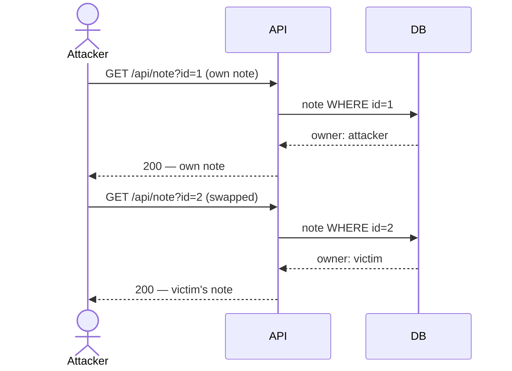

# Insecure Direct Object Reference (IDOR)

> [!map]+ TL;DR
> The server trusts a client-supplied object ID (`?user_id=3`, `/api/note/42`) without checking ownership. Authentication passes; object-level authorization is missing. Swap your ID for someone else's — server returns their data.

## The bug

IDOR is an authorization failure, not an authentication failure. The app proves *who you are* (login) but never checks *what you may read* — it trusts the ID you send.

**Why:** frameworks check "who may call this endpoint", not "which object may they read". The fix — verify `object.owner == current_user.id` — must run on *every* object-fetching endpoint. One missed endpoint is a full compromise.

## Attack flow

## Spotting it

> [!PUZZLE]- Test pattern
> 1. Register + log in; capture your own object reference.
> 2. Swap the ID for another value.
> 3. 200 with someone else's data → IDOR. 403/404 → ownership enforced.

## Where it shows up

Anywhere object IDs travel client → server: REST, GraphQL, file downloads, admin panels, multi-tenant SaaS. More object endpoints = more surface; scanners flag it constantly.

> [!Connect]- Connections
> - **Sibling:** [[Open Redirect (Improper Redirect Handling)]] — same trust boundary: server trusts client-supplied references
> - **Sibling:** [[Nginx Alias Misconfiguration (Path Traversal)]] — path-as-reference traversal, same family
> - **OWASP:** API Security Top 10 #1 — Broken Object Level Authorization (BOLA); part of Broken Access Control (#1, Web Top 10)

## Source

- [OWASP API Security Top 10 (2023)](https://owasp.org/API-Security/) — API1:2023 Broken Object Level Authorization
- [Root-Me: API - Broken Access](https://www.root-me.org/en/Challenges/Web-Server/API-Broken-Access)

---

*Created from challenge context distillation by Sensemaker*
