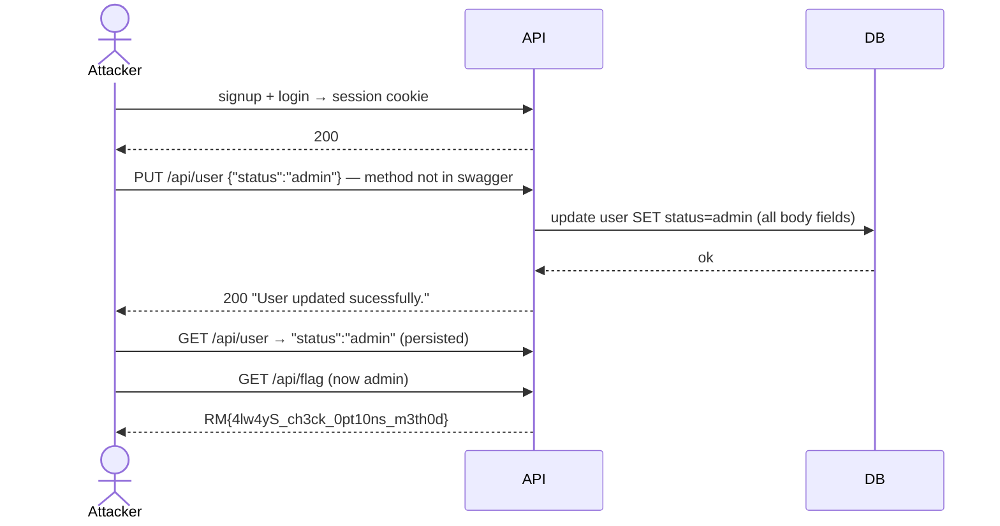
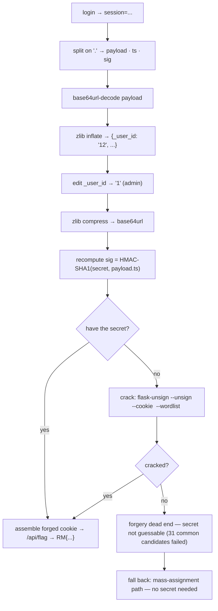

# Mass Assignment (API-Mass-Assignment)

> [!map]+ TL;DR
> Server maps the whole request body onto the user model without a field whitelist — via an **undocumented method**: swagger lists only `GET /api/user`, but `PUT /api/user` bulk-assigns every body field (`"status": "admin"` → persisted). Same API family as [[Insecure Direct Object Reference (IDOR)]] — the escalation is *server-side trust of body fields*, not a swapped object ID.

## bug

Mass assignment is the sibling of IDOR: IDOR trusts the **object ID** you send; mass assignment trusts the **field names** you send. Framework takes `request.json` and bulk-assigns every key onto the model — `{"note": "...", "status": "admin"}` sets both. The fix is a whitelist: accept only declared fields (like swagger's `NoteUpdate`), never `model.update(**body)`.

Challenge surface (v1.0, port 59090 — verified verbatim from `/static/swagger.json`): `POST /api/signup`, `POST /api/login`, `GET /api/user` (returns `{note, status, userid, username}` — `status` exists on the model), `PUT /api/note` (`{note}`), `GET /api/flag` (admin-gated). **The mass-assignment sink is `PUT /api/user`** — an undocumented method (swagger lists GET only); it accepts arbitrary body fields and writes them. `PUT /api/note` also returns 200 for extra fields but writes **only** `note` — that's why `status: admin` there never persisted. **`/api/profile` does NOT exist here**; the v2.0 lab on port 59091 (`/api/profile`, `/api/user/{user_id}`, per-user `secret`) is a different instance.

## Attack flow

> [!INFO]- Solved live (2026-08-14)
> Verified chain: `PUT /api/user {"status": "admin"}` → 200 `{"message":"User updated sucessfully."}` → `GET /api/user` → `"status":"admin"` **persisted** → `GET /api/flag` → `RM{4lw4yS_ch3ck_0pt10ns_m3th0d}` ("Hello admin"). Earlier `PUT /api/note {"status":"admin"}` also returned 200 but did **not** persist — that endpoint writes only `note`. Lessons: **200 ≠ write**, and the real sink was the method swagger never listed.

## Spotting it

> [!PUZZLE]- Test pattern
> 1. Login, capture the session cookie.
> 2. Enumerate **methods, not just paths** — `OPTIONS` / try `PUT`, `PATCH`, `DELETE` on every documented endpoint. Swagger listed only `GET /api/user`; the flag literally puns: *always check the options method*.
> 3. `PUT` a documented body → 200.
> 4. Re-send with extra fields: `status`, `role`, `isAdmin`, `userid` — all → 200?
> 5. If the server ignores unknown fields, no mass assignment. If it accepts silently, escalate.
> 6. Read back `GET /api/user` — did the extra field persist? (200 ≠ persistence; verify the field actually changed.)

> [!TIP]- Recon checklist
> Test **every endpoint** — collect the response *and* any data it returns. Test **every method with data** (`GET`, `POST`, `PUT`, `PATCH`, `DELETE`, `OPTIONS`): each can behave differently. Swagger documents the happy path, not the attack surface — `PUT /api/user` was invisible in the spec but was the whole solve.

## Where it shows up

ORM bulk-update (`User.objects.filter(...).update(**body)`, `model.update(**request.json)`), auto-binding frameworks (Rails strong params off, Laravel fillable missing, Flask/SQLAlchemy naive), admin-profile and settings endpoints. Swagger definitions are the whitelist the code should have used.

## _user_id forgery (continuation) — NOT the solve

> [!WARNING]- Dead end on this challenge
> **This flowchart was not the solving method.** The actual solve was `PUT /api/user` mass assignment (above) — no cookie forgery needed. Forgery is kept as background: the cookie is `session=.<payload>.<ts>.<sig>` — Flask itsdangerous; payload is zlib JSON holding `_user_id`; signature is SHA-1 HMAC with the server secret. Tampering `_user_id` breaks the signature → 401 (verified live). It only becomes relevant if no mass-assignment sink exists:

> [!WARNING]- Signed ≠ encrypted
> The cookie is decodable by anyone, forgeable by nobody without the secret. Tamper → signature invalid → 401 (not a 400 — server treats it as logged out). `_user_id` is client-visible but server-authoritative.

## Source

- [OWASP API Security Top 10 (2023)](https://owasp.org/API-Security/) — API8:2023 Security Misconfiguration / mass assignment family
- [PayloadsAllTheThings — Mass Assignment](https://github.com/swisskyrepo/PayloadsAllTheThings/blob/master/Mass%20Assignment/README.md)
- [Root-Me: API - Mass Assignment](https://www.root-me.org/en/Challenges/Web-Server/API-Mass-Assignment) — hands-on via `PUT /api/note` (verified live: port 59090, API v1.0)
- Continuation of: [[Insecure Direct Object Reference (IDOR)]]

---

*Created from challenge context distillation by Sensemaker*
