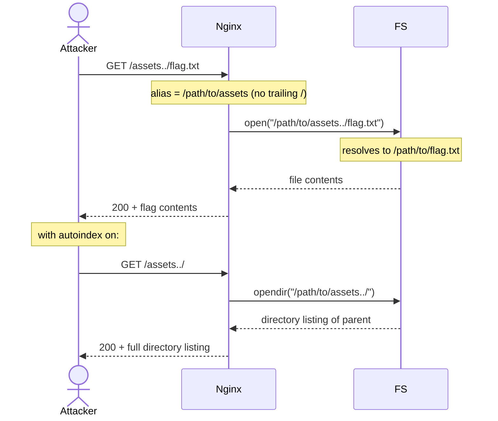

# Nginx Alias Misconfiguration (Path Traversal)

> [!map]+ TL;DR
> When `alias` in an nginx `location` block is missing a trailing slash, the URI suffix — including `..` — gets concatenated straight onto the filesystem path. A request like `GET /assets../secret.txt` resolves to `/path/to/assets../secret.txt`, letting an attacker walk up the directory tree and read arbitrary files. Fix: always put a trailing slash on the alias value.

## The bug

nginx's `alias` directive maps a URL prefix onto a filesystem path. A `location /assets/` block paired with `alias /path/to/assets;` tells nginx: strip `/assets/` from the URI and append what remains to `/path/to/assets`.

The catch: the trailing slash on the **alias value** is what tells nginx where the boundary is. Without it, nginx doesn't append its own separator — it concatenates raw. So a request to `/assets../secret.txt` becomes a filesystem lookup for `/path/to/assets../secret.txt`, which the OS resolves as `../secret.txt` relative to the assets directory. The attacker walks out of the intended root and reads anything the worker process can reach.

This is distinct from `root`, which always appends the full URI to the configured path. With `root`, `/assets/` maps to `<root>/assets/` — there's no suffix-splicing, so `..` segments get normalized before filesystem access. `alias` was designed for cases where the URL prefix and filesystem path differ, but that flexibility is exactly what creates the splice surface.

## Attack flow

## Spotting it

> [!PUZZLE]- Test pattern
> 1. **Find alias blocks.** Grep nginx configs for `alias` without a trailing `/` on the value — `alias /path/to/assets;` is the smell. (Hint: HTML comments like `<!--TODO: Patch /assets/ -->` in served pages flag the suspect endpoint.)
> 2. **Append `..` to the location prefix.** Request `GET /assets../` or `GET /assets../etc/passwd`. A 200 with unexpected content (or a directory listing) confirms the traversal.
> 3. **Check `autoindex`.** Even without traversal, directory listings expose file names. `autoindex on;` amplifies the impact.
> 4. **Verify the fix.** After adding the trailing slash (`alias /path/to/assets/;`), repeat the `..` request. nginx should return 400 or 404 — the URI segment can no longer splice into the filesystem path.

## Where it shows up

Anywhere nginx serves static files with `alias` instead of `root`: CMS asset directories, uploaded file endpoints, legacy web apps with non-standard URL-to-path mappings. The bug is config-level, not code-level, so it survives application upgrades — a deploy that changes the file tree without touching nginx.conf can silently create or expose the misconfiguration. Common in hosting panels (cPanel, Plesk) that auto-generate nginx configs for user sites, and in Docker images that template nginx.conf without auditing alias values.

## Connections

- **Sibling:** [[Open Redirect (Improper Redirect Handling)]] — both are server-side handling flaws where the server trusts client-supplied path/URL segments without sanitization; open redirect lets the attacker choose a destination, alias traversal lets them choose a source file
- **Sibling:** [[Insecure Direct Object Reference (IDOR)]] — same trust boundary family: the server trusts a client-supplied reference (object ID / path segment) without verifying it
- **Root cause family:** path normalization failures (CWE-22 — Path Traversal); nginx's `alias` splice is a specific instance of the broader class where URL-to-filesystem mapping doesn't normalize before access
- **Mitigation overlap:** use `root` instead of `alias` where possible (no suffix splicing); when `alias` is necessary, enforce trailing slash; combine with `location ~ ^/assets/` regex to reject `..` at the nginx layer before it reaches the filesystem

## Source

- [nginx — `alias` directive documentation](https://nginx.org/en/docs/http/ngx_http_core_module.html#alias) — official alias behavior and the trailing-slash requirement
- [Root-Me: Nginx — Alias Misconfiguration](https://www.root-me.org/en/Challenges/Web-Server/Nginx-Alias-Misconfiguration) — hands-on challenge demonstrating the traversal via `<!--TODO: Patch /assets/ -->` hint

---

*Created from challenge context distillation by Sensemaker*
