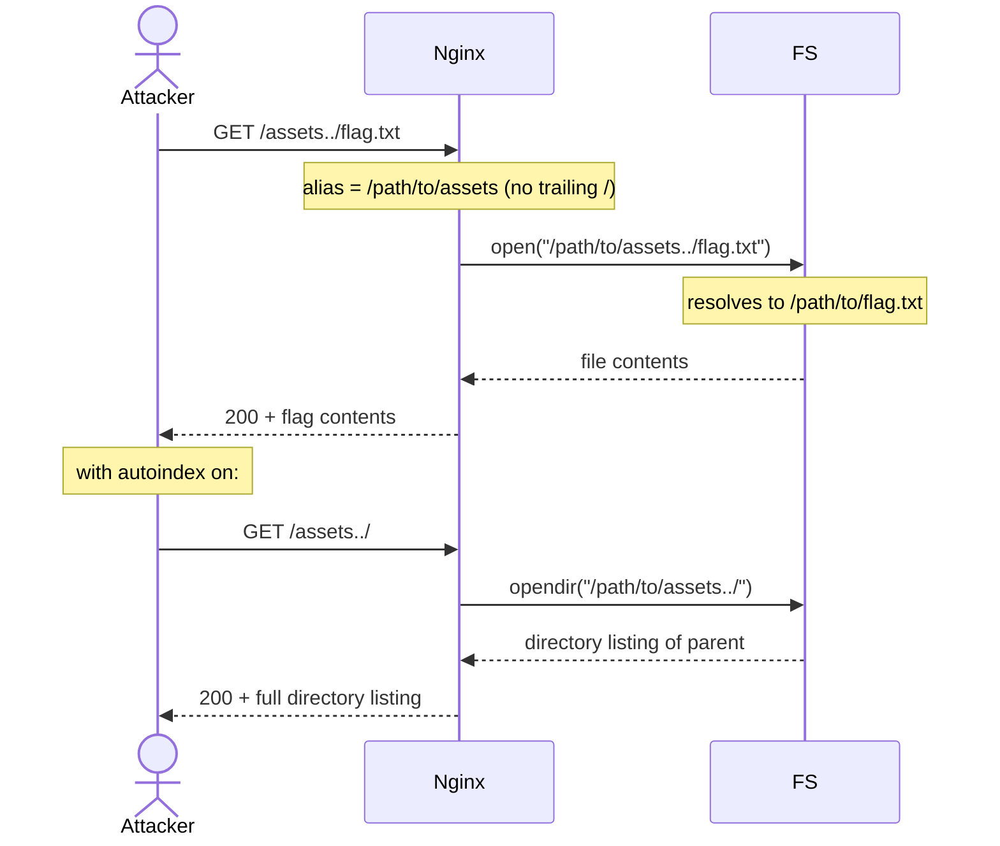

# Nginx Alias Misconfiguration (Path Traversal)

> [!map]+ TL;DR
> `alias` without a trailing slash concatenates the URI suffix — including `..` — onto the filesystem path. `GET /assets../secret.txt` resolves to `/path/to/assets../secret.txt`, walking the attacker up the tree. Fix: trailing slash on the alias value.

## The bug

`location /assets/ { alias /path/to/assets; }` strips `/assets/` and appends the rest raw. No trailing slash on the alias value → no separator → `/assets../secret.txt` becomes `/path/to/assets../secret.txt`, and the OS resolves the `..` segment.

`root` doesn't have this problem: it appends the whole URI after its path, so `..` segments get normalized first. `alias` exists for non-matching URL↔path pairs — that flexibility is the splice surface.

## Attack flow

## Spotting it

> [!Shell]- Test pattern
> 1. Grep configs for `alias` values missing the trailing `/`.
> 2. `curl -L http://host/assets../` → listing or 200 = traversal confirmed.
> 3. Check `autoindex on;` — listings amplify the leak.
> 4. After the fix, repeat → expect 400/404.

## Where it shows up

CMS asset directories, upload endpoints, legacy apps with custom URL→path maps, hosting panels and Docker images that auto-generate nginx.conf. Config-level bug — survives app upgrades untouched.

> [!Connect]- Connections
> - **Sibling:** [[Nginx Root Location Misconfiguration (Config Exposure)]] — alias splices, root misdirects; both mapping flaws
> - **Family:** CWE-22 — path traversal
> - **Fix:** trailing slash on alias; `root` instead where possible; reject `..` at the nginx layer

## Source

- [nginx — `alias` directive](https://nginx.org/en/docs/http/ngx_http_core_module.html#alias)
- [Root-Me: Nginx — Alias Misconfiguration](https://www.root-me.org/en/Challenges/Web-Server/Nginx-Alias-Misconfiguration)

---

*Created from challenge context distillation by Sensemaker*
