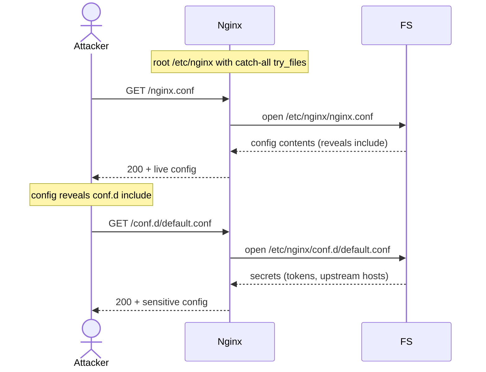

# Nginx Root Location Misconfiguration (Config Exposure)

> [!map]+ TL;DR
> `root /etc/nginx;` maps every request URI onto the config directory. `GET /nginx.conf` returns the live config; secrets in `conf.d/*` get served to anyone. Fix: `root` must point at the intended web root only.

## The bug

`root` prepends its path to the full URI. `GET /nginx.conf` + `root /etc/nginx;` → nginx serves `/etc/nginx/nginx.conf`. Straight mapping — no traversal tricks needed, the attacker just requests well-known filenames.

A catch-all `location / { try_files $uri $uri/ =404; }` serves every reachable file under that root. nginx sees a valid file in its document root → 200 with contents, no 403.

**vs alias traversal:** the alias bug is suffix-splicing (`..` escapes past a boundary). Here the path itself is wrong — a deploy-time mistake that survives because nothing breaks.

## Attack flow

## Spotting it

> [!Shell]- Test pattern
> 1. Grep nginx configs for `root` — `/etc/nginx` or any non-web-root is the smell.
> 2. `curl -L http://host/nginx.conf` → config syntax confirms exposure.
> 3. Probe `conf.d/default.conf`, `sites-enabled/default` next.
> 4. After pointing `root` at the real web root, repeat — expect 404.

## Where it shows up

Docker images that template nginx.conf, hosting panels with wrong root paths, debug shortcuts left in production, single-container setups that co-locate config and content. It survives because serving still works — just from the wrong directory.

> [!Connect]- Connections
> - **Sibling:** [[Nginx Alias Misconfiguration (Path Traversal)]] — mapping flaws: alias splices, root misdirects
> - **Family:** CWE-552 / CWE-200 — files exposed that were never meant to be web-accessible
> - **Analog:** Apache `DocumentRoot /etc`, IIS physical-path exposure
> - **Fix:** root → web root only; configs outside the web tree; `location` denies; least-privilege perms

## Source

- [nginx — `root` directive](https://nginx.org/en/docs/http/ngx_http_core_module.html#root)
- [Root-Me: Nginx — Root Location Misconfiguration](https://www.root-me.org/en/Challenges/Web-Server/Nginx-Root-Location-Misconfiguration)

---

*Created from challenge context distillation by Sensemaker*
