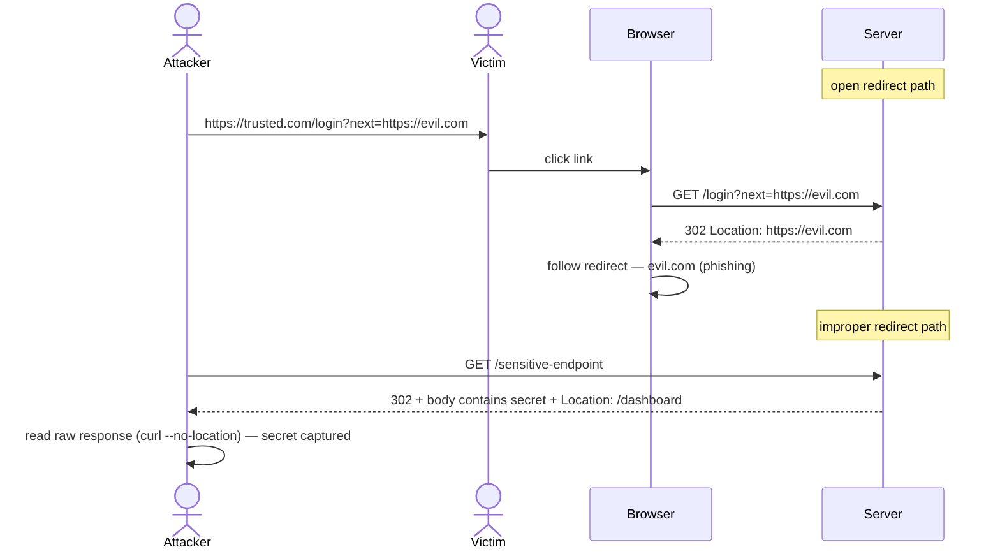

# Open Redirect (Improper Redirect Handling)

> [!map]+ TL;DR
> Two redirect failures in one family: (a) **open redirect** — the server redirects to an attacker-chosen target via unvalidated user input (`?url=`, `?next=`, `?redirect=`), enabling phishing; (b) **improper redirect handling** — the server serves the payload *in the 3xx response itself*, and any client that auto-follows (browsers, `curl -L`) never sees it. Both stem from the server trusting the client on where (or whether) to redirect.

## The bug

In an **open redirect**, the app takes a URL from the request and echoes it into the `Location` header without checking it against an allowlist. The redirect is legitimate — the server genuinely sends the user elsewhere. The problem is "elsewhere" is the attacker's choice. Users trust the original domain; the redirect silently hands that trust to a phishing page.

In **improper redirect handling**, the server embeds sensitive data in the response body of a 3xx reply, then sets a `Location` header to move on. Clients that obey `Location` automatically (browsers, `curl -L`, HTTP libraries with `follow_redirects=true`) discard the body entirely. The payload is there, visible to anything that reads the response without following the redirect.

Why it happens: frameworks treat redirects as a flow-control mechanism — "send the user over there" — not as a security boundary. Developers forget that (a) the target URL is user-influenced and (b) clients differ in how they handle 3xx bodies. Neither case requires a vulnerability in the traditional sense; it's a contract mismatch between server intent and client behavior.

## Attack flow

## Spotting it

> [!PUZZLE]- Test pattern
> 1. Identify any parameter that controls a redirect target: `?url=`, `?next=`, `?redirect=`, `?return_to=`, `?callback=`.
> 2. Replace the value with `https://evil.com`. Does the server follow it? → **open redirect**.
> 3. For hidden payloads: request the endpoint with redirect-following disabled (`curl --no-location`, `fetch` with `redirect: "manual"`, browser DevTools → "Block redirect"). Read the raw 3xx body. Sensitive data in a redirect response → **improper redirect handling**.
> 4. Check for an allowlist. Does the server validate the target domain before issuing the `Location` header? If not, that's the fix.

## Where it shows up

OAuth callback flows (`?redirect_uri=`), login/logout handlers (`?next=`), payment gateways returning to a merchant URL, SSO integrations, any endpoint that "sends the user somewhere" after an action. Improper redirect handling appears in legacy apps, internal admin tools, and any server-side flow that combines a status redirect with a response body. Both variants are common in large codebases — automated scanners flag unvalidated redirect parameters regularly (OWASP ZAP, Burp Suite).

## Connections

- **OWASP:** Top 10 2013 A10 — Unvalidated Redirects and Forwards; no standalone slot in 2021, but the pattern still shows up in assessments
- **Sibling:** [[Insecure Direct Object Reference (IDOR)]] — both are authorization-adjacent failures where the server trusts client input without validation
- **Related:** OAuth `redirect_uri` validation, SSRF (redirect as a pivot to internal services)

## Source

- [OWASP — URL Redirector Abuse](https://cheatsheetseries.owasp.org/cheatsheets/URL_Redirector_Abuse_Cheat_Sheet.html) — open redirect patterns and mitigations
- [OWASP Top 10 (2021)](https://owasp.org/Top10/) — redirect abuse in the context of broken access control
- [Root-Me: HTTP - Improper redirect](https://www.root-me.org/en/Challenges/Web-Server/HTTP-Improper-redirect) — hands-on exercise; payload in pre-redirect response

---

*Created from challenge context distillation by Sensemaker*
