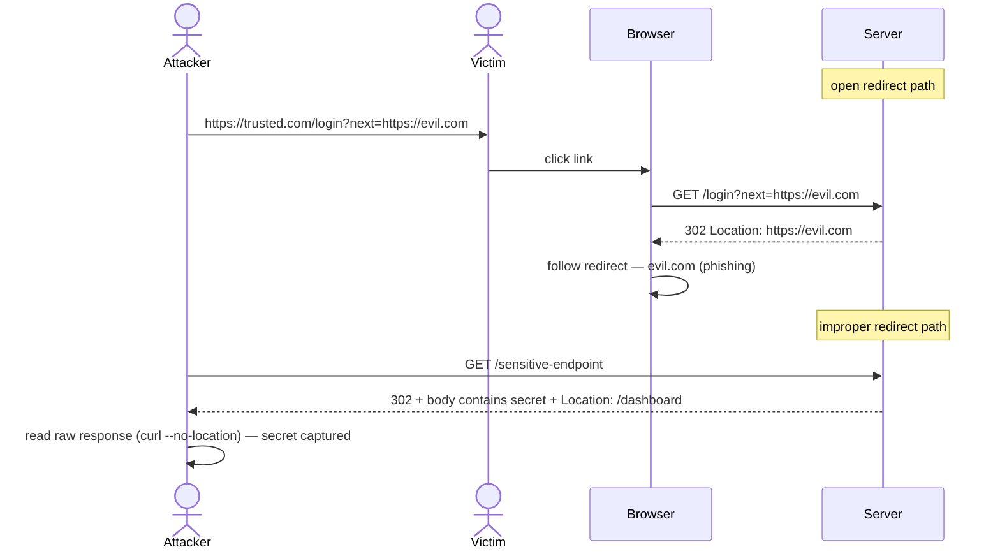

# Open Redirect (Improper Redirect Handling)

> [!map]+ TL;DR
> Two redirect failures, one family: (a) **open redirect** — server redirects to an attacker-chosen target via unvalidated `?url=`/`?next=` input; (b) **improper redirect handling** — payload sits *in the 3xx response itself*, and any client that auto-follows never sees it. Both: server trusts the client on where (or whether) to redirect.

## The bug

**Open redirect.** The app echoes a request-supplied URL into the `Location` header without an allowlist. The redirect is real — the problem is the destination is the attacker's choice. Users trust the original domain; the redirect hands that trust to a phishing page.

**Improper redirect handling.** The server puts sensitive data in the body of a 3xx reply, then `Location:` moves on. Clients that obey automatically (browsers, `curl -L`) discard the body. The payload is there — visible only if you read the response without following.

**Why:** frameworks treat redirects as flow control, not a security boundary. Developers forget the target is user-influenced, and clients differ in how they treat 3xx bodies.

## Attack flow

## Spotting it

> [!Shell]- Test pattern
> 1. Find redirect-controlling params: `?url=`, `?next=`, `?redirect=`, `?return_to=`, `?callback=`.
> 2. Set the value to `https://evil.com`. Server follows it → open redirect.
> 3. For hidden payloads, disable redirect-following: `curl --no-location`, `fetch` with `redirect: "manual"`. Read the raw 3xx body.
> 4. Check the allowlist — does the server validate the target before issuing `Location:`?

## Where it shows up

OAuth callbacks (`?redirect_uri=`), login/logout handlers (`?next=`), payment return URLs, SSO — anywhere the app "sends the user somewhere" after an action. Legacy apps and internal tools carry the 3xx-body variant.

> [!Connect]- Connections
> - **Sibling:** [[Nginx Alias Misconfiguration (Path Traversal)]] — both server-side handling flaws: open redirect picks the destination, alias traversal picks the source file
> - **Sibling:** [[Insecure Direct Object Reference (IDOR)]] — same trust boundary: server trusts client-supplied references
> - **Family:** OAuth `redirect_uri` validation, SSRF pivots; OWASP Top 10 2013 A10 (Unvalidated Redirects and Forwards)

## Source

- [OWASP — URL Redirector Abuse](https://cheatsheetseries.owasp.org/cheatsheets/URL_Redirector_Abuse_Cheat_Sheet.html)
- [Root-Me: HTTP - Improper redirect](https://www.root-me.org/en/Challenges/Web-Server/HTTP-Improper-redirect)

---

*Created from challenge context distillation by Sensemaker*
