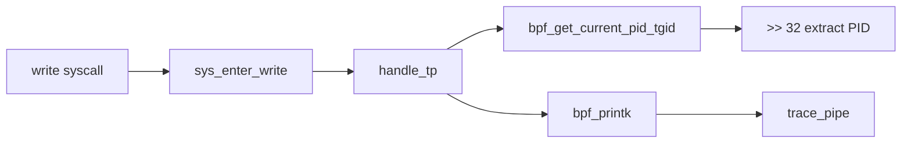

# eBPF Hello World Tutorial

## Summary

Minimal eBPF program attaching to `sys_enter_write` tracepoint. Logs PID of every `write` syscall. Workflow: C code → `ecc` compile → `ecli` run → read trace pipe.

## Key Points

- **Attachment**: `SEC("tp/syscalls/sys_enter_write")` hooks all writes
- **PID**: `bpf_get_current_pid_tgid() >> 32` extracts TGID (userspace PID)
- **Logging**: `bpf_printk()` → `/sys/kernel/debug/tracing/trace_pipe`
- **Compat**: `BPF_NO_GLOBAL_DATA` for pre-5.2 kernels
- **License**: `SEC("license")` mandatory — verifier rejects without it

## Code

```c
#define BPF_NO_GLOBAL_DATA 
#include "vmlinux.h"
#include <bpf/bpf_helpers.h>

char LICENSE[] SEC("license") = "Dual BSD/GPL";

SEC("tp/syscalls/sys_enter_write")
int handle_tp(void *ctx) {
    int pid = bpf_get_current_pid_tgid() >> 32;
    bpf_printk("Hello World from PID: %d\n", pid);
    return 0;
}
```

## Breakdown

### `SEC()` Macro
ELF section placement. Loader parses section names to determine attachment type. Format: `tp/<subsystem>/<event>` for tracepoints.

### `ctx` Pointer
`void *` to kernel-generated tracepoint data structure. Layout: `/sys/kernel/tracing/events/syscalls/sys_enter_write/format`. Cast to access syscall args.

### `bpf_get_current_pid_tgid()`
Returns `__u64`: TGID (upper 32 bits) | PID (lower 32 bits).

```
[63........32][31........0]
     TGID           PID
```

Kernel: `current_task->tgid << 32 | current_task->pid`

**Visual**: [[eBPF-HelloWorld-Bitwise.canvas|Bitwise Structure Canvas]]

### `bpf_printk()`
Writes to shared trace pipe. Limitations: global lock contention, max 3 format args on pre-5.16 kernels.

## Flow



## Build & Run

```bash
ecc stub.bpf.c              # Compile → package.json
ecli package.json           # Load into kernel
echo "test" > /tmp/test.txt # Trigger
cat /sys/kernel/debug/tracing/trace_pipe  # View
sudo bpftool prog list      # Verify loaded
```

## Connections

- **Builds on**: [[eBPF CO-RE Overview]]
- **Next**: eBPF maps (stateful), kprobes (dynamic), XDP (network)
- **Related**: [[Install BCC at Opensuse Leap 16.0]]

## Source

- https://eunomia.dev/tutorials/1-helloworld/
- https://eunomia.dev/tutorials/
- https://eunomia.dev/tutorials/0-introduce/
