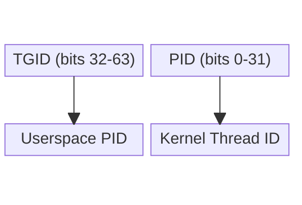

# eBPF Tutorial - Hello World

> [!summary]
> Complete "Hello World" eBPF program using the eunomia-bpf framework. Demonstrates CO-RE compilation, tracepoint attachment, and kernel-space debugging via bpf_printk.

---

## Program Overview

This tutorial creates a minimal eBPF program that attaches to the `sys_enter_write` tracepoint and logs "Hello World" with the process ID whenever a write syscall occurs.

### Architecture

```
User Space          Kernel Space
    │                      │
    │  ecli run            │
    │ ──────────────────>  │
    │                      │
    │  Load BPF program    │
    │  Attach to tracepoint│
    │                      │
    │  Write syscall       │
    │ ──────────────────>  │
    │                      │
    │  Trigger:            │
    │  bpf_printk()        │
    │                      │
    │  Output to trace_pipe│
    │ <──────────────────  │
    │                      │
    ▼                      ▼
```

---

## Source Code

### eBPF Program (stub.bpf.c)

```c
// For compatibility with kernels older than 5.2
#define BPF_NO_GLOBAL_DATA

#include "vmlinux.h"
#include <bpf/bpf_helpers.h>

// Required license definition
char LICENSE[] SEC("license") = "Dual BSD/GPL";

// Attach to the sys_enter_write tracepoint
SEC("tp/syscalls/sys_enter_write")
int handle_tp(void *ctx) {
    // Retrieve the process ID of the current process
    int pid = bpf_get_current_pid_tgid() >> 32;
    
    // Print to the kernel log
    bpf_printk("Hello World\n");
    
    // Standard practice to return 0 for tracepoints
    return 0;
}
```

### Code Breakdown

| Component | Purpose |
|-----------|---------|
| `BPF_NO_GLOBAL_DATA` | Ensures compatibility with kernels older than 5.2 |
| `vmlinux.h` | Core kernel type definitions (generated from BTF) |
| `SEC("license")` | Required license declaration for verifier approval |
| `SEC("tp/syscalls/sys_enter_write")` | Attaches to write syscall tracepoint |
| `bpf_get_current_pid_tgid() >> 32` | Extracts userspace PID from 64-bit return value |
| `bpf_printk()` | Outputs to kernel trace pipe (max 3 parameters) |
| `void *ctx` | Pointer to tracepoint-specific data and arguments |
| `return 0` | Standard required practice for tracepoint programs |

> [!info] No Loader Required
> The eunomia-bpf framework handles user-space loading automatically via `ecli`. You only write kernel-space code.

---

## Deep Dive: Hello World Components

> [!info] `SEC(name)`
> A compiler macro that instructs the eBPF loader where to attach the program. The string is formatted as `tp/syscalls/sys_enter_write` — tracepoint category (`tp`), subsystem (`syscalls`), and specific event (`sys_enter_write`).

> [!info] `bpf_get_current_pid_tgid()`
> Returns a 64-bit `__u64` containing `tgid` (userspace PID) in the upper 32 bits and `pid` (kernel thread ID) in the lower 32 bits.
>
> Because `int` only holds 32 bits, assigning the raw 64-bit return value would truncate to the lower 32 bits — the kernel PID. The ` >> 32` shift moves the upper 32 bits (tgid) into position before truncation captures the correct value.



```c
// Extract upper 32 bits (TGID = userspace PID)
int pid = bpf_get_current_pid_tgid() >> 32;

// Extract lower 32 bits (kernel PID)
int tgid = bpf_get_current_pid_tgid() & 0xFFFFFFFF;
```

> [!info] `bpf_printk()`
> A debugging helper that writes formatted text directly to `/sys/kernel/debug/tracing/trace_pipe`. Limited to 3 parameters alongside the format string (or 12 on kernel 5.16+). Writing to the globally shared trace pipe can severely impact performance during high-frequency events.

> [!info] `void *ctx`
> Provides access to tracepoint-specific data and arguments generated by the kernel event. Declared as `void*` in simple programs because the specific arguments are not needed; cast to a specific structure when advanced access is required.

---

## Build & Execute

### Step 1: Compile

```bash
# Using ecc compiler (eunomia-bpf toolchain)
ecc stub.bpf.c

# Or using Docker
docker run -it -v $(pwd):/src ghcr.io/eunomia-bpf/ecc:latest ecc stub.bpf.c
```

**Output:** `package.json` (portable eBPF package with bytecode + BTF)

### Step 2: Run

```bash
# Load and execute with ecli
sudo ecli run package.json
```

### Step 3: View Output

```bash
# Read from kernel trace pipe (in another terminal)
sudo cat /sys/kernel/debug/tracing/trace_pipe
```

**Expected output:**
```
           <...>-12345   [000] .... 12345.678901: bpf_trace_printk: Hello World from PID: 12345
```

### Trigger Events

If no output appears, trigger a write syscall in another terminal:

```bash
echo "test" > /tmp/test.txt
```

---

## Verification

```bash
# List active eBPF programs
sudo bpftool prog list
```

---

## Key Concepts Demonstrated

1. **Tracepoints** - Stable kernel instrumentation points
2. **CO-RE Compilation** - Single build runs on multiple kernels
3. **bpf_printk Debugging** - Kernel-space printf equivalent
4. **ecli Loader** - Zero-configuration program loading

---

## Next Steps

- Explore [[Atlas/Dots/Things/eBPF-Saturday/eBPF Tutorial - Overview]] for conceptual foundation
- Review [[CO-RE (Compile Once - Run Everywhere)]] for portability mechanics
- Check [[libbpf Framework]] for low-level API details

---

## Complete File Structure

```
project/
├── stub.bpf.c          # eBPF source code
└── package.json        # Compiled eBPF package (generated)
```