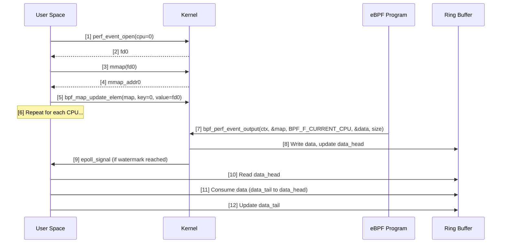

# eBPF Map - PERF_EVENT_ARRAY

> [!summary]
> `BPF_MAP_TYPE_PERF_EVENT_ARRAY` enables eBPF programs to piggy-back on the existing perf-subsystem implementation of ring-buffers to transfer data from kernel to user-space, or to read hardware/software performance counters.

---

## Usage Modes

> [!info] Two Distinct Use Cases
> This map type serves two different purposes. The first and most popular way is to allow programs to send arbitrary data. The second way is to read performance counters.

### 1. Data Transfer (Most Common)

Allows eBPF logic to use the perf-subsystem's ring-buffers to stream data from kernel to user-space.

**Kernel-side:**
```c
bpf_perf_event_output(ctx, &events, BPF_F_CURRENT_CPU, &data, sizeof(data));
```

**User-space:** Polls mmap'd ring buffers via `epoll`.

### 2. Performance Counters

A less common use case is to transfer perf events to eBPF from which programs read. This allows tracing programs to record hardware counters at very specific points such as kprobes or tracepoints.

**Kernel-side:**
```c
u64 count = bpf_perf_event_read(&events, cpu_index);
```

---

## Data Transfer Flow

### Step-by-Step Setup

| Step  | Action                  | Details                                                                               |
| ----- | ----------------------- | ------------------------------------------------------------------------------------- |
| **1** | **Create map**          | `BPF_MAP_TYPE_PERF_EVENT_ARRAY` with `key_size=4`, `value_size=4`                     |
| **2** | **`perf_event_open()`** | `PERF_TYPE_SOFTWARE`, `PERF_COUNT_SW_BPF_OUTPUT`, `PERF_SAMPLE_RAW`                   |
| **3** | **`fcntl()`**           | Set `O_NONBLOCK` for `epoll` compatibility                                            |
| **4** | **`mmap()`**            | `1+2^n` pages (e.g., 12288, 20480 bytes). First page is `perf_event_mmap_page` header |
| **5** | **Map fd to array**     | `bpf_map_update_elem(map, cpu_index, perf_fd)`                                        |
| **6** | **eBPF output**         | `bpf_perf_event_output(ctx, &map, BPF_F_CURRENT_CPU, data, size)`                     |
| **7** | **User-space read**     | Poll via `epoll`, read from mmap'd ring buffer                                        |

### `perf_event_open` Attributes

```c
struct perf_event_attr attr = {
    .type = PERF_TYPE_SOFTWARE,
    .size = sizeof(struct perf_event_attr),
    .config = PERF_COUNT_SW_BPF_OUTPUT,
    .watermark = true,
    .sample_type = PERF_SAMPLE_RAW,
    .wakeup_watermark = {watermark}, // Tuned for latency vs throughput
};

syscall(SYS_perf_event_open, &attr, -1, {cpu}, -1, PERF_FLAG_FD_CLOEXEC);
```

> [!tip] Watermark Tuning
> Setting `.watermark = true` buffers data until the watermark amount is ready before signaling user-space. This improves efficiency but should be tuned for balance between latency, performance, and memory usage.

---

## Critical Structures

### `perf_event_mmap_page` (Header Page)

The first page of the `mmap`'d region contains this structure:

```c
struct perf_event_mmap_page {
    __u32   version;        // version number
    __u32   compat_version; // lowest compatible version
    __u32   lock;           // seqlock for synchronization
    __u32   index;          // hardware event identifier
    __s64   offset;         // add to hardware event value
    __u64   time_enabled;   // time event active
    __u64   time_running;   // time event on cpu
    union {
        __u64   capabilities;
        struct {
            __u64 cap_bit0        : 1,
                  cap_bit0_is_deprecated : 1,
                  cap_user_rdpmc  : 1,
                  cap_user_time   : 1,
                  cap_user_time_zero : 1,
                  cap_user_time_short : 1,
                  cap_____res     : 58;
        };
    };
    __u16   pmc_width;
    __u16   time_shift;
    __u32   time_mult;
    __u64   time_offset;
    __u64   time_zero;
    __u32   size;
    // ... (fields omitted for brevity)
    
    // Control data for the mmap() data buffer
    __u64   data_head;      // head in the data section (kernel writes)
    __u64   data_tail;      // user-space written tail
    __u64   data_offset;    // where the buffer starts
    __u64   data_size;      // data buffer size
};
```

**For consuming data, focus on:**
- `data_head` — Kernel write position (read by user-space)
- `data_tail` — User read position (written by user-space)
- `data_offset` — Ring buffer start from `mmap` base
- `data_size` — Total ring buffer size

### Ring Buffer Entry Header

Every entry starts with:

```c
struct perf_event_header {
    __u32 type;   // PERF_RECORD_SAMPLE or PERF_RECORD_LOST
    __u16 misc;
    __u16 size;   // Total size including header
};
```

**Sample entry:**
```c
struct perf_event_sample {
    struct perf_event_header header;
    __u64 time;
    __u32 size;
    unsigned char data[];  // Actual payload
};
```

---

## Memory Coordination

**No data pending:** `data_head == data_tail`

**Buffer full:** `data_head == data_tail - 1` (kernel will drop samples)

**Reading protocol:**
1. User-space reads `data_head` (issue `smp_rmb()` after)
2. Read data between `data_tail` and `data_head`
3. Write new `data_tail` (issue `smp_mb()` before)
4. Kernel will not overwrite unread data

---

## Attributes

| Attribute | Requirement | Description |
|-----------|-------------|-------------|
| `key_size` | **Must be 4** | 32-bit unsigned integer (CPU index) |
| `value_size` | **Must be 4** | 32-bit unsigned integer (perf event fd) |
| `max_entries` | ≥ logical CPUs | Use `nproc`, `lscpu`, or `/proc/cpuinfo` |

---

## Syscall Commands

The following `bpf()` syscall commands work with this map type:

- `BPF_MAP_LOOKUP_ELEM` — Look up perf event fd by CPU index
- `BPF_MAP_UPDATE_ELEM` — Store perf event fd in map
- `BPF_MAP_GET_NEXT_KEY` — Iterate over CPU indices

---

## Helper Functions

| Helper | Purpose |
|--------|---------|
| `bpf_perf_event_output` | Send custom data to user-space ring buffer |
| `bpf_perf_event_read` | Read performance counter value |
| `bpf_perf_event_read_value` | Read counter + enabled/running time |
| `bpf_skb_output` | Send skb data to perf buffer |
| `bpf_xdp_output` | Send XDP data to perf buffer |

### `bpf_perf_event_output` Signature

```c
static long bpf_perf_event_output(
    void *ctx,              // eBPF program context
    struct bpf_map *map,    // PERF_EVENT_ARRAY map
    u64 flags,              // BPF_F_CURRENT_CPU or explicit CPU
    void *data,             // Pointer to data
    u64 size                // Size of data
);
```

**Flags:**
- `BPF_F_CURRENT_CPU` — Route to current CPU's buffer (optimal cache locality)
- Explicit CPU index — Route to specific CPU's buffer

---

## Flags

| Flag | Kernel | Purpose |
|------|--------|---------|
| `BPF_F_NUMA_NODE` | 4.14 | Respect `numa_node` attribute during map creation |
| `BPF_F_PRESERVE_ELEMS` | 5.10 | Keep unread events after original fd is closed (easier sharing between programs) |
| `BPF_F_RDONLY` | 4.15 | Map read-only via syscall interface |
| `BPF_F_WRONLY` | 4.15 | Map write-only via syscall interface |

---

## Lost Events

> [!warning] Ring Buffer Overruns
> When the ring buffer is full, the kernel cannot write new samples. Instead of crashing, it tracks the number of dropped samples.

**Detection:**
The kernel inserts `PERF_RECORD_LOST` entries into the ring buffer when space becomes available:

```c
struct {
    struct perf_event_header header;
    u64    id;
    u64    lost;        // Number of samples dropped
    struct sample_id sample_id;
};
```

**Mitigation strategies:**
- Increase ring buffer size (`1+2^n` pages)
- Tune watermark for your workload
- Use `epoll` instead of busy-polling to reduce CPU overhead
- Dedicate reader threads if throughput is critical

---

## Data Transfer Mermaid Diagram



---

## Key Concepts

1. **Per-CPU isolation** — Each logical CPU gets its own ring buffer
2. **Memory-mapped I/O** — Zero-copy user-space reads via `mmap`
3. **`BPF_F_CURRENT_CPU`** — Routes events to the generating CPU for cache locality
4. **Watermark-based signaling** — Reduces wakeups during low-throughput periods
5. **Explicit lost event tracking** — `PERF_RECORD_LOST` indicates dropped samples
6. **Two-phase setup** — `perf_event_open` + `mmap` before eBPF program runs
7. **Fixed key/value sizes** — Must be exactly 4 bytes (u32)

---

## References

- docs.ebpf.io: `BPF_MAP_TYPE_PERF_EVENT_ARRAY` — https://docs.ebpf.io/linux/map-type/BPF_MAP_TYPE_PERF_EVENT_ARRAY/
- Linux kernel: `tools/perf/design.txt` — Ring buffer design and logic
- Man pages: `perf_event_open(2)`, `mmap(2)`, `epoll(7)`