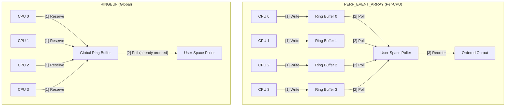
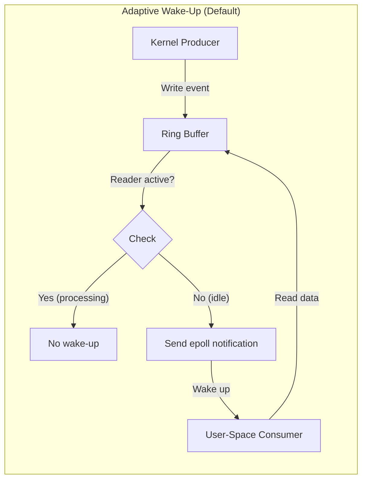

# eBPF Map - RINGBUF

> [!summary]
> `BPF_MAP_TYPE_RINGBUF` is a multiple-producer, single-consumer (MPSC) queue introduced in Linux 5.8. Unlike `BPF_MAP_TYPE_PERF_EVENT_ARRAY` which uses per-CPU buffers, RINGBUF provides a single globally-shared ring buffer that preserves event ordering across all CPUs and supports true zero-copy writes via the reserve/submit pattern.

---

## Definition

`BPF_MAP_TYPE_RINGBUF` is designed for high-throughput streaming of variable-length data from eBPF programs in kernel space to user-space applications. It solves the memory efficiency and event reordering problems inherent in the older `PERF_EVENT_ARRAY` approach.

### Key Characteristics

| Feature | Description |
|---------|-------------|
| **Structure** | Single global ring buffer shared across all CPUs |
| **Ordering** | Strict FIFO — events appear in chronological order |
| **Concurrency** | Lock-free MPSC (Multiple Producer, Single Consumer) |
| **Writes** | Zero-copy via reserve/submit API |
| **Data size** | Variable-length records supported |
| **Notification** | Adaptive epoll wake-ups |

---

## Attributes

```c
struct {
    __uint(type, BPF_MAP_TYPE_RINGBUF);
    __uint(max_entries, 256 * 1024);  // Buffer size in bytes
    __uint(key_size, 0);              // Must be 0
    __uint(value_size, 0);            // Must be 0
} rb SEC(".maps");
```

| Attribute | Requirement | Description |
|-----------|-------------|-------------|
| `type` | `BPF_MAP_TYPE_RINGBUF` | Ring buffer map type |
| `key_size` | **Must be 0** | Ring buffers don't use key-value pairs |
| `value_size` | **Must be 0** | Ring buffers don't use key-value pairs |
| `max_entries` | Power of 2, multiple of page size | Total buffer size in bytes (e.g., 4096, 256*1024) |

> [!warning] Size Constraints
> `max_entries` must be:
> - A **power of 2** (e.g., 4096, 8192, 65536, 262144)
> - A **multiple of the system page size** (typically 4096 bytes)
>
> Common sizes: 256 KB (262144 bytes), 1 MB (1048576 bytes), 4 MB (4194304 bytes)

---

## Kernel Version History

| Feature | Kernel Version | Notes |
|---------|---------------|-------|
| `BPF_MAP_TYPE_RINGBUF` | **5.8** | Initial introduction |
| `bpf_ringbuf_reserve` | 5.8 | Reserve/submit API |
| `bpf_ringbuf_output` | 5.8 | Direct output API |
| `BPF_RB_FORCE_WAKEUP` | 5.8 | Force wake-up flag |
| `BPF_RB_NO_WAKEUP` | 5.8 | Suppress wake-up flag |

| Comparison | PERF_EVENT_ARRAY | RINGBUF |
|-----------|-----------------|---------|
| **Introduced** | 4.x | **5.8** |
| **Buffer model** | Per-CPU | **Global shared** |
| **Event ordering** | Per-CPU only | **Global FIFO** |
| **Memory usage** | `num_cpus × buffer_size` | **`buffer_size`** |
| **Write API** | `bpf_perf_event_output` | **`bpf_ringbuf_reserve` + `submit`** |
| **Zero-copy writes** | ❌ Stack → buffer copy | ✅ **Direct (reserve/submit only)** |
| **Variable length** | Yes | **Yes** |

---

## Architecture Comparison

### Per-CPU PERF_EVENT_ARRAY vs Global RINGBUF



### Pros and Cons

| Aspect | PERF_EVENT_ARRAY | RINGBUF |
|--------|-----------------|---------|
| **Memory overhead** | ❌ High (per-CPU allocation) | ✅ Efficient (single buffer) |
| **Event ordering** | ❌ Must reorder in user-space | ✅ Natural global order |
| **Cache locality** | ✅ Writes stay on local CPU cache | ❌ Some cache bouncing |
| **Scalability** | ✅ No contention between CPUs | ⚠️ Lock-free but shared |
| **Stack usage** | ❌ Consumes eBPF stack (512B limit) | ✅ Writes directly to buffer |
| **Kernel version** | ✅ 4.x+ | ⚠️ 5.8+ only |

---

## eBPF-Side Mechanics

### 1. Reserve/Submit Pattern (Recommended)

```c
// Reserve space in ring buffer
struct event *e = bpf_ringbuf_reserve(&rb, sizeof(*e), 0);
if (!e)
    return 0;  // Buffer full

// Write directly into reserved memory
e->pid = pid;
e->timestamp = bpf_ktime_get_ns();

// Submit to user-space
bpf_ringbuf_submit(e, 0);
```

**Advantages:**
- **True zero-copy**: `bpf_ringbuf_reserve()` returns a pointer directly into the ring buffer's memory. The eBPF program writes to the final destination without intermediate buffers.
- No stack usage: avoids 512-byte eBPF stack limit
- Conditional discard: can abort with `bpf_ringbuf_discard`

> [!info] Zero-Copy Only for Reserve/Submit
> The zero-copy benefit applies **only** to the reserve/submit pattern (`bpf_ringbuf_reserve` + `bpf_ringbuf_submit`).
> `bpf_ringbuf_output` (see below) copies data from the eBPF stack to the ring buffer internally.

### 2. Direct Output Pattern (Stack Copy)

```c
struct event e = {};
e.pid = pid;
e.timestamp = bpf_ktime_get_ns();

// Copy from eBPF stack to ring buffer (NOT zero-copy)
bpf_ringbuf_output(&rb, &e, sizeof(e), 0);
```

**How it works:**
1. Build struct on the 512-byte eBPF stack
2. `bpf_ringbuf_output` internally copies data from stack → ring buffer
3. Same memory flow as `bpf_perf_event_output`

**Use case:** Simple, pre-built structs where you don't need conditional discard or don't want to manage reservation lifetime.

---

## Helper Functions

### bpf_ringbuf_reserve

```c
void *bpf_ringbuf_reserve(
    struct bpf_map *map,    // RINGBUF map
    u64 size,               // Size to reserve (compile-time constant)
    u64 flags               // Reserved, must be 0
);
```

**Returns:** Writable pointer or `NULL` if buffer full

### bpf_ringbuf_submit

```c
void bpf_ringbuf_submit(
    void *data,     // Pointer from bpf_ringbuf_reserve
    u64 flags       // Wake-up behavior
);
```

**Flags:**
| Flag | Value | Behavior |
|------|-------|----------|
| `0` (default) | 0 | Adaptive: wake only if reader caught up |
| `BPF_RB_FORCE_WAKEUP` | (1ULL << 0) | Always notify user-space |
| `BPF_RB_NO_WAKEUP` | (1ULL << 1) | Never notify (batch manually) |

### bpf_ringbuf_discard

```c
void bpf_ringbuf_discard(
    void *data,     // Pointer from bpf_ringbuf_reserve
    u64 flags       // Same wake-up flags
);
```

**Use case:** Cancel a reservation:

```c
struct event *e = bpf_ringbuf_reserve(&rb, sizeof(*e), 0);
if (!e)
    return 0;

if (should_filter_out(pid)) {
    bpf_ringbuf_discard(e, 0);  // Clean up
    return 0;
}

// ... fill event ...
bpf_ringbuf_submit(e, 0);
```

### bpf_ringbuf_output

```c
long bpf_ringbuf_output(
    struct bpf_map *map,    // RINGBUF map
    void *data,             // Source data pointer
    u64 size,               // Size to copy
    u64 flags               // Wake-up flags
);
```

**Use case:** Copy pre-built data from eBPF stack:

```c
struct event e = { .pid = pid, .code = code };
bpf_ringbuf_output(&rb, &e, sizeof(e), BPF_RB_NO_WAKEUP);
```

### bpf_ringbuf_query

```c
u64 bpf_ringbuf_query(
    struct bpf_map *map,    // RINGBUF map
    u64 flags               // What to query
);
```

**Query types:**
| Flag | Returns |
|------|---------|
| `BPF_RB_AVAIL_DATA` | Amount of unconsumed data |
| `BPF_RB_RING_SIZE` | Total ring buffer size |
| `BPF_RB_CONS_POS` | Consumer position |
| `BPF_RB_PROD_POS` | Producer position |

---

## User-Space Mechanics

### epoll-Based Polling

User-space applications use `epoll` to efficiently wait for new data without consuming CPU:

```c
// Get ring buffer fd
int map_fd = bpf_obj_get("/sys/fs/bpf/my_ringbuf");

// Create epoll instance
int epoll_fd = epoll_create1(0);

// Add ring buffer to epoll
struct epoll_event ev = {
    .events = EPOLLIN,
    .data.fd = map_fd
};
epoll_ctl(epoll_fd, EPOLL_CTL_ADD, map_fd, &ev);

// Wait for events
struct epoll_event events[10];
int nfds = epoll_wait(epoll_fd, events, 10, -1);
```

### libbpf Ring Buffer API

libbpf provides a high-level API for reading ring buffers:

```c
#include <linux/ring_buffer.h>

// Set up ring buffer with callback
struct ring_buffer *rb = ring_buffer__new(
    map_fd,           // RINGBUF map file descriptor
    handle_event,     // Callback for each event
    NULL,             // User context
    NULL              // Options
);

// Poll for new data (non-blocking)
int err = ring_buffer__poll(rb, 100 /* timeout_ms */);

// Consume all available events (blocking)
ring_buffer__consume(rb);

// Clean up
ring_buffer__free(rb);
```

### Callback Function

```c
int handle_event(void *ctx, void *data, size_t size)
{
    struct event *e = data;
    
    printf("PID: %d, Exit Code: %d\n", e->pid, e->exit_code);
    
    return 0;  // Return 0 to continue, non-zero to stop
}
```

---

## Wake-Up Behavior

The kernel controls when user-space is notified about new data:



**Adaptive (default, flag=0):**
- If user-space is actively reading → **no wake-up** (avoids redundant notifications)
- If user-space is idle → **send wake-up**

**BPF_RB_FORCE_WAKEUP:** Always notify, useful for latency-critical events

**BPF_RB_NO_WAKEUP:** Never notify, useful for batch processing where user-space polls manually

---

## Lost Events

When the ring buffer is full, `bpf_ringbuf_reserve()` returns `NULL`. Unlike `PERF_EVENT_ARRAY` which silently overwrites old data, the ring buffer provides explicit backpressure:

```c
struct event *e = bpf_ringbuf_reserve(&rb, sizeof(*e), 0);
if (!e) {
    // Buffer full — event dropped
    // Consider incrementing a drop counter
    __sync_fetch_and_add(&drop_count, 1);
    return 0;
}
```

**Mitigation strategies:**
- Increase `max_entries` (larger buffer)
- Use `BPF_RB_NO_WAKEUP` + manual batch polling
- Add per-CPU drop counters
- Dedicate reader thread with high priority

---

## Example Implementation

Example implementation can be found in [[eBPF Tutorial - Exitsnoop]].

---

## Key Concepts

1. **Global FIFO Order** — Single shared buffer preserves chronological event ordering across all CPUs
2. **Zero-Copy Writes (Reserve/Submit)** — `bpf_ringbuf_reserve` returns pointer directly into ring buffer memory; `bpf_ringbuf_output` copies from stack
3. **MPSC Queue** — Lock-free multiple-producer, single-consumer design
4. **Adaptive Wake-Ups** — Kernel intelligently notifies user-space only when needed
5. **Backpressure** — Explicit `NULL` return when buffer full (no silent data loss)
6. **Kernel 5.8+** — Modern feature requiring recent kernel version

---

## References

- eBPF Docs: `BPF_MAP_TYPE_RINGBUF` — https://docs.ebpf.io/linux/map-type/BPF_MAP_TYPE_RINGBUF/
- eBPF Docs: `bpf_ringbuf_reserve` — https://docs.ebpf.io/linux/helper-function/bpf_ringbuf_reserve/
- eBPF Docs: `bpf_ringbuf_submit` — https://docs.ebpf.io/linux/helper-function/bpf_ringbuf_submit/
- eBPF Docs: `bpf_ringbuf_discard` — https://docs.ebpf.io/linux/helper-function/bpf_ringbuf_discard/
- eBPF Docs: `bpf_ringbuf_output` — https://docs.ebpf.io/linux/helper-function/bpf_ringbuf_output/
- [[eBPF Tutorial - Exitsnoop]] — Practical usage example
- [[eBPF Map - PERF_EVENT_ARRAY]] — Comparison with older approach
