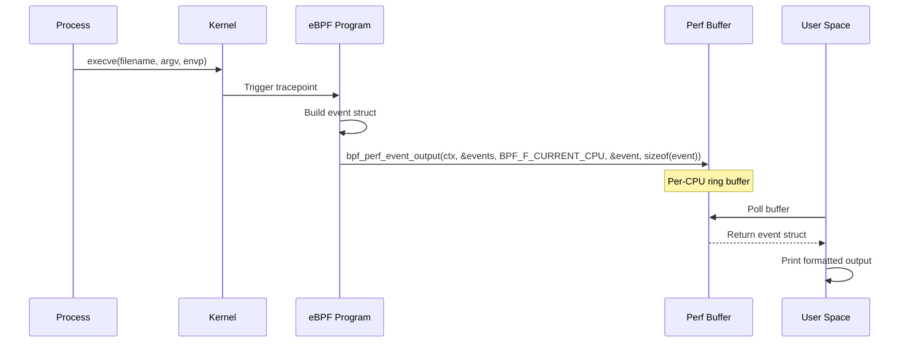
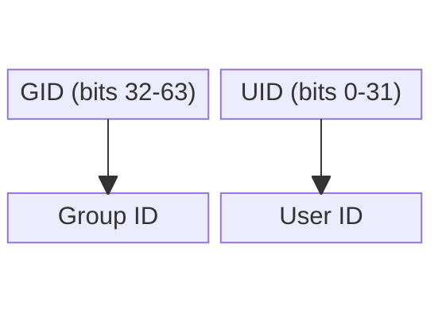

# eBPF Tutorial - Execsnoop (Perf Events)

> [!summary]
> Capture process execution events using eBPF perf event arrays. Streams structured data from kernel to user-space for real-time process monitoring without reading trace_pipe.

---

## Why Perf Event Array?

> [!info] Streaming vs Storage
> Unlike Hash Maps (used in sigsnoop for entry/exit correlation), execsnoop uses `BPF_MAP_TYPE_PERF_EVENT_ARRAY` to **stream events directly to user-space**.

| Aspect           | Hash Map (sigsnoop)         | Perf Event Array (execsnoop)      |
| ---------------- | --------------------------- | --------------------------------- |
| **Pattern**      | Entry/exit correlation      | Streaming to user-space           |
| **CPU handling** | Shared map (contention)     | Per-CPU buffers (no lock)         |
| **Data flow**    | Kernel ↔ Kernel             | Kernel → User-space               |
| **User-space**   | Not involved during tracing | Actively polls perf buffer        |
| **Lost events**  | Map full = silent drop      | Buffer full = explicit lost count |
| **Use case**     | State correlation           | Real-time monitoring              |

### Per-CPU Architecture

> [!info] Why Per-CPU?
> Each CPU core gets its own ring buffer. This eliminates:
> - **Lock contention** between CPUs
> - **Cache bouncing** across NUMA nodes
> - **Serialization overhead** in high-throughput scenarios

`BPF_F_CURRENT_CPU` routes the event to the specific CPU that generated it, ensuring optimal cache locality.

---

## How It Works



---

## Source Code

### Header File (execsnoop.h)

```c
#ifndef __EXECSNOOP_H
#define __EXECSNOOP_H

#define TASK_COMM_LEN 16

struct event {
    int pid;
    int ppid;
    int uid;
    int retval;
    bool is_exit;
    char comm[TASK_COMM_LEN];
};

#endif /* __EXECSNOOP_H */
```

### eBPF Program (execsnoop.bpf.c)

```c
// SPDX-License-Identifier: (LGPL-2.1 OR BSD-2-Clause)
#include <vmlinux.h>
#include <bpf/bpf_helpers.h>
#include <bpf/bpf_core_read.h>
#include "execsnoop.h"

struct {
    __uint(type, BPF_MAP_TYPE_PERF_EVENT_ARRAY);
    __uint(key_size, sizeof(u32));
    __uint(value_size, sizeof(u32));
} events SEC(".maps");

SEC("tracepoint/syscalls/sys_enter_execve")
int tracepoint_syscalls_sys_enter_execve(struct trace_event_raw_sys_enter* ctx)
{
    u64 id;
    pid_t pid, tgid;
    struct event event={0};
    struct task_struct *task;

    uid_t uid = (u32)bpf_get_current_uid_gid();
    id = bpf_get_current_pid_tgid();
    tgid = id >> 32;

    event.pid = tgid;
    event.uid = uid;
    task = (struct task_struct*)bpf_get_current_task();
    event.ppid = BPF_CORE_READ(task, real_parent, tgid);
    char *cmd_ptr = (char *) BPF_CORE_READ(ctx, args[0]);
    bpf_probe_read_str(&event.comm, sizeof(event.comm), cmd_ptr);
    bpf_perf_event_output(ctx, &events, BPF_F_CURRENT_CPU, &event, sizeof(event));
    return 0;
}

char LICENSE[] SEC("license") = "GPL";
```

### Where Does `ctx->args[0]` Come From?

The `ctx` parameter is a pointer to `struct trace_event_raw_sys_enter`, defined in `vmlinux.h`:

```c
struct trace_event_raw_sys_enter {
    struct trace_entry ent;
    long int id;                    // Syscall number
    long unsigned int args[6];      // Syscall arguments
    char __data[0];
};
```

For the `sys_enter_execve` tracepoint specifically, `bpftrace -vl` reveals the argument mapping:

```bash
$ bpftrace -vl "tracepoint:syscalls:sys_enter_execve"
tracepoint:syscalls:sys_enter_execve
    int __syscall_nr
    const char * filename      ← args[0]
    const char *const * argv   ← args[1]
    const char *const * envp   ← args[2]
```

**Argument mapping:**

| `args[]` | bpftrace Field | Description |
|----------|---------------|-------------|
| `args[0]` | `filename` | Command being executed (e.g., `/bin/ls`) |
| `args[1]` | `argv` | Argument array pointer |
| `args[2]` | `envp` | Environment array pointer |

**In the code:**
```c
// ctx->args[0] holds the filename pointer
char *cmd_ptr = (char *) BPF_CORE_READ(ctx, args[0]);
```

**Why `BPF_CORE_READ(ctx, args[0])` instead of `ctx->args[0]`?**

Because `ctx` points to kernel memory. Direct dereferencing (`ctx->args[0]`) could access invalid memory and crash the kernel. `BPF_CORE_READ()` safely copies the value via `bpf_probe_read_kernel()`.

### Code Breakdown

| Component                                | Purpose                                  |
| ---------------------------------------- | ---------------------------------------- |
| `BPF_MAP_TYPE_PERF_EVENT_ARRAY`          | Per-CPU ring buffer for streaming events |
| `key_size = sizeof(u32)`                 | CPU number as key                        |
| `value_size = sizeof(u32)`               | File descriptor                          |
| `bpf_get_current_uid_gid()`              | Get user ID                              |
| `bpf_get_current_pid_tgid()`             | Get process/thread ID                    |
| `bpf_get_current_task()`                 | Get current task_struct                  |
| `BPF_CORE_READ(task, real_parent, tgid)` | Read parent process ID                   |
| `bpf_probe_read_str()`                   | Read command from user-space             |
| `bpf_perf_event_output()`                | Push event to perf buffer                |
| `BPF_F_CURRENT_CPU`                      | Route to current CPU's buffer            |

---

## Macro Deep Dive

### bpf_perf_event_output

```c
static long bpf_perf_event_output(
    void *ctx,                          // Tracepoint context
    struct bpf_map *map,                // PERF_EVENT_ARRAY map
    u64 flags,                          // BPF_F_CURRENT_CPU
    void *data,                         // Pointer to event struct
    u64 size                            // Size of event
);
```

| Parameter | Description |
|-----------|-------------|
| `ctx` | Tracepoint context (provides CPU info) |
| `map` | PERF_EVENT_ARRAY map definition |
| `flags` | `BPF_F_CURRENT_CPU` routes to current CPU |
| `data` | Pointer to structured event data |
| `size` | Size of data to copy |

> [!info] Memory Alignment
> The event struct is defined in a shared header (`execsnoop.h`) included by both kernel and user-space code. The compiler applies identical alignment rules on both sides, ensuring struct layout matches exactly.

> [!tip] Historical Context
> Explicit struct alignment (`#pragma pack` or manual padding) was a common practice in the past when cross-compiling between different architectures or compiler versions. Modern compilers handle natural alignment automatically, making this less critical for eBPF programs where both kernel and user-space code use the same toolchain and header files.
>
> For a deeper look at the relocation mechanics used here, see [[eBPF Concept - BPF_CORE_READ|BPF_CORE_READ]].

---

### Helper: bpf_get_current_uid_gid

> [!info] `bpf_get_current_uid_gid()`
> Returns a 64-bit integer (`__u64`) containing the current process's User ID (UID) and Group ID (GID) packed together:
> - **Upper 32 bits (bits 32-63):** `gid` (Group ID)
> - **Lower 32 bits (bits 0-31):** `uid` (User ID)
>
> Similar to `bpf_get_current_pid_tgid()`, this helper packs two 32-bit values into one 64-bit return for atomic retrieval.

![[eBPF Tutorial - Execsnoop - UID GID.canvas]]



**Full extraction:**
```c
// Extract lower 32 bits (UID)
uid_t uid = bpf_get_current_uid_gid() & 0xFFFFFFFF;

// Extract upper 32 bits (GID)
gid_t gid = bpf_get_current_uid_gid() >> 32;
```

**Execsnoop usage (truncation):**
```c
// In execsnoop, only UID is needed
// Casting to u32 truncates to lower 32 bits automatically
uid_t uid = (u32)bpf_get_current_uid_gid();
```

> [!tip] Why truncation works
> `(u32)` casts the 64-bit return to 32-bit, discarding the upper 32 bits (GID). This is equivalent to `& 0xFFFFFFFF` but more concise when you only need the UID.

---

## Memory Alignment of Event Struct

```c
struct event {
    int pid;              // 4 bytes, offset 0-3
    int ppid;             // 4 bytes, offset 4-7
    int uid;              // 4 bytes, offset 8-11
    int retval;           // 4 bytes, offset 12-15
    bool is_exit;         // 1 byte,  offset 16
    char comm[16];        // 16 bytes, offset 17-32
};                        // Data: 33 bytes, Total: 36 bytes (with 3 bytes padding)
```

**Padding Breakdown:**

| Member | Size | Offset | Notes |
|--------|------|--------|-------|
| `pid` | 4 | 0-3 | `int` alignment = 4 |
| `ppid` | 4 | 4-7 | `int` alignment = 4 |
| `uid` | 4 | 8-11 | `int` alignment = 4 |
| `retval` | 4 | 12-15 | `int` alignment = 4 |
| `is_exit` | 1 | 16 | `bool` alignment = 1 |
| `comm[16]` | 16 | 17-32 | `char` alignment = 1 |
| **padding** | **3** | **33-35** | **Largest alignment = 4, so total must be multiple of 4** |
| **Total** | **36** | **0-35** | **Verified with `sizeof(struct event)`** |

**Why 3 bytes of padding?**

The struct's **largest alignment requirement is 4** (from `int`). The total size must be a multiple of 4 so arrays are properly aligned:

```c
struct event events[2];
// events[0] at offset 0
// events[1] at offset 36 ✓ (divisible by 4)
```

If size were 33:
- `events[1]` would start at offset 33
- `events[1].pid` at offset 33 — **not divisible by 4**
- Misaligned memory access on most CPUs

> [!info] Why This Matters
> `bpf_perf_event_output()` copies raw memory. User-space must read the exact same structure layout. Using a shared header file (`execsnoop.h`) ensures both sides agree on offsets and sizes.

---

## Build & Execute

### Step 1: Compile

```bash
# Using ecc (requires header file)
ecc execsnoop.bpf.c execsnoop.h

# Or using Docker
docker run -it -v `pwd`/:/src/ ghcr.io/eunomia-bpf/ecc-`uname -m`:latest
```

### Step 2: Run

```bash
sudo ecli run package.json
```

### Step 3: Generate Events

Open another terminal and run commands:

```bash
ls -la
echo "test"
ps aux
```

### Step 4: View Output

```
TIME     PID     PPID    UID     COMM
21:28:30  40747  3517    1000    node
21:28:30  40748  40747   1000    sh
21:28:30  40749  3517    1000    node
21:28:30  40750  40749   1000    sh
21:28:30  40751  3517    1000    node
21:28:30  40752  40751   1000    sh
21:28:30  40753  40752   1000    cpuUsage.sh
```

> [!info] Direct Terminal Output
> Unlike previous tutorials that required `cat /sys/kernel/debug/tracing/trace_pipe`, execsnoop outputs directly to the terminal via the perf event array.

---

## User-Space Polling

The eunomia-bpf framework handles user-space polling automatically. Under the hood:

```c
// libbpf handles this for you
perf_buffer__poll(pb, timeout_ms);
```

**Polling mechanism:**
1. Create per-CPU perf buffers
2. mmap() ring buffers into user-space
3. Poll for new data without syscalls (memory-mapped I/O)
4. Handle lost samples via callback

> [!warning] Lost Samples
> If user-space cannot keep up with kernel production, the per-CPU buffer wraps around and overwrites old data. Check `perf_buffer__poll()` return values and implement a lost-event callback for monitoring.

---

## Key Concepts Demonstrated

1. **Perf Event Array** — Per-CPU streaming ring buffers
2. **bpf_perf_event_output** — Kernel-to-user data transfer
3. **BPF_F_CURRENT_CPU** — CPU-local routing for cache efficiency
4. **Memory Alignment** — Shared structs between kernel and user-space
5. **Direct Terminal Output** — No trace_pipe required
6. **Process Monitoring** — Capturing execve syscalls for security/observability

---

## Next Steps

- Compare with [[eBPF Tutorial - Sigsnoop]] for Hash Map state storage
- Review [[eBPF Tutorial - Opensnoop]] for global variable filtering
- Explore [[eBPF Tutorial - Hello World]] for tracepoint basics