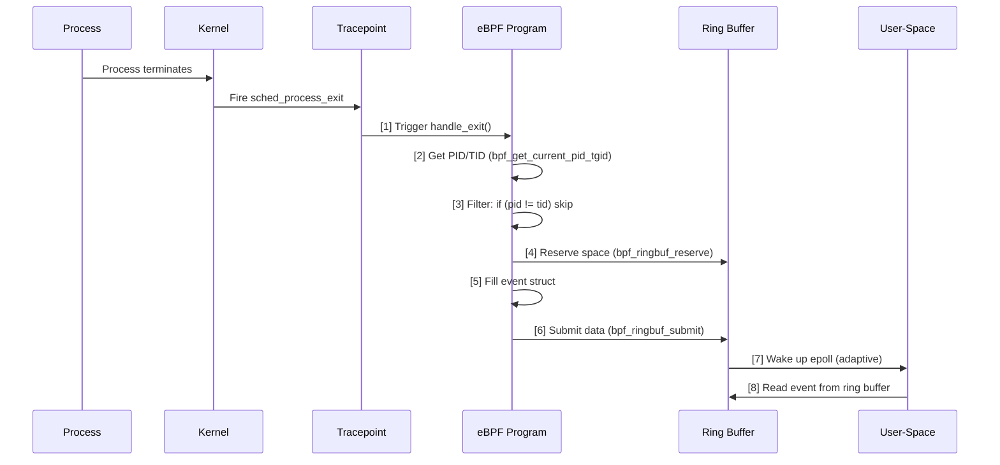

# eBPF Tutorial - Exitsnoop

> [!summary]
> Exitsnoop monitors Linux process exit events using the `sched_process_exit` tracepoint and streams data to user-space via `BPF_MAP_TYPE_RINGBUF`. Unlike `BPF_MAP_TYPE_PERF_EVENT_ARRAY`, the ring buffer preserves global event ordering and uses a reserve/submit pattern for true zero-copy writes.

---

## Program Overview

**What it traces:** Process termination events (not thread exits)
**How it works:** Attaches to `sched_process_exit` tracepoint, filters thread exits by comparing PID vs TID, captures exit metadata, and submits to a ring buffer
**Key difference from execsnoop:** Uses `BPF_MAP_TYPE_RINGBUF` instead of `BPF_MAP_TYPE_PERF_EVENT_ARRAY`

### Why Ring Buffer?

| Feature               | PERF_EVENT_ARRAY                           | RINGBUF                                   |
| --------------------- | ------------------------------------------ | ----------------------------------------- |
| **Event ordering**    | Per-CPU only (must reorder in user-space)  | Global FIFO order preserved               |
| **Memory efficiency** | Allocates buffer per CPU (wastes memory)   | Single shared buffer                      |
| **Write pattern**     | Copy complete struct to stack, then output | Reserve → Write → Submit (true zero-copy) |
| **Kernel version**    | 4.x+                                       | 5.8+                                      |

---

## Tracepoint: sched_process_exit

The `sched_process_exit` tracepoint fires when a process terminates and is removed from the CPU run queue. It's part of the scheduler subsystem (`sched`) and provides stable, pre-defined hooks in the kernel.

### Context Structure

```c
struct trace_event_raw_sched_process_template {
    struct trace_entry ent;    // Common tracepoint header
    char comm[16];             // Process command name
    pid_t pid;                 // Process ID
    int prio;                  // Process priority
    char __data[0];            // Variable-length data
};
```

**Fields:**
- `comm[16]` — Command name (e.g., "bash", "nginx")
- `pid` — Process ID (userspace-visible PID)
- `prio` — Scheduling priority

---

## Source Code

### Header File: exitsnoop.h

```c
#ifndef __EXITSNOOP_H
#define __EXITSNOOP_H

#define TASK_COMM_LEN 16
#define MAX_FILENAME_LEN 127

struct event {
    int pid;                    // Process ID
    int ppid;                   // Parent Process ID
    unsigned exit_code;         // Exit status code
    unsigned long long duration_ns;  // Process lifetime in nanoseconds
    char comm[TASK_COMM_LEN];   // Command name
};

#endif /* __EXITSNOOP_H */
```

### eBPF Program: exitsnoop.bpf.c

```c
#include "vmlinux.h"
#include <bpf/bpf_helpers.h>
#include <bpf/bpf_tracing.h>
#include <bpf/bpf_core_read.h>
#include "exitsnoop.h"

char LICENSE[] SEC("license") = "Dual BSD/GPL";

// Ring Buffer map definition
struct {
    __uint(type, BPF_MAP_TYPE_RINGBUF);
    __uint(max_entries, 256 * 1024);  // 256 KB buffer
} rb SEC(".maps");

SEC("tp/sched/sched_process_exit")
int handle_exit(struct trace_event_raw_sched_process_template* ctx)
{
    struct task_struct *task;
    struct event *e;
    pid_t pid, tid;
    u64 id, ts, *start_ts, start_time = 0;

    // Get PID and TID of exiting thread/process
    id = bpf_get_current_pid_tgid();
	pid = id >> 32;
    tid = (u32)id;

    // Filter out thread exits — only track full process exits
    if (pid != tid)
        return 0;

    // Reserve sample from BPF ringbuf
    e = bpf_ringbuf_reserve(&rb, sizeof(*e), 0);
    if (!e)
        return 0;

    // Fill out the sample with data
    task = (struct task_struct *)bpf_get_current_task();
    start_time = BPF_CORE_READ(task, start_time);

    e->duration_ns = bpf_ktime_get_ns() - start_time;
    e->pid = pid;
    e->ppid = BPF_CORE_READ(task, real_parent, tgid);
    e->exit_code = (BPF_CORE_READ(task, exit_code) >> 8) & 0xff;
    bpf_get_current_comm(&e->comm, sizeof(e->comm));

    // Submit data to user-space
    bpf_ringbuf_submit(e, 0);
    return 0;
}
```

### Code Breakdown

| Component | Purpose |
|-----------|---------|
| `BPF_MAP_TYPE_RINGBUF` | Single shared ring buffer for all CPUs |
| `max_entries = 256 * 1024` | Buffer size in bytes (must be power of 2, multiple of page size) |
| `pid = id >> 32` | Extract TGID (userspace PID) from 64-bit value |
| `tid = (u32)id` | Extract kernel thread ID (lower 32 bits) |
| `if (pid != tid)` | Filter: skip thread exits, track only process exits |
| `bpf_ringbuf_reserve()` | Allocate space in ring buffer, return writable pointer |
| `bpf_ktime_get_ns()` | Get current kernel time in nanoseconds |
| `BPF_CORE_READ(task, start_time)` | Read process creation time from task_struct |
| `bpf_get_current_comm()` | Read command name into buffer |
| `bpf_ringbuf_submit()` | Commit reserved data, make available to user-space |

> [!info] TGID vs PID
> `tgid` (Thread Group ID) is the userspace-visible PID (what `ps` and `top` show).
> In the kernel, `pid` is the actual thread ID. For single-threaded processes they're
> identical. `bpf_get_current_pid_tgid()` packs `tgid` into the upper 32 bits, so
> `>> 32` extracts the userspace PID.
>
> Exitsnoop uses `pid` to identify the exiting process and `ppid` (parent's `tgid`)
> to show the process hierarchy.

---

## Why Filter Thread Exits?

> [!info] Linux Thread Model
> In the kernel, every thread has a unique PID. Multiple threads in the same process share the same TGID (Thread Group ID), which is what userspace tools display as the PID.

**What `bpf_get_current_pid_tgid()` returns:**
```
Upper 32 bits: TGID (userspace-visible PID)
Lower 32 bits: PID (actual kernel thread ID)
```

**The problem:**
When a multi-threaded process exits, `sched_process_exit` fires for **every thread** individually.

| Thread      | pid (TGID) | tid (PID) | `pid == tid?` |
| ----------- | ---------- | --------- | ------------- |
| Main thread | 1000       | 1000      | Yes           |
| Worker 1    | 1000       | 1001      | No            |
| Worker 2    | 1000       | 1002      | No            |

Without filtering, a single process exit generates **3 events** (one per thread).

**The solution:**
```c
if (pid != tid)  // If this is a worker thread
    return 0;    // Skip it
```

Only the main thread (where `pid == tid`) triggers output, giving you **one event per process exit**.

> [!tip] Single-Threaded Processes
> For single-threaded programs, `pid == tid` always, so this filter has no effect.

---

## Macro Deep Dive

### bpf_ringbuf_reserve

```c
void *bpf_ringbuf_reserve(
    struct bpf_map *map,    // RINGBUF map
    u64 size,               // Size of data to reserve (compile-time constant)
    u64 flags               // Reserved, must be 0
);
```

**Returns:** Pointer to reserved memory, or `NULL` if buffer is full

**What it does:**
1. Allocates `size` bytes directly inside the ring buffer
2. Returns a writable pointer — no extra memory copies
3. The verifier ensures you don't write beyond `size`

> [!warning] Reserve Must Submit
> Every `bpf_ringbuf_reserve()` must be paired with either `bpf_ringbuf_submit()` or `bpf_ringbuf_discard()`. Forgetting to submit will leak reserved space and eventually fill the buffer.

### bpf_ringbuf_submit

```c
void bpf_ringbuf_submit(
    void *data,     // Pointer returned by bpf_ringbuf_reserve
    u64 flags       // Wake-up behavior flags
);
```

**Flags:**
- `0` (default) — Adaptive wake-up: notify user-space only if reader has caught up
- `BPF_RB_FORCE_WAKEUP` — Always notify user-space
- `BPF_RB_NO_WAKEUP` — Don't notify (batch notifications manually)

> [!info] Same Flags for bpf_ringbuf_discard
> `bpf_ringbuf_discard()` accepts the identical set of wake-up flags. Even when discarding a reservation, you can control whether user-space is notified (e.g., `BPF_RB_NO_WAKEUP` to suppress unnecessary wake-ups).

### bpf_ringbuf_discard

```c
void bpf_ringbuf_discard(
    void *data,     // Pointer returned by bpf_ringbuf_reserve
    u64 flags       // Same wake-up flags as submit
);
```

**Use case:** Abort a reservation if filtering conditions fail after reserve:

```c
struct event *e = bpf_ringbuf_reserve(&rb, sizeof(*e), 0);
if (!e)
    return 0;

// Check condition after reserve
if (should_skip(pid)) {
    bpf_ringbuf_discard(e, 0);  // Clean up reservation
    return 0;
}

// Fill and submit
e->pid = pid;
bpf_ringbuf_submit(e, 0);
```

### Reserve/Submit vs bpf_ringbuf_output

| Pattern | Use Case | Efficiency |
|---------|----------|------------|
| `bpf_ringbuf_reserve` + `submit` | Build data incrementally, conditional logic | **Most efficient** (true zero-copy) |
| `bpf_ringbuf_output` | Pre-built struct, simple output | Good (one copy from stack) |

> [!tip] For a conceptual deep dive into the architecture used here, see [[eBPF Map - RINGBUF]].

---

## Build & Execute

### Step 1: Compile

```bash
# Using ecc (requires header file)
ecc exitsnoop.bpf.c exitsnoop.h

# Or using Docker
docker run -it -v `pwd`/:/src/ ghcr.io/eunomia-bpf/ecc-`uname -m`:latest
```

### Step 2: Run

```bash
sudo ecli run package.json
```

### Step 3: Generate Events

Open another terminal and run commands:

```bash
ls -la
echo "test"
ps aux
```

### Step 4: View Output

```
TIME     PID     PPID    EXIT_CODE  DURATION_NS  COMM
21:40:09  42050  42049   0          0            which
21:40:09  42049  3517    0          0            sh
21:40:09  42052  42051   0          0            ps
21:40:09  42051  3517    0          0            sh
```

**Output columns:**
- `PID` — Exiting process ID
- `PPID` — Parent process ID
- `EXIT_CODE` — Process exit status (0 = success)
- `DURATION_NS` — Process lifetime in nanoseconds
- `COMM` — Command name

> [!info] Thread Exit Filtering
> Notice how you only see process exits, not individual thread exits. The `if (pid != tid)` filter ensures only the main thread (where PID == TID) triggers output.

---

## Execution Flow



---

## Key Concepts Demonstrated

1. **Ring Buffer** — Global FIFO event ordering across all CPUs
2. **Reserve/Submit Pattern** — Zero-copy writes directly into shared buffer
3. **Thread Filtering** — Using PID vs TID to distinguish process vs thread exits
4. **Process Lifetime** — Calculating duration from `start_time` to `bpf_ktime_get_ns()`
5. **Exit Code Extraction** — Reading and formatting `task->exit_code`
6. **Tracepoint Stability** — Using pre-defined `sched_process_exit` hook

---

## Next Steps

- Compare with [[eBPF Tutorial - Execsnoop]] for PERF_EVENT_ARRAY usage
- Review [[eBPF Map - RINGBUF]] for ring buffer architecture deep dive
- Explore [[eBPF Tutorial - Sigsnoop]] for Hash Map state storage
