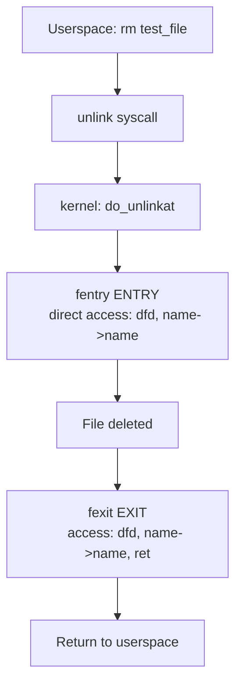

# eBPF Tutorial - Fentry Unlink

> [!summary]
> Monitor file deletion using fentry/fexit — the modern, high-performance successor to kprobe/kretprobe. Demonstrates direct parameter access and simultaneous input/output capture at function exit.

---

## What is fentry?

> [!info] fentry
> **fentry** (function entry) and **fexit** (function exit) are the modern way to trace kernel functions in eBPF. Introduced in kernel 5.5 for x86 and 6.0 for ARM, they serve as faster, more efficient successors to kprobes.

### fentry vs kprobe

| Aspect | fentry/fexit | kprobe/kretprobe |
|--------|--------------|------------------|
| **Parameter access** | Direct C-style access (e.g., `name->name`) | Requires `BPF_CORE_READ` helper |
| **Exit context** | Access to **both** input parameters **and** return value | kretprobe only provides return value |
| **Performance** | ~**10x faster** via BPF trampoline | Slower breakpoint-based approach |
| **Code simplicity** | No special memory-reading helpers | Must use helpers for kernel memory |

> [!tip] When to choose fentry
> Use fentry for production monitoring tools that run on every function call. The performance difference is significant at scale.

---

## Restrictions

> [!warning] fentry Requirements
> - **Kernel 5.5+** for x86/x86_64 processors
> - **Kernel 6.0+** for ARM/ARM64 processors
> - **BTF required:** `CONFIG_DEBUG_INFO_BTF=y` must be enabled
> - **eBPF features:** `CONFIG_BPF=y`, `CONFIG_BPF_SYSCALL=y`, `CONFIG_BPF_JIT=y`
> - **Function availability:** Target function must be exported and traceable

> [!warning] Common Error
> **Error code -524 (ENOTSUPP)** typically means your kernel doesn't support fentry/fexit. Check kernel version and BTF support, or fall back to kprobe.

---

## Architecture



### Key Difference from kprobe

With **fentry**, you access function parameters **directly** as regular C code:

```c
// fentry: direct access
bpf_printk("filename = %s\n", name->name);

// kprobe: requires helper
filename = BPF_CORE_READ(name, name);
bpf_printk("filename = %s\n", filename);
```

With **fexit**, you get **both inputs and return value** simultaneously:

```c
// fexit: access inputs (dfd, name) AND return value (ret)
int BPF_PROG(do_unlinkat_exit, int dfd, struct filename *name, long ret)
```

---

## Source Code

### eBPF Program (fentry-link.bpf.c)

```c
#include "vmlinux.h"
#include <bpf/bpf_helpers.h>
#include <bpf/bpf_tracing.h>

char LICENSE[] SEC("license") = "Dual BSD/GPL";

SEC("fentry/do_unlinkat")
int BPF_PROG(do_unlinkat, int dfd, struct filename *name)
{
    pid_t pid;

    pid = bpf_get_current_pid_tgid() >> 32;
    bpf_printk("fentry: pid = %d, filename = %s\n", pid, name->name);
    return 0;
}

SEC("fexit/do_unlinkat")
int BPF_PROG(do_unlinkat_exit, int dfd, struct filename *name, long ret)
{
    pid_t pid;

    pid = bpf_get_current_pid_tgid() >> 32;
    bpf_printk("fexit: pid = %d, filename = %s, ret = %ld\n", pid, name->name, ret);
    return 0;
}
```

### Code Breakdown

| Component | Purpose |
|-----------|---------|
| `BPF_PROG` | Macro for fentry/fexit programs; handles parameter unwrapping automatically |
| `name->name` | **Direct access** to `struct filename->name` without helper (fentry advantage) |

> [!info] `struct filename`
> `struct filename` is defined in the Linux kernel source (typically `include/linux/fs.h` or `include/linux/filename.h`) and is included via `vmlinux.h` generated from your kernel's BTF.
>
> ```c
> struct filename {
>     const char *name;        // The actual filename string
>     struct filename *next;   // For file renaming
>     ...
> };
> ```
>
> This is why fentry allows direct access to `name->name` without helpers — `vmlinux.h` from BTF includes this structure definition. To verify the exact layout on your system:
>
> ```bash
> bpftool btf dump file /sys/kernel/btf/vmlinux | grep -A 10 "struct filename"
> ```
| `ret` | Return value available at fexit exit point |
| `SEC("fentry/do_unlinkat")` | Attaches to function entry |
| `SEC("fexit/do_unlinkat")` | Attaches to function exit with full context |

---

## Macro Deep Dive

> [!info] `BPF_PROG(func, ...)`
> Similar to `BPF_KPROBE`, but designed specifically for fentry/fexit. It automatically unwraps parameters so you can define handlers with the exact same signature as the original kernel function.

---

## Build & Execute

### Step 1: Compile

```bash
ecc fentry-link.bpf.c
```

### Step 2: Run

```bash
sudo ecli run package.json
```

### Step 3: Trigger Events

```bash
touch test_file
rm test_file
touch test_file2
rm test_file2
```

### Step 4: View Output

```bash
sudo cat /sys/kernel/debug/tracing/trace_pipe
```

**Expected output:**
```
              rm-9290    [004] d..2  4637.798698: bpf_trace_printk: fentry: pid = 9290, filename = test_file
              rm-9290    [004] d..2  4637.798843: bpf_trace_printk: fexit: pid = 9290, filename = test_file, ret = 0
```

---

## Troubleshooting

| Issue | Solution |
|-------|----------|
| `failed to attach: ERROR: strerror_r(-524)=22` | Kernel doesn't support fentry. Check `uname -r` and BTF config. Use kprobe fallback. |
| BTF not enabled | Verify `cat /boot/config-$(uname -r) \| grep CONFIG_DEBUG_INFO_BTF` returns `=y` |
| Function not found | Check `sudo cat /sys/kernel/debug/tracing/available_filter_functions \| grep unlink` |

---

## Key Concepts Demonstrated

1. **fentry** - Modern kernel function entry instrumentation with direct parameter access
2. **fexit** - Exit capture with simultaneous input parameter and return value access
3. **BPF trampoline** - High-performance mechanism (~10x faster than kprobe breakpoints)
4. **Direct dereferencing** - `name->name` without `BPF_CORE_READ` helper

---

## Next Steps

- Compare with [[eBPF Tutorial - Kprobe Unlink]] for the legacy approach
- Review [[eBPF Tutorial - Hello World]] for tracepoint basics
- Check [[CO-RE (Compile Once - Run Everywhere)]] for BTF mechanics