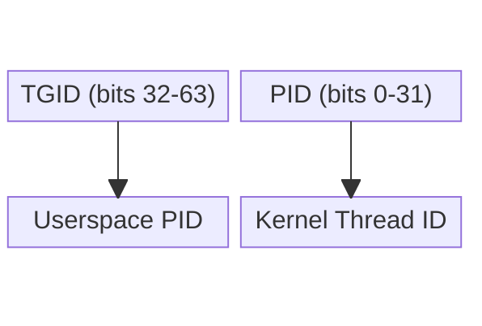

# eBPF Tutorial - Hello World

> [!summary]
> Complete "Hello World" eBPF program using the eunomia-bpf framework. Demonstrates CO-RE compilation, tracepoint attachment, and kernel-space debugging via bpf_printk.

---

## Program Overview

This tutorial creates a minimal eBPF program that attaches to the `sys_enter_write` tracepoint and logs "Hello World" with the process ID whenever a write syscall occurs.

### Architecture

```
User Space          Kernel Space
    │                      │
    │  ecli run            │
    │ ──────────────────>  │
    │                      │
    │  Load BPF program    │
    │  Attach to tracepoint│
    │                      │
    │  Write syscall       │
    │ ──────────────────>  │
    │                      │
    │  Trigger:            │
    │  bpf_printk()        │
    │                      │
    │  Output to trace_pipe│
    │ <──────────────────  │
    │                      │
    ▼                      ▼
```

---

## Source Code

### eBPF Program (stub.bpf.c)

```c
#define BPF_NO_GLOBAL_DATA  // For compatibility with kernels < 5.2

#include "vmlinux.h"
#include <bpf/bpf_helpers.h>

// License required for verifier approval
char LICENSE[] SEC("license") = "Dual BSD/GPL";

// Attach to write syscall tracepoint
SEC("tp/syscalls/sys_enter_write")
int handle_tp(void *ctx) {
    // Retrieve current process ID
    int pid = bpf_get_current_pid_tgid() >> 32;
    
    // Print to kernel trace pipe
    bpf_printk("Hello World from PID: %d\n", pid);
    
    return 0;
}
```

### Code Breakdown

| Component | Purpose |
|-----------|---------|
| `BPF_NO_GLOBAL_DATA` | Enables compatibility with kernels older than 5.2 |
| `vmlinux.h` | Core kernel type definitions (generated from BTF) |
| `SEC("license")` | Required license declaration for verifier |
| `SEC("tp/syscalls/sys_enter_write")` | Attaches to write syscall tracepoint |
| `bpf_get_current_pid_tgid()` | Retrieves current process ID and thread group ID |
| `bpf_printk()` | Outputs to kernel trace pipe (max 3 parameters) |

> [!info] No Loader Required
> The eunomia-bpf framework handles user-space loading automatically via `ecli`. You only write kernel-space code.

---

## Build & Execute

### Step 1: Compile

```bash
# Using ecc compiler (eunomia-bpf toolchain)
ecc stub.bpf.c

# Or using Docker
docker run -it -v $(pwd):/src ghcr.io/eunomia-bpf/ecc:latest ecc stub.bpf.c
```

**Output:** `package.json` (portable eBPF package with bytecode + BTF)

### Step 2: Run

```bash
# Load and execute with ecli
sudo ecli run package.json
```

### Step 3: View Output

```bash
# Read from kernel trace pipe (in another terminal)
sudo cat /sys/kernel/debug/tracing/trace_pipe
```

**Expected output:**
```
           <...>-12345   [000] .... 12345.678901: bpf_trace_printk: Hello World from PID: 12345
```

---

## Verification & Debugging

### Check Loaded Programs

```bash
# List active eBPF programs
sudo bpftool prog list
```

### Troubleshooting

| Issue | Solution |
|-------|----------|
| No output | Trigger a write syscall: `echo "test" > /tmp/test.txt` |
| Permission denied | Run with `sudo` |
| Program not loading | Check kernel BTF: `ls /sys/kernel/btf/vmlinux` |
| Output stops | Process stopped (Ctrl+C); restart with `ecli run` |

### Trigger Events

Since the program attaches to `sys_enter_write`, you need write activity to see output:

```bash
# Terminal 1: Monitor output
sudo cat /sys/kernel/debug/tracing/trace_pipe

# Terminal 2: Trigger writes
echo "Hello" > /tmp/test.txt
echo "World" > /tmp/test.txt
ls -la > /tmp/ls.txt
```

---

## Key Concepts Demonstrated

1. **Tracepoints** - Stable kernel instrumentation points
2. **CO-RE Compilation** - Single build runs on multiple kernels
3. **bpf_printk Debugging** - Kernel-space printf equivalent
4. **ecli Loader** - Zero-configuration program loading

---

## Deep Dive: Hello World Components

> [!info] `SEC(name)`
> A compiler macro that places eBPF symbols into specific ELF sections. The eBPF loader reads the section name to understand the program's purpose and determine where to attach it.
>
> For `SEC("tp/syscalls/sys_enter_write")`, the loader parses the tracepoint category (`tp`), subsystem (`syscalls`), and event (`sys_enter_write`), then attaches the program to that specific kernel hook.

> [!info] `void *ctx`
> The context parameter contains a pointer to a structure holding tracepoint-specific data and arguments generated by the kernel event.
>
> It is declared as `void*` in simple programs because the specific tracepoint arguments are not needed. In advanced programs, developers cast `ctx` to a specific C structure to access the underlying tracepoint arguments.

> [!info] `bpf_get_current_pid_tgid()`
> Returns a 64-bit integer (`__u64`) containing two values packed together:
> - **Upper 32 bits (bits 32-63):** `tgid` (Thread Group ID, appears as PID in userspace)
> - **Lower 32 bits (bits 0-31):** `pid` (kernel thread ID)
>
> Constructed as: `current_task->tgid << 32 | current_task->pid`
>
> The `>> 32` operation in Hello World extracts the upper 32 bits, giving us the userspace PID.
>
> Because `int` only holds 32 bits, assigning the raw 64-bit return value would truncate to the lower 32 bits — the kernel PID. The shift is required to move the upper 32 bits (tgid) into position before truncation captures the correct value.

![[eBPF Tutorial - Hello World.canvas]]



```c
// Extract upper 32 bits (TGID = userspace PID)
int pid = bpf_get_current_pid_tgid() >> 32;

// Extract lower 32 bits (kernel PID)
int tgid = bpf_get_current_pid_tgid() & 0xFFFFFFFF;
```

> [!info] `bpf_printk()`
> A debugging macro that outputs formatted text to the globally shared kernel log at `/sys/kernel/debug/tracing/trace_pipe`.
>
> **Limitations:** Writing to the trace pipe impacts performance during high-frequency events. The macro wraps either `bpf_trace_printk` (max 3 parameters + format string) or `bpf_trace_vprintk` (up to 12 parameters, requires kernel 5.16+).

> [!info] Tracepoints
> Stable, static kernel instrumentation points hardcoded directly into the Linux kernel source. They act as probe functions with guaranteed ABI stability.
>
> `sys_enter_write` fires every time a process enters the `write` system call, making it a reliable hook for capturing user-space I/O activity.

---

## Next Steps 

- Explore [[Atlas/Dots/Things/eBPF/eBPF Tutorial - Overview]] for conceptual foundation
- Review [[CO-RE (Compile Once - Run Everywhere)]] for portability mechanics
- Check [[libbpf Framework]] for low-level API details

---

## Complete File Structure

```
project/
├── stub.bpf.c          # eBPF source code
└── package.json        # Compiled eBPF package (generated)
```