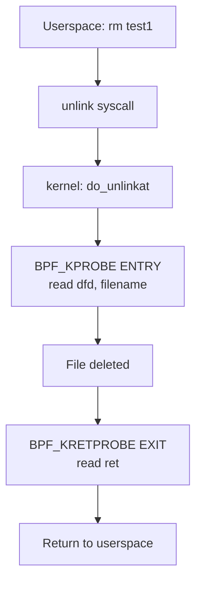

# eBPF Tutorial - Kprobe Unlink

> [!summary]
> Monitor file deletion via the `unlink` syscall using kprobe and kretprobe. Demonstrates dynamic kernel instrumentation on `do_unlinkat` with entry parameter capture and exit return-value inspection.

---

## What is a kprobe?

> [!info] kprobe
> **kprobes** dynamically insert probes into almost any Linux kernel function. They rely on CPU exception handling and single-step debugging: when kernel execution hits the probe point, control redirects to a user-defined callback. After the callback, single-stepping executes the original instruction and resumes normal flow.

### Detection Methods

| Type | Purpose |
|------|---------|
| **kprobe** | Place at any position; provides `pre_handler`, `post_handler`, `fault_handler` |
| **jprobe** | Capture input values of a probed function |
| **kretprobe** | Capture return values of a probed function |

> [!warning] kprobe Usage Restrictions
> kprobes can probe almost any kernel function, including interrupt handlers, but with strict guardrails:
> - **Forbidden targets:** kprobe implementation files (`kernel/kprobes.c`, `arch/*/kernel/kprobes.c`), `do_page_fault`, and `notifier_call_chain` cannot be probed.
> - **Inline functions unreliable:** GCC optimizations may inline functions, meaning probes may not catch all call sites.
> - **Callback constraints:** Preemption is disabled during callbacks (interrupts may be too). Never call CPU-yielding functions like semaphores or mutex locks.
> - **Re-entrancy guard:** If a probe triggers itself (e.g., `printk` probe calling `printk`), the callback is skipped and the `nmissed` counter increments to prevent infinite loops.

> [!warning] kretprobe Limitations
> kretprobe captures return values by replacing the real return address with a trampoline. This creates specific restrictions:
> - **Stack traces break:** `__builtin_return_address()` and stack backtraces show the trampoline address, not the real return address.
> - **Entry/exit mismatch:** Functions with unequal call/return counts like `do_exit()` will not work correctly. `do_execve()` and `do_fork()` are safe.
> - **Task stack switching:** On x86_64, `__switch_to()` is explicitly unsupported and will return `-EINVAL`.

---

## unlink Syscall Context

> [!info] unlink
> The `unlink` system call deletes a file. The tutorial hooks the underlying kernel function `do_unlinkat`, which handles the actual deletion.

### Entry Probe (kprobe)

Attaches to `do_unlinkat` to capture:
- `dfd` - directory file descriptor
- `name` - pointer to filename structure

Because eBPF runs in a restricted environment, `BPF_CORE_READ` safely reads the filename string from kernel memory.

### Exit Probe (kretprobe)

Attaches to `do_unlinkat` return to capture:
- `ret` - return value (`0` = success, negative = failure)

### Macro Deep Dives

> [!info] `BPF_KPROBE(func, ...)`
> Wraps the raw `struct pt_regs *ctx` passed by the kernel into typed arguments matching the probed function's signature. It performs architecture-specific register extraction so you don't need to parse `pt_regs` manually.

> [!info] `BPF_KRETPROBE(func, ret)`
> Similar to `BPF_KPROBE`, but captures the return value from the exit point. It reads the return register from `pt_regs` and passes it as the final argument before normal execution resumes.

> [!info] `BPF_CORE_READ(ptr, field)`
> Replaces unsafe pointer dereferences (`ptr->field`) with verified `bpf_probe_read` calls under the hood. Also emits CO-RE relocations so the field offset is recomputed at load time if the kernel structure layout differs.
>
> For a deeper look at the relocation mechanics used here, see [[eBPF Concept - BPF_CORE_READ|BPF_CORE_READ]].

### Execution Flow



---

## Source Code

### eBPF Program (kprobe-link.bpf.c)

```c
#include "vmlinux.h"
#include <bpf/bpf_helpers.h>
#include <bpf/bpf_tracing.h>
#include <bpf/bpf_core_read.h>

char LICENSE[] SEC("license") = "Dual BSD/GPL";

SEC("kprobe/do_unlinkat")
int BPF_KPROBE(do_unlinkat, int dfd, struct filename *name)
{
    pid_t pid;
    const char *filename;

    pid = bpf_get_current_pid_tgid() >> 32;
    filename = BPF_CORE_READ(name, name);
    bpf_printk("KPROBE ENTRY pid = %d, filename = %s\n", pid, filename);
    return 0;
}

SEC("kretprobe/do_unlinkat")
int BPF_KRETPROBE(do_unlinkat_exit, long ret)
{
    pid_t pid;

    pid = bpf_get_current_pid_tgid() >> 32;
    bpf_printk("KPROBE EXIT: pid = %d, ret = %ld\n", pid, ret);
    return 0;
}
```

### Code Breakdown

| Component | Purpose |
|-----------|---------|
| `pid_t` | Process ID type alias from `vmlinux.h` |
| `BPF_KPROBE` | Wraps `pt_regs` into typed function arguments matching the probed signature |
| `BPF_KRETPROBE` | Wraps `pt_regs` exit context into the return value argument |
| `BPF_CORE_READ(name, name)` | Safe dereference: reads `name->name` with CO-RE relocation |
| `bpf_get_current_pid_tgid() >> 32` | Extracts userspace PID from 64-bit TGID\|PID |
| `SEC("kprobe/do_unlinkat")` | Attaches entry probe to `do_unlinkat` |
| `SEC("kretprobe/do_unlinkat")` | Attaches return probe to `do_unlinkat` |

---

## Build & Execute

### Step 1: Compile

```bash
ecc kprobe-link.bpf.c
```

### Step 2: Run

```bash
sudo ecli run package.json
```

### Step 3: Trigger Events

Open another terminal and create/delete files:

```bash
touch test1
rm test1
touch test2
rm test2
```

### Step 4: View Output

```bash
sudo cat /sys/kernel/debug/tracing/trace_pipe
```

**Expected output:**
```
           rm-12345    [000] .... 12345.678901: bpf_trace_printk: KPROBE ENTRY pid = 12345, filename = test1
           rm-12345    [000] .... 12345.678902: bpf_trace_printk: KPROBE EXIT: pid = 12345, ret = 0
```

---

## Key Concepts Demonstrated

1. **kprobe** - Dynamic kernel function entry instrumentation
2. **kretprobe** - Return-value capture without source modification
3. **BPF_CORE_READ** - Safe kernel memory access in CO-RE programs
4. **Filename extraction** - Reading kernel structures from eBPF

---

## Next Steps

- Review [[Atlas/Dots/Things/eBPF/eBPF Tutorial - Hello World]] for tracepoint basics
- Check [[Atlas/Dots/Things/eBPF/eBPF Tutorial - Overview]] for conceptual foundation
- Explore [[CO-RE (Compile Once - Run Everywhere)]] for portability mechanics
