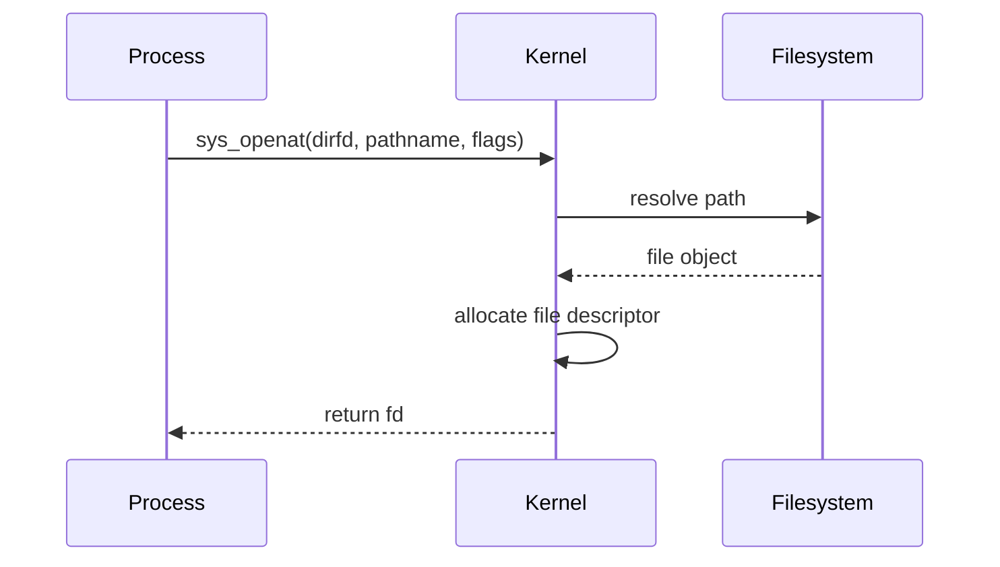
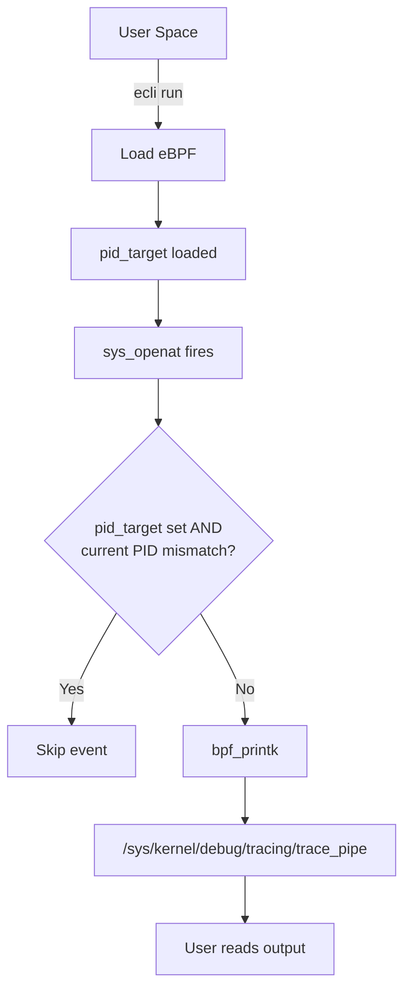

# eBPF Tutorial - Opensnoop (Global Variables)

> [!summary]
> Monitor file opens across the system using eBPF global variables for runtime filtering. Demonstrates kernel-user space configuration sharing and introduces BPF maps for state storage.

---

## Global Variables in eBPF

> [!info] What Are Global Variables?
> Global variables allow passing runtime configuration from user-space into kernel eBPF programs. They are stored in the **data section** of the compiled eBPF program and retained in kernel memory during execution.

### How They Work

```c
/// @description "Process ID to trace"
const volatile int pid_target = 0;
```

- **`const`** — eBPF program cannot modify the variable (read-only from kernel perspective)
- **`volatile`** — tells the compiler that user-space can modify the value before loading
- When `pid_target = 0`, the program captures all processes
- When set to a specific PID, the kernel filters out all other events

### User Space Interaction

User-space programs interact with global variables via BPF system calls (`bpf_obj_get_info_by_fd`). The eunomia-bpf framework automatically parses annotations like `/// @description` to generate CLI arguments:

```bash
sudo ecli run package.json --pid_target 618
```

---

## BPF Maps: The Alternative

> [!info] What Are BPF Maps?
> BPF maps are generic key-value stores that allow eBPF programs to share data with each other and with user-space applications. They are the primary mechanism for state storage and cross-program communication.

### Map Types

| Type | Use Case |
|------|----------|
| **BPF_MAP_TYPE_HASH** | Key-value storage (used in sigsnoop) |
| **BPF_MAP_TYPE_ARRAY** | Fixed-size indexed storage |
| **BPF_MAP_TYPE_RINGBUF** | Streaming data to user-space |
| **BPF_MAP_TYPE_PERF_EVENT_ARRAY** | Performance events output |

### Defining Maps

```c
struct {
    __uint(type, BPF_MAP_TYPE_HASH);
    __uint(max_entries, 10240);
    __type(key, __u32);           // TID as key
    __type(value, struct event);  // Event data as value
} values SEC(".maps");
```

### Map Operations

| Function | Purpose |
|----------|---------|
| `bpf_map_lookup_elem` | Read value by key |
| `bpf_map_update_elem` | Insert or update key-value pair |
| `bpf_map_delete_elem` | Remove entry by key |

---

## Global Variables vs Maps

| Aspect | Global Variables | BPF Maps |
|--------|------------------|----------|
| **Purpose** | Runtime configuration | State storage, data sharing |
| **Size** | Single values | Thousands of entries |
| **Persistence** | Fixed at load time | Dynamic during execution |
| **Kernel modification** | Read-only (`const`) | Read-write |
| **Cross-program** | No | Yes |
| **User-space access** | Via BPF object info | Direct lookup/update |
| **Use case** | Filter parameters | Event correlation, statistics |

> [!tip] When to Use What
> - **Global variables** for simple configuration (PID filter, enable/disable flags)
> - **Maps** for storing state, correlating events, or sharing data between programs

---

## sys_openat Syscall

> [!info] sys_openat
> The `sys_openat` system call is the interface processes use to request file open operations from the kernel. It takes parameters like file path and open mode, and returns a file descriptor.

### Process → File Interaction



---

## Program Architecture



---

## Source Code

### eBPF Program (opensnoop.bpf.c)

```c
#include <vmlinux.h>
#include <bpf/bpf_helpers.h>

/// @description "Process ID to trace"
const volatile int pid_target = 0;

SEC("tracepoint/syscalls/sys_enter_openat")
int tracepoint__syscalls__sys_enter_openat(struct trace_event_raw_sys_enter *ctx)
{
    u64 id = bpf_get_current_pid_tgid();
    u32 pid = id >> 32;

    // Filter by pid_target if set
    if (pid_target && pid_target != pid)
        return 0;

    // Print process information
    bpf_printk("Process ID: %d enter sys openat\n", pid);

    return 0;
}

/// "Trace open family syscalls."
char LICENSE[] SEC("license") = "GPL";
```

### Code Breakdown

| Component | Purpose |
|-----------|---------|
| `const volatile int pid_target` | Global variable for runtime PID filtering |
| `/// @description` | Annotation for eunomia-bpf CLI generation |
| `trace_event_raw_sys_enter` | Tracepoint context structure |
| `bpf_get_current_pid_tgid()` | Get current process/thread ID |
| `id >> 32` | Extract PID from 64-bit TGID\|PID |
| `pid_target && pid_target != pid` | Filter logic: skip if target doesn't match |

---

## Build & Execute

### Step 1: Compile

```bash
ecc opensnoop.bpf.c
```

### Step 2: Run (Capture All)

```bash
sudo ecli run package.json
```

### Step 3: Run (Filter by PID)

```bash
# Target specific PID (e.g., 618)
sudo ecli run package.json --pid_target 618
```

### Step 4: View Output

```bash
sudo cat /sys/kernel/debug/tracing/trace_pipe
```

**Expected output:**
```
Process ID: 1234 enter sys openat
Process ID: 5678 enter sys openat
```

---

## Restrictions

> [!warning] Global Variable Limitations
> - **Kernel 5.2+ required:** Global variables are unsupported on older kernels. Use `BPF_NO_GLOBAL_DATA` macro and BPF maps as fallback.
> - **Read-only in kernel:** `const volatile` means eBPF code cannot modify values at runtime.
> - **Single values only:** Not suitable for storing multiple events or state.

---

## Key Concepts Demonstrated

1. **Global Variables** — Runtime configuration without recompilation
2. **BPF Maps** — State storage and cross-event correlation
3. **Tracepoints** — Stable syscall instrumentation (`sys_enter_openat`)
4. **PID Filtering** — Kernel-side filtering for efficiency
5. **CLI Integration** — Automatic argument generation from annotations

---

## Map Example: State Storage Pattern

From the [sigsnoop tutorial](https://eunomia.dev/tutorials/6-sigsnoop/), here's how maps store state across entry/exit:

```c
// Store signal info at syscall entry
bpf_map_update_elem(&values, &tid, &event, BPF_ANY);

// Retrieve and complete at syscall exit
eventp = bpf_map_lookup_elem(&values, &tid);
eventp->ret = ret;

// Cleanup
bpf_map_delete_elem(&values, &tid);
```

This pattern is essential when you need to correlate data from two separate events (entry and exit).

---

## Next Steps

- Compare with [[eBPF Tutorial - Fentry Unlink]] for modern function tracing
- Review [[eBPF Tutorial - Hello World]] for tracepoint basics
- Explore [[CO-RE (Compile Once - Run Everywhere)]] for BTF mechanics
- Practice [[eBPF Tutorial - Kprobe Unlink]] for legacy function tracing