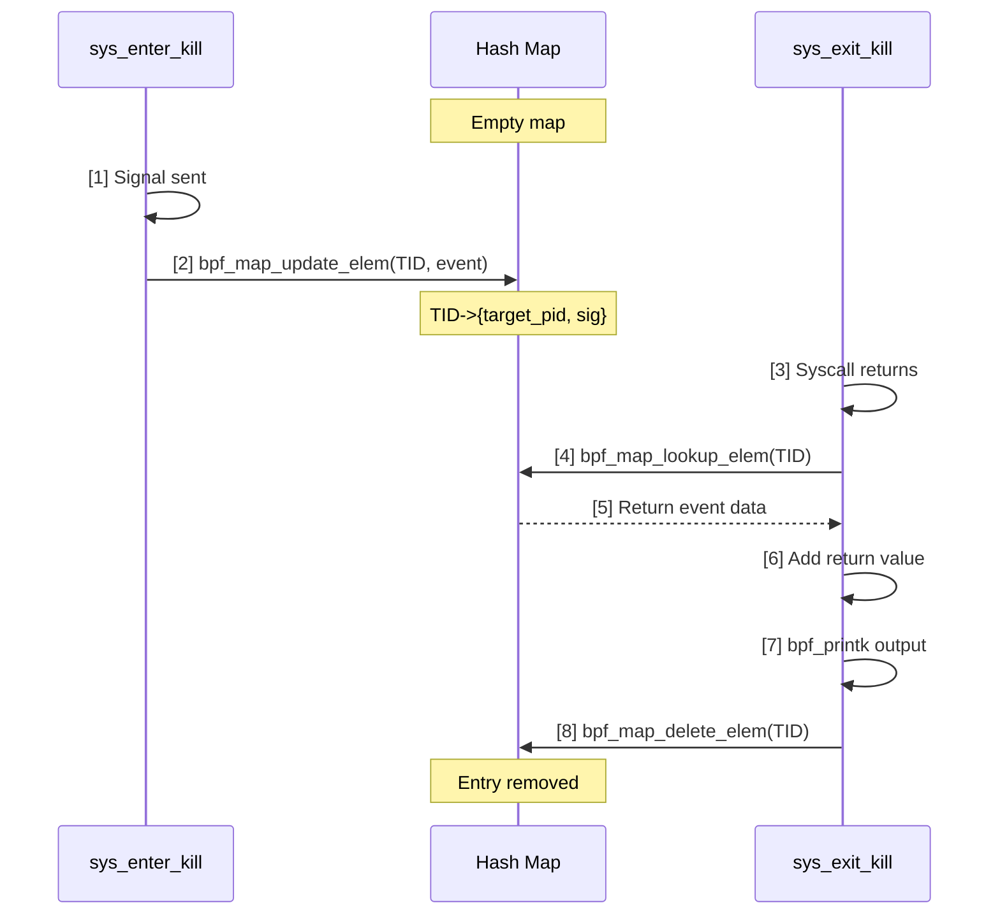
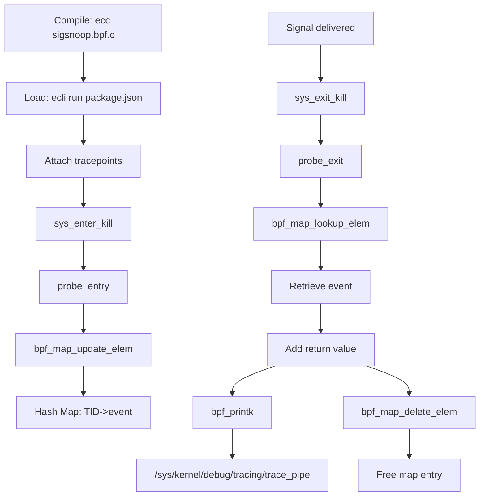

# eBPF Tutorial - Sigsnoop (eBPF Maps)

> [!summary]
> Trace inter-process signals using eBPF Hash Maps to correlate syscall entry and exit events. Demonstrates state storage, TID-keyed maps, memory leak prevention, and signal tracing fundamentals.

---

## What is Signal Tracing?

> [!info] Inter-Process Communication
> Signals are a fundamental IPC mechanism in Linux. Tracing `sys_enter_kill` and `sys_exit_kill` reveals who sends signals, to whom, what type, and whether delivery succeeded.

### Why Trace Both Entry and Exit?

Tracing **only entry** gives you intent (sender, target, signal number) but **not result**. Tracing **only exit** gives you success/failure but **not context**. You need **both** for complete visibility.

| Tracepoint       | Captures                                     |
| ---------------- | -------------------------------------------- |
| `sys_enter_kill` | Sender PID, target PID, signal number        |
| `sys_exit_kill`  | Return value (0 = success, negative = error) |

**Together they answer:** Who sent what signal to whom, and did it work?

---

## Common Linux Signals

| Signal | Number | Default Action | Description |
|--------|--------|----------------|-------------|
| **SIGHUP** | 1 | Terminate | Hangup detected on controlling terminal |
| **SIGINT** | 2 | Terminate | Interrupt from keyboard (Ctrl+C) |
| **SIGKILL** | 9 | Terminate | Force kill (cannot be caught or ignored) |
| **SIGTERM** | 15 | Terminate | Graceful termination request |
| **SIGSTOP** | 17 | Stop | Pause process (cannot be caught) |
| **SIGCONT** | 18 | Continue | Resume stopped process |
| **SIGUSR1** | 10 | Terminate | User-defined signal 1 |
| **SIGUSR2** | 12 | Terminate | User-defined signal 2 |

---

## Map Mechanics

> [!info] BPF_MAP_TYPE_HASH
> Hash maps store key-value pairs for state correlation between separate events.

### Why TID, Not PID?

> [!warning] Thread Collision Risk
> Threads within the same process make syscalls **independently**. Using PID as the map key would cause concurrent syscalls from different threads to **overwrite each other's data**.

| Key Type | Problem |
|----------|---------|
| **PID** | Thread A's signal overwrites Thread B's signal in the same process |
| **TID** | Each thread has unique ID; no collision between concurrent syscalls |

### Map Definition

```c
struct {
    __uint(type, BPF_MAP_TYPE_HASH);
    __uint(max_entries, 10240);
    __type(key, __u32);           // TID (not PID!)
    __type(value, struct event);
} values SEC(".maps");
```

| Parameter | Purpose |
|-----------|---------|
| `BPF_MAP_TYPE_HASH` | Key-value storage with O(1) lookup |
| `max_entries` | Maximum 10,240 entries (bounded memory) |
| `key` | Thread ID (TID) for unique syscall identification |
| `value` | Signal event data structure |

---

## Map Helpers Deep Dive

### bpf_map_update_elem

```c
bpf_map_update_elem(&values, &tid, &event, BPF_ANY);
```

**Purpose:** Insert or update a key-value pair in the hash map.

| Parameter | Description |
|-----------|-------------|
| `&values` | Pointer to the map |
| `&tid` | Key (TID) |
| `&event` | Value (signal data) |
| `BPF_ANY` | Create new or update existing |

**Used in:** `probe_entry` — stores signal info when syscall starts.

### bpf_map_lookup_elem

```c
eventp = bpf_map_lookup_elem(&values, &tid);
```

**Purpose:** Retrieve value by key from the hash map.

**Returns:** Pointer to value, or NULL if key not found.

**Used in:** `probe_exit` — retrieves stored signal info to correlate with return value.

### bpf_map_delete_elem

```c
bpf_map_delete_elem(&values, &tid);
```

**Purpose:** Remove key-value pair from the map.

> [!danger] Memory Leak Prevention
> **CRITICAL:** eBPF hash maps have strictly bounded size (10,240 entries). Without deletion, the map fills up and subsequent `bpf_map_update_elem` calls **fail silently**, dropping new tracing events.

**Used in:** `probe_exit` — **must delete after processing** to free map entry.

---

## State Correlation Flow



**Step-by-step:**
1. Signal syscall enters
2. Store signal info in map (TID as key)
3. Syscall executes in kernel
4. Syscall exits
5. Retrieve stored info by TID
6. Combine with return value
7. Print complete event
8. **Delete map entry** (prevent leak)

---

## Source Code

### eBPF Program (sigsnoop.bpf.c)

```c
#include "vmlinux.h"
#include <bpf/bpf_helpers.h>
#include <bpf/bpf_tracing.h>

#define MAX_ENTRIES 10240
#define TASK_COMM_LEN 16

char LICENSE[] SEC("license") = "Dual BSD/GPL";

// Event structure stored in map
struct event {
    unsigned int pid;
    unsigned int tpid;
    int sig;
    int ret;
    char comm[TASK_COMM_LEN];
};

// Hash map definition
struct {
    __uint(type, BPF_MAP_TYPE_HASH);
    __uint(max_entries, MAX_ENTRIES);
    __type(key, __u32);           // TID (not PID!)
    __type(value, struct event);
} values SEC(".maps");

// probe_entry: Runs when sys_enter_kill fires
static int probe_entry(pid_t tpid, int sig)
{
    struct event event = {};
    __u64 pid_tgid;
    __u32 tid;

    pid_tgid = bpf_get_current_pid_tgid();
    tid = (__u32)pid_tgid;
    event.pid = pid_tgid >> 32;
    event.tpid = tpid;
    event.sig = sig;
    bpf_get_current_comm(event.comm, sizeof(event.comm));
    
    // Store in hash map using TID as key
    bpf_map_update_elem(&values, &tid, &event, BPF_ANY);
    return 0;
}

// probe_exit: Runs when sys_exit_kill fires
static int probe_exit(void *ctx, int ret)
{
    __u64 pid_tgid = bpf_get_current_pid_tgid();
    __u32 tid = (__u32)pid_tgid;
    struct event *eventp;

    // Retrieve stored event by TID
    eventp = bpf_map_lookup_elem(&values, &tid);
    if (!eventp)
        return 0;

    // Add return value
    eventp->ret = ret;
    
    // Print complete signal event
    bpf_printk("PID %d (%s) sent signal %d ",
               eventp->pid, eventp->comm, eventp->sig);
    bpf_printk("to PID %d, ret = %d",
               eventp->tpid, ret);

    // CRITICAL: Delete to prevent memory leak
    bpf_map_delete_elem(&values, &tid);
    return 0;
}

SEC("tracepoint/syscalls/sys_enter_kill")
int kill_entry(struct trace_event_raw_sys_enter *ctx)
{
    pid_t tpid = (pid_t)ctx->args[0];
    int sig = (int)ctx->args[1];
    return probe_entry(tpid, sig);
}

SEC("tracepoint/syscalls/sys_exit_kill")
int kill_exit(struct trace_event_raw_sys_exit *ctx)
{
    return probe_exit(ctx, ctx->ret);
}
```

### Code Breakdown

| Component | Purpose |
|-----------|---------|
| `struct event` | Signal data: sender, target, signal number, return value, command name |
| `BPF_MAP_TYPE_HASH` | Key-value storage for entry/exit correlation |
| `tid = (__u32)pid_tgid` | Extract TID (lower 32 bits) from pid_tgid |
| `bpf_map_update_elem` | Store event at syscall entry |
| `bpf_map_lookup_elem` | Retrieve event at syscall exit |
| `bpf_map_delete_elem` | **Prevent memory leak** — remove after processing |
| `bpf_get_current_comm` | Get sender's command name |
| `ctx->args[0]` | Target PID (from tracepoint args) |
| `ctx->args[1]` | Signal number (from tracepoint args) |

---

## Alternative Map Types

> [!info] When to Use Other Map Types
> While HASH maps are ideal for entry/exit correlation, other map types serve different purposes:

| Map Type | Best For | Why Not Here? |
|----------|----------|---------------|
| **BPF_MAP_TYPE_ARRAY** | Fixed-size indexed data | No fixed index; dynamic TID keys |
| **BPF_MAP_TYPE_RINGBUF** | Streaming events to user-space | Overkill for simple correlation |
| **BPF_MAP_TYPE_PERF_EVENT_ARRAY** | Performance monitoring | Not needed for signal tracing |
| **BPF_MAP_TYPE_LRU_HASH** | Automatic eviction | Explicit deletion preferred for clarity |

---

## Execution Flow



---

## Build & Execute

### Step 1: Compile

```bash
ecc sigsnoop.bpf.c
```

### Step 2: Run

```bash
sudo ecli run package.json
```

### Step 3: Generate Events

Send signals between processes:

```bash
# Terminal 1: Start a sleep process
sleep 100 &
# Note the PID (e.g., 1234)

# Terminal 2: Send signals
kill -TERM 1234
kill -KILL 5678  # non-existent PID to see error
```

### Step 4: View Output

```bash
sudo cat /sys/kernel/debug/tracing/trace_pipe
```

**Expected output:**
```
     systemd-journal-363     [000] d...1   672.563868: bpf_trace_printk: PID 363 (systemd-journal) sent signal 0
     systemd-journal-363     [000] d...1   672.563869: bpf_trace_printk: to PID 1400, ret = 0
     systemd-journal-363     [000] d...1   672.563870: bpf_trace_printk: PID 363 (systemd-journal) sent signal 0
     systemd-journal-363     [000] d...1   672.563870: bpf_trace_printk: to PID 1527, ret = -3
```

---

### eBPF Map Helpers Deep Dive

#### bpf_map_update_elem

> [!info] Definition
> Insert or update a key-value pair in an eBPF map.

```c
static long (* const bpf_map_update_elem)(
    void *map, 
    const void *key, 
    const void *value, 
    __u64 flags
) = (void *) 2;
```

| Parameter | Description |
|-----------|-------------|
| `map` | Pointer to map definition |
| `key` | Pointer to key |
| `value` | Pointer to value |
| `flags` | Behavior flags |

**Flags:**

| Flag | Behavior |
|------|----------|
| `BPF_ANY` | Create or update (default) |
| `BPF_NOEXIST` | Only create if key doesn't exist |
| `BPF_EXIST` | Only update if key already exists |

> [!warning] Array Map Limitation
> `BPF_NOEXIST` is not supported for `BPF_MAP_TYPE_ARRAY` since all keys always exist.

**Returns:** `0` on success, negative error on failure.

---

#### bpf_map_lookup_elem

> [!info] Definition
> Look up a value by key in an eBPF map.

```c
static void *(* const bpf_map_lookup_elem)(
    void *map, 
    const void *key
) = (void *) 1;
```

| Parameter | Description |
|-----------|-------------|
| `map` | Pointer to map definition |
| `key` | Pointer to key |

**Returns:** Pointer to map value, or `NULL` if not found.

> [!warning] CRITICAL: NULL Check Required
> The verifier requires explicit NULL checking before dereferencing the returned pointer. Always check `if (!ptr) return 0;` before using the result.

> [!warning] Race Conditions
> The returned pointer is a direct reference to kernel memory (not a copy). Modifications are automatically persisted, but concurrent access to non-per-CPU maps requires atomic instructions or spinlocks.

---

#### bpf_map_delete_elem

> [!info] Definition
> Delete a key-value pair from an eBPF map.

```c
static long (* const bpf_map_delete_elem)(
    void *map, 
    const void *key
) = (void *) 3;
```

| Parameter | Description |
|-----------|-------------|
| `map` | Pointer to map definition |
| `key` | Pointer to key |

**Returns:** `0` on success, negative error on failure.

> [!danger] Memory Leak Prevention
> eBPF hash maps have bounded size (`max_entries`). Without deletion, the map fills up and `bpf_map_update_elem` fails silently, dropping events. **Always delete entries after processing.**

---

## Key Concepts Demonstrated

1. **Tracepoint Pairing** — `sys_enter_kill` + `sys_exit_kill` for complete event visibility
2. **Hash Maps** — BPF_MAP_TYPE_HASH for state storage between events
3. **TID vs PID** — Thread ID prevents collision between concurrent syscalls
4. **Map Lifecycle** — update → lookup → **delete** (memory leak prevention)
5. **Signal Numbers** — Understanding common Linux signals and their meanings
6. **Entry/Exit Correlation** — Pattern applicable to any syscall pair

---

## Next Steps

- Review [[eBPF Tutorial - Opensnoop]] for global variable configuration
- Explore [[eBPF Tutorial - Hello World]] for tracepoint basics
- Compare with [[eBPF Tutorial - Kprobe Unlink]] for kernel function tracing
- Practice [[eBPF Tutorial - Fentry Unlink]] for modern kernel probes