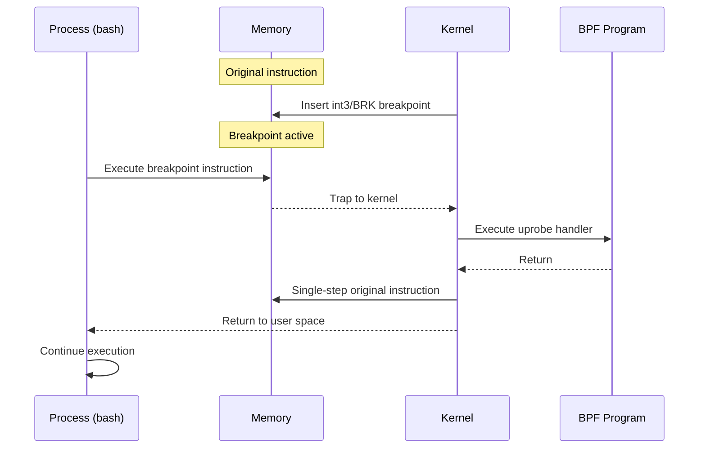
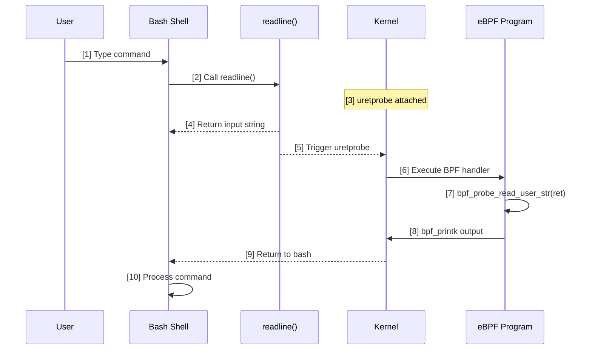
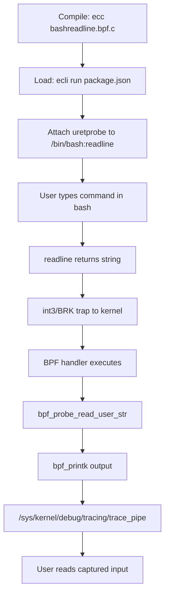

# eBPF Tutorial - Uprobe Bashreadline

> [!summary]
> Capture bash command input using uprobe/uretprobe dynamic instrumentation. Demonstrates user-space probing, int3 breakpoint mechanism, memory safety with bpf_probe_read_user_str, and performance considerations.

---

## What are uprobe and uretprobe?

> [!info] uprobe
> **Uprobes** are user-space probes that allow dynamic instrumentation of user-space programs, including executables, shared libraries, and JIT-compiled code. Unlike kprobes, uprobes are **file-based** — when a function in a binary is traced, all processes using that file across the entire system are instrumented.

> [!info] uretprobe
> **Uretprobes** are the return-counterparts to uprobes. They trigger when a user-space function completes and returns to its caller, allowing the eBPF program to capture the function's return value.

---

## Dynamic Instrumentation Mechanism

### Breakpoint Insertion

When you define a uprobe, the kernel dynamically modifies the target instruction in user-space memory by inserting a fast software breakpoint:

| Architecture | Breakpoint Instruction |
|--------------|------------------------|
| **x86/x86_64** | `int3` (0xCC) |
| **ARM/ARM64** | `BRK` instruction |

### Execution Flow



**Step-by-step:**
1. Kernel inserts breakpoint at target instruction
2. Process executes breakpoint → trap to kernel mode
3. Kernel calls attached eBPF handler
4. eBPF program reads data (e.g., return value)
5. Kernel single-steps original instruction
6. Execution returns to user space

---

## Probe Locations

Uprobes can be attached to three primary locations:

1. **Function entry points** — start of a function
2. **Specific instruction offsets** — any position within a function
3. **Function returns** — via uretprobe

> [!tip] Offset Probing
> Unlike kprobes, uprobes allow you to specify an **offset** within a binary. This means you can instrument the middle of a function to capture specific variable states, not just entry/exit points.

---

## uprobe vs kprobe

| Aspect | uprobe | kprobe |
|--------|--------|--------|
| **Target** | User-space functions | Kernel functions |
| **Location** | File-based (all processes using binary) | Address-based |
| **Use case** | HTTP/2, HTTPS, bash input | Syscalls, kernel internals |
| **Mechanism** | int3/BRK breakpoint | CPU exception |
| **Overhead** | Higher (user→kernel context switch) | Lower |

### Why Use Uprobes?

Uprobes are strictly required for capturing data that the kernel cannot parse natively:
- **User-mode HTTP/2 traffic** — headers are encoded in user-space
- **HTTPS traffic** — payloads are TLS/SSL encrypted in user-space libraries (libssl, gnutls)
- **Bash readline** — capture raw command-line input before shell processing

---

## Memory Safety: bpf_probe_read_user_str

> [!warning] User-Space Memory Access
> When the eBPF uprobe handler runs, it executes in **kernel space**. It cannot safely or directly dereference pointers pointing to user-space memory.

### Why Required?

The eBPF VM operates in kernel mode, but the data it needs (like the bash command string) lives in user-space memory. Direct dereferencing would cause:
- Page faults
- Security vulnerabilities
- Kernel crashes

### Safe Copy Mechanism

```c
bpf_probe_read_user_str(&str, sizeof(str), ret);
```

| Parameter | Purpose |
|-----------|---------|
| `&str` | Destination buffer in eBPF stack |
| `sizeof(str)` | Maximum bytes to copy |
| `ret` | Source pointer (user-space return value) |

This helper safely copies the string from user-space memory into the eBPF program's stack, performing all necessary validation.

> [!info] See Also
> For a comprehensive guide on all string reading helpers including `bpf_probe_read_str` and `bpf_probe_read_kernel_str`, see [[eBPF Helper - bpf_probe_read_str|bpf_probe_read_str]].

---

## Performance Overhead

> [!warning] Context Switch Cost
> Uprobes can introduce significant performance overhead, especially when targeting high-frequency user-space functions (like `malloc`). Every hit requires an expensive **context switch** between user mode and kernel mode.

### Alternative: bpftime (User-Space eBPF Runtime)

**bpftime** is a user-mode eBPF runtime built on LLVM JIT/AOT:
- Runs eBPF programs entirely in **user space**
- **Avoids kernel-user context switch** completely
- Improves execution efficiency by up to **10x** compared to kernel-mode uprobes
- Ideal for high-frequency tracing scenarios

---

## Source Code

### eBPF Program (bashreadline.bpf.c)

```c
#include "vmlinux.h"
#include <bpf/bpf_helpers.h>
#include <bpf/bpf_tracing.h>

char LICENSE[] SEC("license") = "Dual BSD/GPL";

// SEC Syntax:
// "uretprobe"   = probe type (return probe)
// "/bin/bash"   = absolute path to binary
// "readline"    = function to hook
SEC("uretprobe//bin/bash:readline")
int BPF_KRETPROBE(printret, const void *ret)
{
    char comm[16];
    char str[17];
    u32 pid;

    // Get current task name
    bpf_get_current_comm(&comm, sizeof(comm));
    
    // Get PID
    pid = bpf_get_current_pid_tgid() >> 32;
    
    // Safely read user input from user-space memory
    bpf_probe_read_user_str(&str, sizeof(str), ret);

    // Print to kernel trace pipe
    bpf_printk("PID: %d, Comm: %s, Line: %s\n", pid, comm, str);
    
    return 0;
}
```

### SEC Syntax Breakdown

```
SEC("uretprobe//bin/bash:readline")
       │        │         │
       │        │         └── Function name
       │        └──────────── Binary path
       └───────────────────── Probe type
```

| Component | Description |
|-----------|-------------|
| `uretprobe` | Probe type: trigger on function return |
| `/bin/bash` | Absolute path to target binary |
| `readline` | Function name to instrument |

### Code Breakdown

| Component | Purpose |
|-----------|---------|
| `BPF_KRETPROBE` | Macro for uretprobe handlers with return value access |
| `const void *ret` | Return value pointer (user-space string from readline) |
| `bpf_get_current_comm` | Get current task/process name |
| `bpf_probe_read_user_str` | Safely read user-space string into kernel buffer |
| `bpf_printk` | Output to kernel trace pipe |

---

## Process/File Interaction



---

## Execution Flow



---

## Build & Execute

### Step 1: Compile

```bash
ecc bashreadline.bpf.c
```

### Step 2: Run

```bash
sudo ecli run package.json
```

### Step 3: Generate Events

Open a new bash shell and type commands:

```bash
bash
ls -la
echo "hello world"
exit
```

### Step 4: View Output

```bash
sudo cat /sys/kernel/debug/tracing/trace_pipe
```

**Expected output:**
```
     bash-12345    [000] .... 12345.678901: bpf_trace_printk: PID: 12345, Comm: bash, Line: ls -la
     bash-12345    [000] .... 12345.678902: bpf_trace_printk: PID: 12345, Comm: bash, Line: echo "hello world"
```

---

## Troubleshooting

> [!warning] Symbol Not Found Error
> If you encounter `elf: failed to find symbol 'readline' in '/bin/bash'`, modern Linux distributions dynamically link bash against `libreadline` instead of embedding it directly.

### Solution

**Step 1:** Find the actual library path:

```bash
ldd /bin/bash | grep readline
# Output: libreadline.so.8 => /lib64/libreadline.so.8
```

**Step 2:** Update the SEC macro in your eBPF code:

```c
// Change from:
SEC("uretprobe//bin/bash:readline")

// To:
SEC("uretprobe//lib64/libreadline.so.8:readline")
```

**Step 3:** Recompile and run:

```bash
ecc bashreadline.bpf.c
sudo ecli run package.json
```

This works because uprobe instruments the **binary file** (`libreadline.so.8`) rather than the process (`/bin/bash`), and all processes using that library will be traced.

---

## Key Concepts Demonstrated

1. **User-space dynamic instrumentation** — uprobe/uretprobe attach to user binaries
2. **Breakpoint mechanism** — int3 (x86) / BRK (ARM) instruction insertion
3. **User-space memory safety** — bpf_probe_read_user_str for safe copying
4. **SEC syntax** — `uretprobe//path:function` format for binary targeting
5. **Context switch overhead** — performance cost vs bpftime alternative
6. **File-based tracing** — all processes using binary are instrumented

---

## Next Steps

- Compare with [[eBPF Tutorial - Kprobe Unlink]] for kernel-space tracing
- Review [[eBPF Tutorial - Fentry Unlink]] for modern kernel function tracing
- Explore [[eBPF Tutorial - Opensnoop]] for global variable filtering
- Consider [[libbpf Framework]] for low-level API details