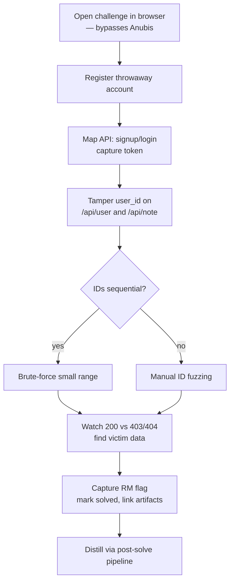

# Root-Me API Broken Access (IDOR)

Challenge: [API - Broken Access](https://www.root-me.org/en/Challenges/Web-Server/API-Broken-Access) — Root-Me Web/Server challenge, topic: IDOR (Insecure Direct Object Reference).

> [!Milestone]+ Status: prep — not solved
> First attempt. Vault search (`idor`, `root-me`, `broken access`, `api security`, `OWASP`) → no prior notes on this topic.

## What is known

- **Profile:** Easy, 2nd of the "API - Broken Access" series (follow-ups: [API - Broken Access 2](https://www.root-me.org/en/Challenges/Web-Server/API-Broken-Access-2), GraphQL - Introspection). ~3% completion, 40 pts, ID 9006.
- **Surface (public walkthroughs):** `/api/signup`, `/api/login`, `/api/user`, `/api/note` — register → login → note CRUD; `user_id` attacker-controlled.
- **Flag format:** `RM{...}`.

> [!NOTE]- Access: Anubis anti-bot
> Challenge page is served behind Anubis — scripted fetches return a bot-check page. Use a real browser session.

> [!Link]- Research (method only)
> [Walkthrough](https://medium.com/@ssh_fsociety/root-me-web-server-lab-7-api-broken-access-walkthrough-edfa6744a4ed) · [writeup repo](https://github.com/Dallihunter/root-me-web-writeups). Solve live — don't copy flags.

## Open questions

- How is `user_id` assigned — sequential/enumerable? Is admin a low ID?
- Where is authorization enforced — endpoint-level checks or object-level lookup?
- Does the session token bind to the user, or do requests accept tampered params?
- Is `/api/user` a single-object fetch or a list that leaks all users?

## Solve plan

## Post-solve pipeline

> [!COMMAND]- Learnings → vault Knowledge Pipeline (no custom tooling)
> 1. **Encounter Gate** — `skill://grill-me`: raw spark? → capture to `+/`; to promote, skip gate (`.omp/RULES.md` Steps 0–0b).
> 2. **Classify** knowledge type (Concept/Process/Entity/Principle) — `.omp/knowledge/knowledge-classification.md`.
> 3. **Distill → locate → link** — @sensemaker (atomic notes, own words) → @librarian (location) → @connector (`up:`/`related:`, duplicates, `needs-moc`). Destination `Atlas/` (`.omp/RULES.md` Steps 1–4). Logged via `bash .omp/scripts/knowledge-pipeline.sh`. Research: Open Notebook.
> 4. **Confidence** — ≥0.85 auto-run; 0.70–0.84 confirm; <0.70 options per step (`.omp/knowledge/workflows.md`). Fallbacks: @librarian fails → `+/`; @connector fails → linkless + flag.
> 5. **Frontmatter + validation** — `standards.md`, `output-standards.md`, Validation Checklist (`.omp/knowledge/workflows.md`).
> 6. **MOC Gate** — `skill://grill-me` + `skill://moc-workbench`; `scripts/validate_moc.py` (`.omp/RULES.md` Step 5; squeeze-point rule).

Never ingest challenge tokens/keys into notes — `.omp/RULES.md` Sensitive Data Protection (FATAL).
