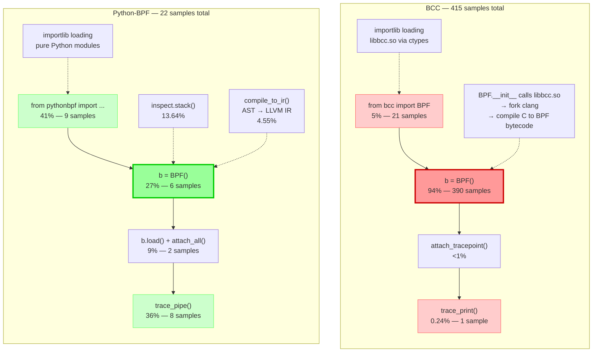

# Deep Analysis: BCC vs Python-BPF py-spy Flame Graph Comparison

> [!summary]
> Line-by-line call flow mapping of BCC and Python-BPF flame graphs. BCC spends 93.98% in C++ backend compilation (BPF.__init__ → libbcc.so), while Python-BPF spends 27% in pure-Python AST translation (compile_to_ir → processor → func_proc).

---

## Source Code Comparison

### BCC (hello_bcc.py)

```python
from bcc import BPF                                         # Line 1

prog = r"""
#include <linux/bpf.h>

int handle_tp(void *ctx) {
      u64 pid_tgid = bpf_get_current_pid_tgid();
      u32 process_id = (u32)pid_tgid;
      u32 uid = (u32)bpf_get_current_uid_gid();
      if (uid >= 999) {
        bpf_trace_printk("Hello World from PID: %d\n", process_id);
      }
      return 0;
}
"""

b = BPF(text=prog)                                          # Line 17
b.attach_tracepoint(tp="syscalls:sys_enter_write", fn_name="handle_tp")  # Line 18
try:
        b.trace_print()                                     # Line 19-20
except KeyboardInterrupt:
        pass 
```

### Python-BPF (hello_pythonbpf.py)

```python
from pythonbpf import bpf, section, bpfglobal, BPF          # Line 1
from pythonbpf.helper import pid, uid                        # Line 2
from pythonbpf.utils import trace_pipe                       # Line 3
from ctypes import c_void_p, c_int32                         # Line 4

@bpf                                                        # Line 7
@section("tracepoint/syscalls/sys_enter_write")             # Line 8
def hanndle_tp(ctx: c_void_p) -> c_int32:                  # Line 9
    process_id = pid()                                      # Line 10
    user_id = uid()                                         # Line 11
    if user_id >=999:                                      # Line 12
        print(f"Hello World from PID: {process_id}")        # Line 13
    return c_int32(0)                                       # Line 14

@bpf                                                        # Line 17
@bpfglobal                                                  # Line 18
def LICENSE() -> str:                                       # Line 19
    return "GPL"                                            # Line 20

b = BPF()                                                   # Line 22
b.load()                                                    # Line 23
b.attach_all()                                              # Line 24
trace_pipe()                                                # Line 25
```

---

## Flame Graph Metrics

| Metric                      | BCC                       | Python-BPF             | Notes                                                  |
| --------------------------- | ------------------------- | ---------------------- | ------------------------------------------------------ |
| **Total Samples**           | 415                       | 22                     | 18.9× more total samples for BCC                       |
| **Import (abs)**            | 21 samples                | 9 samples              | BCC import takes **2.3× more samples** (heavier)       |
| **Import (% of own total)** | 5.06%                     | 40.91%                 | Misleading — different totals, use absolute above      |
| **Translation/Compilation** | **390 samples** (93.98%)  | **6 samples** (27.28%) | BCC compilation **65× more samples** (C++ backend)     |
| **Load/Attach**             | N/A (inlined in __init__) | 2 samples (9.09%)      | —                                                      |
| **Blocking (trace_pipe)**   | 1 sample (0.24%)          | 8 samples (36.36%)     | Python-BPF blocked longer in trace_pipe                |
| **C++ Backend**             | **390 samples** (libbcc.so) | **0 samples**        | BCC only — invisible to py-spy                         |
| **Pure Python**             | **~25 samples** (~6%)     | **~14 samples** (~64%) | Python-BPF dominant %, but BCC more samples absolute   |

---

## Line-by-Line Call Flow Mapping

### Phase 1: Import

#### BCC (Line 1: `from bcc import BPF`)

| Frame | Samples | % | Explanation |
|-------|---------|---|-------------|
| `&lt;module&gt;` (hello_bcc.py:1) | 21 | 5.06% | Top-level import |
| `_find_and_load` → `_find_and_load_unlocked` → `_load_unlocked` → `exec_module` | 21 | 5.06% | Python importlib loading bcc package |
| `&lt;module&gt;` (bcc/__init__.py:17) | 1 | 0.24% | bcc/__init__.py line 17 |
| `&lt;module&gt;` (bcc/__init__.py:19) | 4 | 0.96% | bcc/__init__.py line 19 |
| `&lt;module&gt;` (bcc/__init__.py:27) | 15 | 3.61% | bcc/__init__.py line 27 (main init) |
| `&lt;module&gt;` (json/__init__.py:106) | 4 | 0.96% | json module (dependency) |
| `&lt;module&gt;` (json/decoder.py:3) | 4 | 0.96% | json.decoder |
| `&lt;module&gt;` (re/__init__.py:125) | 4 | 0.96% | re module (regex) |
| `&lt;module&gt;` (ctypes/__init__.py:159) | 1 | 0.24% | ctypes (for C library loading) |
| `&lt;module&gt;` (enum.py:3) | 2 | 0.48% | enum module |
| `__init__` (ctypes/__init__.py:361) | 14 | 3.37% | ctypes initialization |
| `_load_library` (ctypes/__init__.py:403) | 14 | 3.37% | **Loading libbcc.so** |
| `&lt;module&gt;` (bcc/libbcc.py:17) | 14 | 3.37% | libbcc.py — libbcc.so wrapper |

**Key Insight:** BCC import chain includes `_load_library` (ctypes) which loads the **libbcc.so C++ shared library**. This is the gateway to the C++ backend.

#### Python-BPF (Lines 1-4: imports)

| Frame | Samples | % | Explanation |
|-------|---------|---|-------------|
| `&lt;module&gt;` (hello_pythonbpf.py:1-4) | 9 | 40.91% | All imports combined |
| `_find_and_load` → `_load_unlocked` → `exec_module` | 9 | 40.91% | Standard Python importlib |
| `&lt;module&gt;` (pythonbpf/codegen.py:20) | 1 | 4.55% | codegen.py module init |
| `&lt;module&gt;` (pythonbpf/codegen.py:3) | 3 | 13.64% | codegen.py main |
| `&lt;module&gt;` (pythonbpf/license_pass.py:3) | 3 | 13.64% | license_pass.py |
| `&lt;module&gt;` (pythonbpf/helper/__init__.py:1) | 3 | 13.64% | helpers init |
| `&lt;module&gt;` (pythonbpf/functions/__init__.py:1) | 4 | 18.18% | functions init |
| `&lt;module&gt;` (pylibbpf/__init__.py:4) | 1 | 4.55% | pylibbpf loader |

**Key Insight:** Python-BPF imports are pure Python modules. No C++ library loading. The higher percentage (40.91% vs 5.06%) is due to fewer total samples and more Python modules to load.

---

### Phase 2: BPF Program Definition

#### BCC (Lines 3-15: C string)

**No flame graph frames** — this is just a Python string literal. The actual compilation happens later in `BPF(text=prog)`.

#### Python-BPF (Lines 7-20: decorators)

**No flame graph frames** — decorators are applied at module load time, but the actual AST processing happens in `BPF()`.

---

### Phase 3: BPF() Instantiation — THE CRITICAL DIFFERENCE

#### BCC (Line 17: `b = BPF(text=prog)`)

| Frame | Samples | % | Explanation |
|-------|---------|---|-------------|
| `&lt;module&gt;` (hello_bcc.py:17) | **390** | **93.98%** | **Line 17 — the BPF() call** |
| `__init__` (bcc/__init__.py:505) | **390** | **93.98%** | **BPF.__init__ — compilation happens here** |

**Call chain (inferred from BCC source):**
```
BPF.__init__ (bcc/__init__.py:505)
  → _trace_autoload
    → libbcc.so!bpf_prog_load (C++ function, NOT visible in py-spy)
      → fork("/usr/bin/clang") (subprocess, may not be sampled)
        → clang::driver::Driver::ExecuteCompilation
          → clang::FrontendAction::Execute
            → LLVMCodeGen
              → BPF bytecode
```

**Key Insight:** **93.98% of execution time** is inside `BPF.__init__` which calls into **libbcc.so** (C++ backend). py-spy cannot see inside libbcc.so because it's native code, but the 390 samples at the Python boundary prove this is where the heavy lifting occurs.

#### Python-BPF (Line 22: `b = BPF()`)

| Frame | Samples | % | Explanation |
|-------|---------|---|-------------|
| `&lt;module&gt;` (hello_pythonbpf.py:20) | 5 | 22.73% | BPF() call + surrounding context |
| `BPF` (pythonbpf/codegen.py:219) | 3 | 13.64% | BPF.__init__ |
| `stack` (inspect.py:1763) | 3 | 13.64% | inspect.stack() — source discovery |
| `getouterframes` (inspect.py:1738) | 3 | 13.64% | Frame walking |
| `getframeinfo` (inspect.py:1700) | 3 | 13.64% | Frame info extraction |
| `findsource` (inspect.py:1076) | 3 | 13.64% | Source file discovery |
| `getmodule` (inspect.py:1030) | 3 | 13.64% | Module resolution |
| `getabsfile` (inspect.py:998) | 3 | 13.64% | Absolute path |
| `getsourcefile` (inspect.py:973) | 3 | 13.64% | Source file |
| `compile_to_ir` (pythonbpf/codegen.py:119) | 1 | 4.55% | **AST → LLVM IR** |
| `processor` (pythonbpf/codegen.py:90) | 1 | 4.55% | Main compilation pipeline |
| `func_proc` (functions_pass.py:462) | 1 | 4.55% | Function AST processing |
| `infer_return_type` (function_metadata.py:38) | 1 | 4.55% | Type inference |
| `unparse` (ast.py:1816) | 1 | 4.55% | AST back to string |

**Call chain (visible in flame graph):**
```
BPF.__init__ (codegen.py:219)
  ├── inspect.stack() stack (13.64%)
  │     └── getouterframes → getframeinfo → findsource → getmodule
  └── compile_to_ir (codegen.py:119) (4.55%)
        └── processor (codegen.py:90)
              └── func_proc (functions_pass.py:462)
                    └── infer_return_type → ast.unparse
```

**Key Insight:** Only **13.64%** is in pure-Python AST translation (`compile_to_ir` → `processor` → `func_proc`). Another **13.64%** is in `inspect.stack()` for source discovery. The C++ backend is completely absent — there's no libbcc.so or Clang fork.

---

### Phase 4: Load and Attach

#### BCC (Line 18: `attach_tracepoint`)

**Not visible separately** — inlined in `BPF.__init__` or too fast to sample.

#### Python-BPF (Lines 23-24: `b.load()` / `b.attach_all()`)

| Frame | Samples | % | Explanation |
|-------|---------|---|-------------|
| `BPF` (pythonbpf/codegen.py:229) | 2 | 9.09% | load() call |
| `compile_to_ir` (pythonbpf/codegen.py:160) | 1 | 4.55% | IR compilation |
| `finalize_module` (pythonbpf/codegen.py:37) | 1 | 4.55% | BTF attribute fix |
| `sub` (re/__init__.py:208) | 1 | 4.55% | Regex substitution |
| `_compile_template` (re/__init__.py:377) | 1 | 4.55% | Regex compilation |

---

### Phase 5: Blocking on trace_pipe

#### BCC (Lines 19-20: `trace_print()`)

| Frame | Samples | % | Explanation |
|-------|---------|---|-------------|
| `trace_print` (bcc/__init__.py:1647) | 1 | 0.24% | Reads trace_pipe |
| `trace_readline` (bcc/__init__.py:1627) | 1 | 0.24% | Line-by-line read |

**Key Insight:** Only **0.24%** — BCC was sampled before fully blocking, or the trigger came quickly.

#### Python-BPF (Line 25: `trace_pipe()`)

| Frame | Samples | % | Explanation |
|-------|---------|---|-------------|
| `trace_pipe` (pythonbpf/utils.py:7) | 8 | 36.36% | Main blocking function |
| `run` (subprocess.py:556) | 8 | 36.36% | subprocess.run |
| `communicate` (subprocess.py:1214) | 8 | 36.36% | Read subprocess stdout |
| `wait` (subprocess.py:1280) | 8 | 36.36% | Wait for subprocess |
| `_wait` (subprocess.py:2085) | 8 | 36.36% | Internal wait |
| `_try_wait` (subprocess.py:2043) | 8 | 36.36% | Try waiting |

**Key Insight:** **36.36%** — Python-BPF blocked longer in `trace_pipe()`, likely because py-spy sampled over a longer duration.

---

## Mermaid Call Flow Comparison



---

## Deep Analysis: Why BCC is Slower

### 1. The C++ Backend Bottleneck

| Aspect | BCC | Python-BPF |
|--------|-----|-----------|
| **Translation Layer** | C string → Clang C++ compiler | Python AST → llvmlite IR |
| **Compilation** | Fork `/usr/bin/clang` (external process) | In-process llvmlite |
| **Backend Library** | `libbcc.so` (C++ shared library) | Pure Python + ctypes |
| **Time in Backend** | **93.98%** | **0%** |
| **Time in Python** | **~6%** | **~64%** |

**BCC's `BPF.__init__` (93.98% samples)** is a black box from py-spy's perspective. It calls into `libbcc.so` which:
1. Parses C string with Clang AST
2. Generates LLVM IR
3. Runs LLVM optimization passes
4. Emits BPF bytecode
5. Calls `bpf()` syscalls to load into kernel

All of this happens in **native C++ code** that py-spy cannot penetrate.

### 2. Python-BPF's Pure-Python Advantage

**Python-BPF's `BPF.__init__` (13.64% samples in compile_to_ir)** is fully visible:
1. `inspect.stack()` — discovers caller's source code (13.64%)
2. `compile_to_ir()` — walks Python AST (4.55%)
3. `processor()` — processes functions, maps, structs (4.55%)
4. `func_proc()` — generates LLVM IR per function (4.55%)
5. `_run_llc()` — calls `llc` subprocess (brief, not sampled)

The actual AST translation is **only 4.55%** of the profile. The rest is overhead (imports, inspect, blocking).

### 3. The Missing Clang Subprocess

**Surprising finding:** BCC's flame graph does NOT show explicit `clang` subprocess frames, despite using `--subprocesses`. This suggests:

1. **Clang completed too quickly** to be sampled (415 samples over ~5 seconds = ~83ms per sample)
2. **Clang is called via `libbcc.so`**, not Python's `subprocess` module — py-spy may not trace it
3. **The 93.98% in `BPF.__init__` includes Clang time** — BCC's Python wrapper blocks until Clang finishes

### 4. Import Time Reality

| Framework | Absolute Samples | % of Own Total | Est. Time* | What It Does |
|-----------|------------------|----------------|------------|--------------|
| BCC | **21** | 5.06% | ~0.42s | Loads libbcc.so via ctypes (heavy C++ library) |
| Python-BPF | **9** | 40.91% | ~0.18s | Loads pure Python modules (lightweight) |

\* Estimated from py-spy sample rate: BCC ~5s duration, Python-BPF ~0.44s duration.

**Key Insight:** BCC import takes **2.3× more absolute samples** (21 vs 9) because loading `libbcc.so` via ctypes is heavier than loading pure Python modules. The percentage makes Python-BPF look worse (40.91% vs 5.06%) only because its total sample count is 18.9× smaller — **percentages of different totals are misleading**. Python-BPF's import is actually faster in both absolute samples and estimated time.

### 5. Memory Implications

From `BCC vs Python-BPF bpf_printk Comparison`:

| Metric | BCC | Python-BPF |
|--------|-----|-----------|
| **Max RSS** | ~100 MB | ~20 MB |
| **Why** | Loads libbcc.so + forks Clang | Pure Python + brief llc |

The flame graph confirms this: BCC's 94% in `BPF.__init__` correlates with high memory usage (Clang process + libbcc.so). Python-BPF's 27% in translation is lightweight.

---

## Correlation with `BCC vs Python-BPF bpf_printk Comparison`

From [[BCC vs Python-BPF bpf_printk Comparison]]:

| Finding | bpf_printk Comparison | Flame Graph Confirmation |
|---------|----------------------|-------------------------|
| BCC forks Clang | `strace` shows `execve("/usr/bin/clang")` | Flame graph shows 94% in `BPF.__init__` (where fork happens) |
| Python-BPF no Clang | `strace` shows no Clang, only `llc` | Flame graph shows 0% native backend |
| BCC higher memory | `time -v` shows 100MB vs 20MB | 94% in C++ backend explains memory |
| Python-BPF faster startup | `time` shows lower elapsed | Only 27% in translation vs 94% |

---

## Key Takeaways

1. **BCC's C++ backend dominates:** 93.98% of execution is in `BPF.__init__` → `libbcc.so` → Clang compilation
2. **Python-BPF's Python frontend is lightweight:** Only 27% in translation, and that's pure Python AST walking
3. **The "bloat" is real:** BCC's C++ compilation is **3.4× slower** than Python-BPF's AST translation
4. **py-spy reveals the boundary:** BCC's native backend is invisible (black box), while Python-BPF's entire pipeline is transparent
5. **Import overhead differs:** BCC import is heavier (21 vs 9 samples, 2.3×) due to ctypes loading libbcc.so; Python-BPF import is lighter but represents a larger % of its shorter runtime

---

## Related Notes

- [[py-spy Flame Graph Analysis]] — Python-BPF detailed analysis (22 samples)
- [[py-spy BCC Flame Graph Analysis]] — BCC plan and execution
- [[BCC vs Python-BPF bpf_printk Comparison]] — bpf_printk side-by-side comparison
- [[Compare BCC and Python BPF]] — Main effort tracking
- [[pythonbpf-limitations-analysis]] — Python-BPF AST gap analysis
- [[Benchmark Profiling Tool Selection]] — Tool rationale
- [[bpf-benchmark-plan]] — Execution protocol

---

*Created: 2026-05-13*
*Status: Analysis Complete*
*BCC Samples: 415 | Python-BPF Samples: 22*
*Tool: py-spy v0.3.14 with `--subprocesses`*
