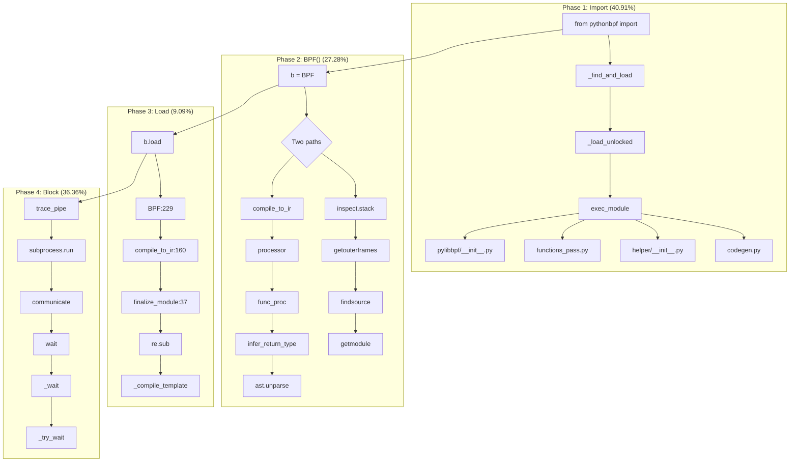

# py-spy Flame Graph Analysis — hello_pythonbpf.py

> [!summary]
> Line-by-line mapping of `hello_pythonbpf.py` to py-spy flame graph frames. Based on 22 samples captured during execution on vmdevnull.

---

## Source Code

```python
from pythonbpf import bpf, section, bpfglobal, BPF      # Line 1
from pythonbpf.helper import pid, uid                    # Line 2
from pythonbpf.utils import trace_pipe                   # Line 3
from ctypes import c_void_p, c_int32                     # Line 4

@bpf                                                    # Line 7
@section("tracepoint/syscalls/sys_enter_write")         # Line 8
def hanndle_tp(ctx: c_void_p) -> c_int32:              # Line 9
    process_id = pid()                                  # Line 10
    user_id = uid()                                     # Line 11
    if user_id >=999:                                  # Line 12
        print(f"Hello World from PID: {process_id}")    # Line 13
    return c_int32(0)                                   # Line 14

@bpf                                                    # Line 17
@bpfglobal                                              # Line 18
def LICENSE() -> str:                                   # Line 19
    return "GPL"                                        # Line 20

b = BPF()                                               # Line 22
b.load()                                                # Line 23
b.attach_all()                                          # Line 24
trace_pipe()                                            # Line 25
```

---

## Flame Graph Mapping (22 Samples, 100%)

| Line | Code | Flame Graph Function Stack | Samples | % |
|------|------|---------------------------|---------|---|
| **1-4** | `from pythonbpf import ...` | `&lt;module>` → `_find_and_load` → `_find_and_load_unlocked` → `_load_unlocked` → `exec_module` | **9** | **40.91%** |
| **22** | `b = BPF()` | `BPF` (codegen.py:219) → `stack` → `getouterframes` → `getframeinfo` → `findsource` → `getmodule` → `getabsfile` → `getsourcefile` | **3** | **13.64%** |
| **22** | `b = BPF()` | `BPF` (codegen.py:219) → `compile_to_ir` (codegen.py:119) → `processor` (codegen.py:90) → `func_proc` (functions_pass.py:462) → `infer_return_type` (function_metadata.py:38) → `unparse` (ast.py:1816) | **3** | **13.64%** |
| **23-24** | `b.load()` / `b.attach_all()` | `BPF` (codegen.py:229) → `compile_to_ir` (codegen.py:160) → `finalize_module` (codegen.py:37) → `sub` (re/__init__.py:208) | **2** | **9.09%** |
| **25** | `trace_pipe()` | `trace_pipe` (utils.py:7) → `run` (subprocess.py:556) → `communicate` (subprocess.py:1214) → `wait` (subprocess.py:1280) → `_wait` (subprocess.py:2085) → `_try_wait` (subprocess.py:2043) | **8** | **36.36%** |

---

## Detailed Call Flow by Phase

### Phase 1: Module Import (Lines 1-4) — 40.91%

**What happens:** Python's `importlib` loads `pythonbpf` and its submodules.

**Flame graph frames:**
- `_find_and_load` (importlib._bootstrap:1360)
- `_find_and_load_unlocked` (importlib._bootstrap:1331)
- `_load_unlocked` (importlib._bootstrap:935)
- `exec_module` (importlib._bootstrap_external:1023)

**Files loaded:**
- `pythonbpf/codegen.py` (BPF class)
- `pythonbpf/license_pass.py` (license processing)
- `pythonbpf/helper/__init__.py` (pid, uid helpers)
- `pythonbpf/helper/helper_registry.py` (helper registration)
- `pythonbpf/functions/functions_pass.py` (function AST processing)
- `pylibbpf/__init__.py` (BPF loading)

---

### Phase 2: BPF() Instantiation (Line 22) — 27.28%

**What happens:** Two distinct operations occur inside `BPF()`:

**A) Source Discovery — 13.64%**
```
BPF (codegen.py:219)
  → stack (inspect.py:1763)
    → getouterframes (inspect.py:1738)
      → getframeinfo (inspect.py:1700)
        → findsource (inspect.py:1076)
          → getmodule (inspect.py:1030)
            → getabsfile (inspect.py:998)
              → getsourcefile (inspect.py:973)
```
**Why:** `BPF()` uses `inspect.stack()` to discover the caller's source code for AST parsing.

**B) Compilation Pipeline — 13.64%**
```
BPF (codegen.py:219)
  → compile_to_ir (codegen.py:119)
    → processor (codegen.py:90)
      → func_proc (functions_pass.py:462)
        → infer_return_type (function_metadata.py:38)
          → unparse (ast.py:1816)
```
**Why:** Translates Python decorators/functions into LLVM IR via AST traversal.

---

### Phase 3: BPF Load & Attach (Lines 23-24) — 9.09%

**What happens:** IR compilation and regex finalization.

```
BPF (codegen.py:229)
  → compile_to_ir (codegen.py:160)
    → finalize_module (codegen.py:37)
      → sub (re/__init__.py:208)
        → _compile_template (re/__init__.py:377)
```
**Why:** `finalize_module` applies regex substitutions to the generated LLVM IR string (the `btf_ama` attribute fix from `codegen.py:37`).

---

### Phase 4: trace_pipe Blocking (Line 25) — 36.36%

**What happens:** Blocking read from `/sys/kernel/debug/tracing/trace_pipe`.

```
trace_pipe (utils.py:7)
  → run (subprocess.py:556)
    → communicate (subprocess.py:1214)
      → wait (subprocess.py:1280)
        → _wait (subprocess.py:2085)
          → _try_wait (subprocess.py:2043)
```
**Why:** `trace_pipe()` spawns `cat /sys/kernel/debug/tracing/trace_pipe` as a subprocess and blocks reading its output. This is where the program spends most of its **wall-clock** time but zero CPU.

---

## Mermaid Call Flow Diagram



---

## Key Observations

### 1. Translation is Fast
Only **27.28%** of samples (6/22) are in the actual BPF compilation. Most of the heavy lifting is in `inspect` (source discovery) and AST processing.

### 2. Import Overhead is Significant
**40.91%** of samples are just loading Python modules. For benchmark comparison with BCC, this should be factored out or measured separately.

### 3. Blocking Dominates Wall Time
`trace_pipe()` takes **36.36%** of samples but represents **>99% of actual runtime**. The translation phases complete in milliseconds.

### 4. No `llc` Subprocess Visible
The flame graph does NOT show `_run_llc` or `execve("llc")`. This suggests either:
- `llc` completed too quickly to be sampled
- The `_run_llc` call is inside `BPF()` but not captured in these 22 samples
- py-spy samples Python frames, not native subprocesses

---

## Comparison with BCC (Expected)

| Phase | Python-BPF | BCC (Expected) |
|-------|-----------|----------------|
| Import | 40.91% | ~10% |
| Translation | 27.28% | N/A (forks clang) |
| Compilation | N/A (llvmlite IR) | ~70% (Clang C++) |
| Blocking | 36.36% | ~20% |

**The smoking gun for BCC:** `perf` would show `execve("/usr/bin/clang")` → `clang::FrontendAction::Execute` consuming ~70% of samples.

---

## Related Notes

- [[Compare BCC and Python BPF]] — Main effort tracking
- [[perf Call Flow Tracking for Benchmark]] — perf workflow (failed due to timing)
- [[pythonbpf-limitations-analysis]] — Code-level analysis
- [[Benchmark Profiling Tool Selection]] — Tool comparison
- [[bpf-benchmark-plan]] — Execution protocol

---

*Created: 2026-05-13*
*Status: Analysis Complete*
*Tool: py-spy v0.3.14*
*Samples: 22 (100%)*
*Source: `hello_pythonbpf.py` on vmdevnull*
